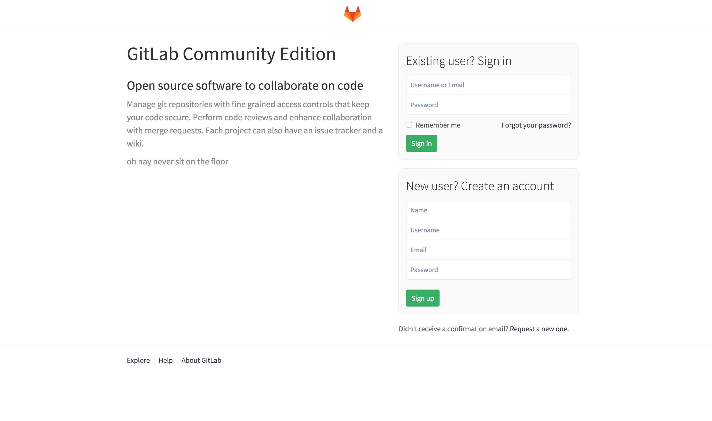
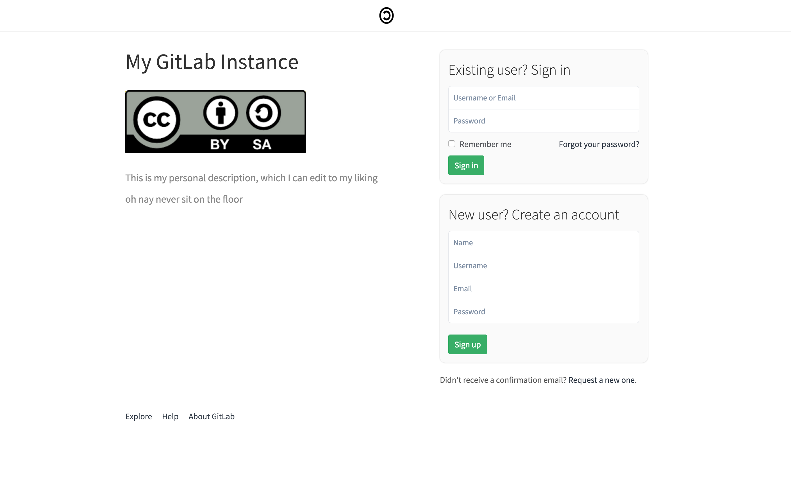

# Changing the appearance of the login page

GitLab Community Edition offers a way to put your company's identity on the login page of your GitLab server and make it a branded login page.

By default, the page shows the GitLab logo and description.

## Changing the appearance of the login page

Navigate to the **Admin** area and go to the **Appearance** page.

Fill in the required details like Title, Description and upload the company logo.

After saving the page, your GitLab login page will have the details you filled in:

