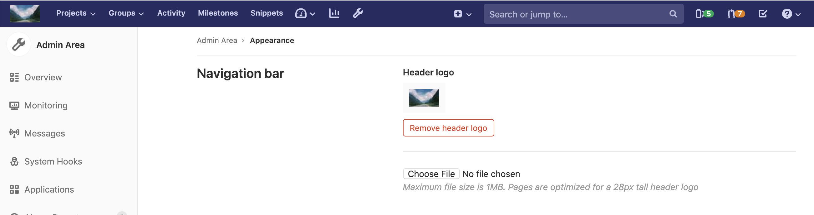
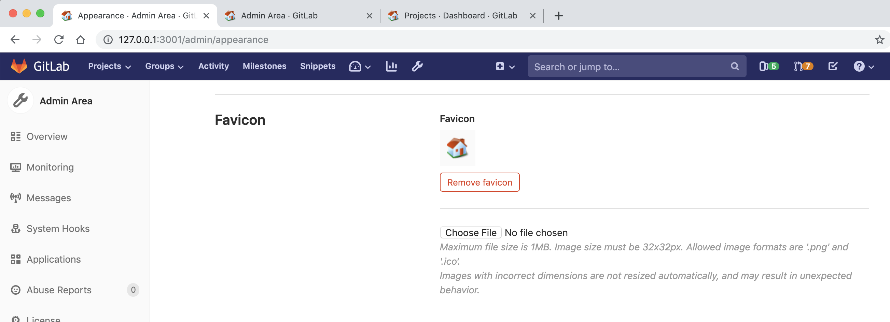
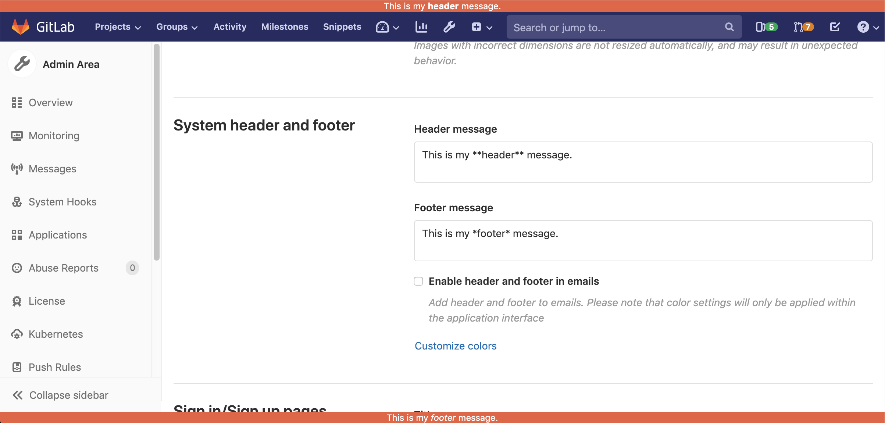
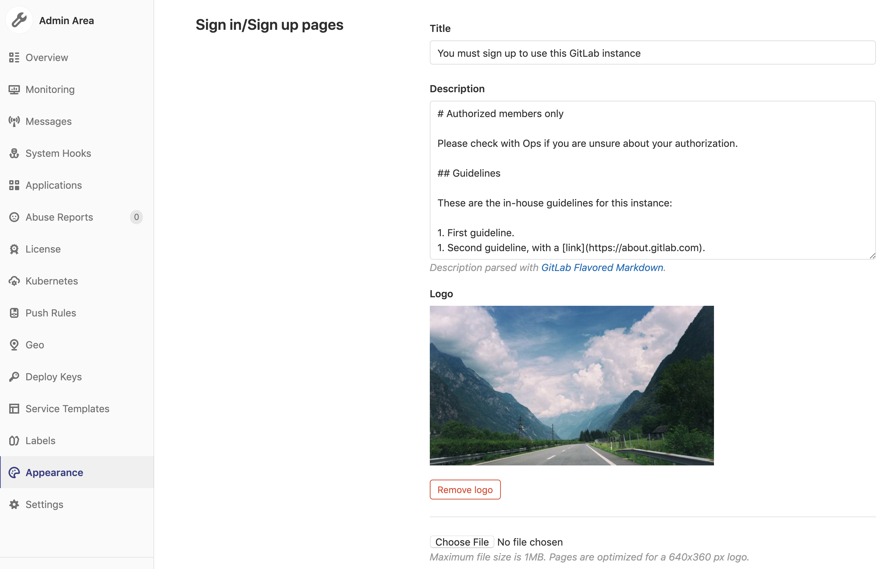
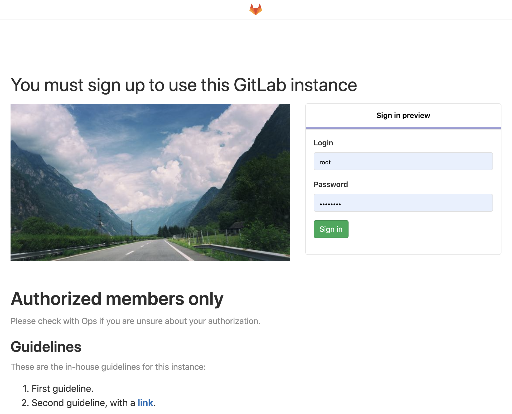
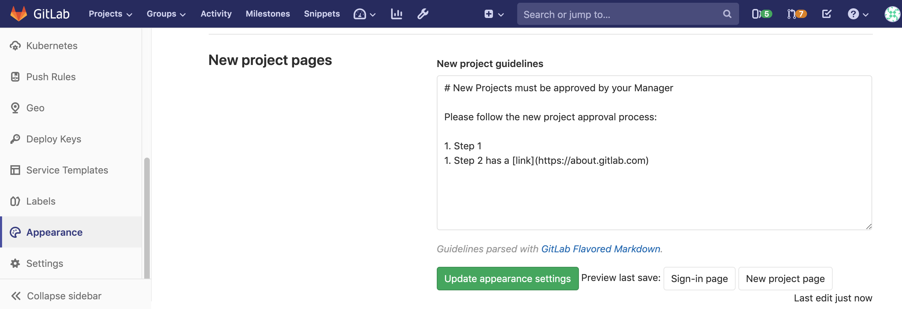
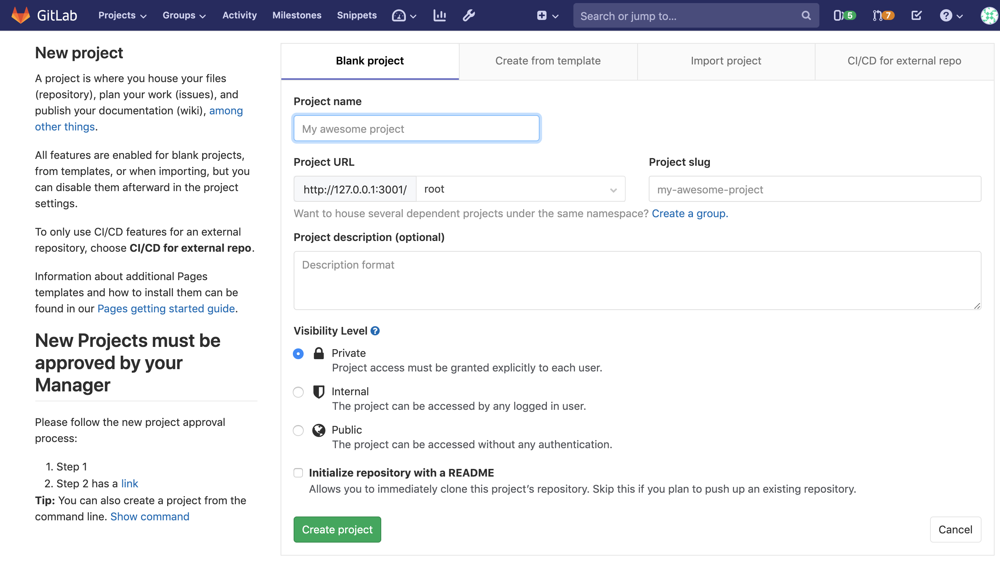

# GitLab Appearance **(CORE ONLY)**

There are several options for customizing the appearance of a self hosted instance
of GitLab. These settings are accessed from the **Admin Area** in the **Appearance**
section.

## Navigation bar

By default, the navigation bar has the GitLab logo, but this can be customized with
any image desired. It is optimized for images 28px high (any width), but any image can be
used (less than 1MB) and it will automatically be resized.

Once you select and upload an image, click **Update appearance settings** at the bottom
of the page to activate it in the GitLab instance.

NOTE: **Note:**
GitLab pipeline emails will also display the custom logo.

## Favicon

> [Introduced](https://gitlab.com/gitlab-org/gitlab-foss/merge_requests/14497) in GitLab 11.0.

By default, the favicon (used by the browser as the tab icon, as well as the CI status icon)
uses the GitLab logo, but this can be customized with any icon desired. It must be a
32x32 `.png` or `.ico` image.

After you select and upload an icon, click **Update appearance settings** at the bottom
of the page to activate it in the GitLab instance.

## System header and footer messages

> - [Introduced](https://gitlab.com/gitlab-org/gitlab/issues/5023) in [GitLab Premium](https://about.gitlab.com/pricing/) 10.7.
> - [Added](https://gitlab.com/gitlab-org/gitlab-foss/issues/55057) to [GitLab Core](https://about.gitlab.com/pricing/) in 11.9.

You can add a small header message, a small footer message, or both, to the interface
of your GitLab instance. These messages will appear on all projects and pages of the
instance, including the sign in / sign up page. The default color is white text on
an orange background, but this can be customized by clicking on **Customize colors**.

Limited [Markdown](../markdown.md) is supported, such as bold, italics, and links, for
example. Other Markdown features, including lists, images and quotes, are not supported,
as the header and footer messages can only be a single line.

If desired, you can select **Enable header and footer in emails** to have the text of
the header and footer added to all emails sent by the GitLab instance.

After you add a message, click **Update appearance settings** at the bottom of the page
to activate it in the GitLab instance.

## Sign in / Sign up pages

You can replace the default message on the sign in / sign up page with your own message
and logo. You can make full use of [Markdown](../markdown.md) in the description:

The optimal size for the logo is 640x360px, but any image can be used (below 1MB)
and it will be resized automatically. The logo image will appear between the title and
the description, on the left of the sign-up page.

After you add a message, click **Update appearance settings** at the bottom of the page
to activate it in the GitLab instance. You can also click on the **Sign-in page** button,
to review the saved appearance settings:

NOTE: **Note:**
You can add also add a [customized help message](settings/help_page.md) below the sign in message.

## New project pages

You can add a new project guidelines message to the **New project page** within GitLab.
You can make full use of [Markdown](../markdown.md) in the description:

The message will be displayed below the **New Project** message, on the left side
of the **New project page**.

After you add a message, click **Update appearance settings** at the bottom of the page
to activate it in the GitLab instance. You can also click on the **New project page**
button, which will bring you to the new project page so you can review the change.

## Libravatar

[Libravatar](https://www.libravatar.org) is supported by GitLab for avatar images, but you must
[manually enable Libravatar support on the GitLab instance](../../administration/libravatar.md)
in order to use the service.

<!-- ## Troubleshooting

Include any troubleshooting steps that you can foresee. If you know beforehand what issues
one might have when setting this up, or when something is changed, or on upgrading, it's
important to describe those, too. Think of things that may go wrong and include them here.
This is important to minimize requests for support, and to avoid doc comments with
questions that you know someone might ask.

Each scenario can be a third-level heading, e.g. `### Getting error message X`.
If you have none to add when creating a doc, leave this section in place
but commented out to help encourage others to add to it in the future. -->
