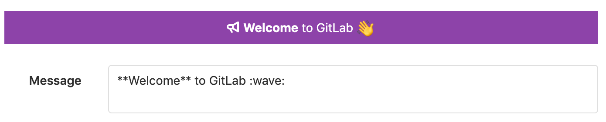
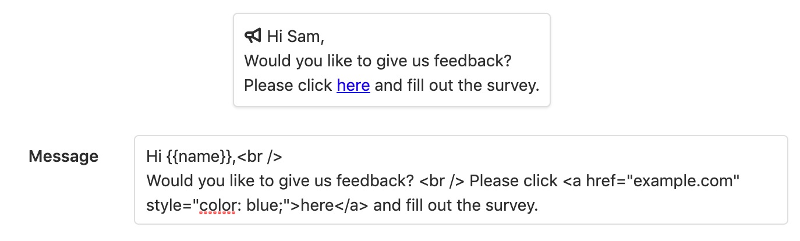

# Broadcast messages **(FREE SELF)**

GitLab can display broadcast messages to all users of a GitLab instance. There are two types of broadcast messages:

- Banners
- Notifications

Broadcast messages can be managed using the [broadcast messages API](../../api/broadcast_messages.md).

## Banners

Banners are shown on the top of a page and in Git remote responses.



```shell
$ git push
...
remote:
remote: **Welcome** to GitLab :wave:
remote:
...
```

If more than one banner is active at one time, they are displayed in a stack in order of creation.

## Notifications

Notifications are shown on the bottom right of a page and can contain placeholders. A placeholder is replaced with an attribute of the active user. Placeholders must be surrounded by curly braces, for example `{{name}}`.
The available placeholders are:

- `{{email}}`
- `{{name}}`
- `{{user_id}}`
- `{{username}}`
- `{{instance_id}}`

If the user is not signed in, user related values are empty.



If more than one notification is active at one time, only the newest is shown.

## Add a broadcast message

To display messages to users on your GitLab instance, add a broadcast message.

To add a broadcast message:

1. On the top bar, select **Menu >** **{admin}** **Admin**.
1. On the left sidebar, select **Messages**.
1. Add the text for the message to the **Message** field. You can style a message's content using Markdown, emoji, and the `a` and `br` HTML tags.
   The `br` tag inserts a line break. The `a` HTML tag accepts `class` and `style` attributes with the following CSS properties:
    - `color`
    - `border`
    - `background`
    - `padding`
    - `margin`
    - `text-decoration`
1. Select one of the suggested background colors, or add the hex code of a different color. The default color is orange.
1. Select the **Dismissable** checkbox to enable users to dismiss the broadcast message.
1. If required, add a **Target Path** to only show the broadcast message on URLs matching that path. You can use the wildcard character `*` to match multiple URLs, for example `mygroup/myproject*`.
1. Select a date for the message to start and end.
1. Select **Add broadcast message**.

NOTE:
The **Background color** field expects the value to be a hexadecimal code because
the form uses the [color_field](https://api.rubyonrails.org/v6.0.3.4/classes/ActionView/Helpers/FormHelper.html#method-i-color_field)
helper method, which generates the proper HTML to render.

When a broadcast message expires, it no longer displays in the user interface but is still listed in the
list of broadcast messages.

## Edit a broadcast message

If you need to make changes to a broadcast message, you can edit it.

To edit a broadcast message:

1. On the top bar, select **Menu >** **{admin}** **Admin**.
1. On the left sidebar, select **Messages**.
1. From the list of broadcast messages, select the edit button for the message.
1. After making the required changes, select **Update broadcast message**.

Expired messages can be made active again by changing their end date.

## Delete a broadcast message

If you no longer require a broadcast message, you can delete it.
You can delete a broadcast message while it's active.

To delete a broadcast message:

1. On the top bar, select **Menu >** **{admin}** **Admin**.
1. On the left sidebar, select **Messages**.
1. From the list of broadcast messages, select the delete button for the message.

When a broadcast message is deleted, it's removed from the list of broadcast messages.

<!-- ## Troubleshooting

Include any troubleshooting steps that you can foresee. If you know beforehand what issues
one might have when setting this up, or when something is changed, or on upgrading, it's
important to describe those, too. Think of things that may go wrong and include them here.
This is important to minimize requests for support, and to avoid doc comments with
questions that you know someone might ask.

Each scenario can be a third-level heading, e.g. `### Getting error message X`.
If you have none to add when creating a doc, leave this section in place
but commented out to help encourage others to add to it in the future. -->
