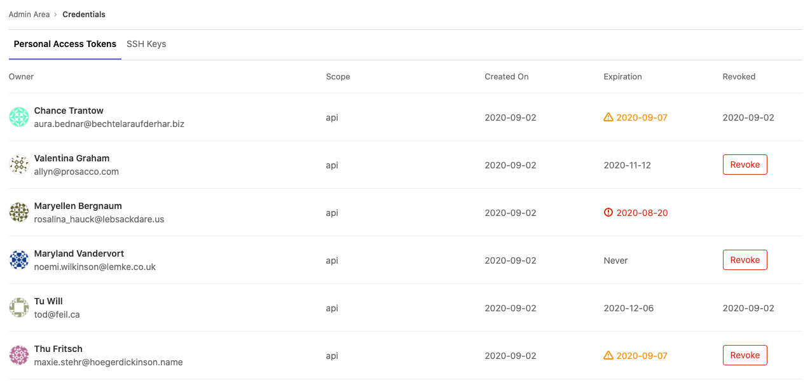
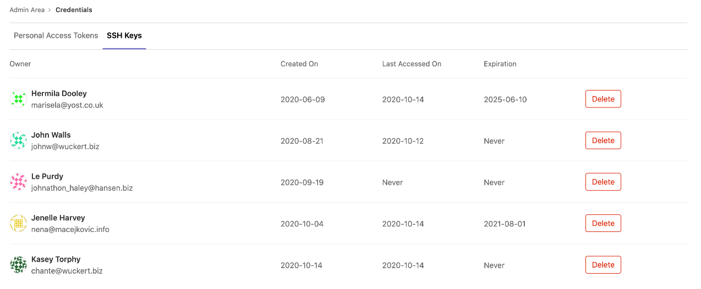

# Credentials inventory **(ULTIMATE ONLY)**

> [Introduced](https://gitlab.com/gitlab-org/gitlab/-/merge_requests/20912) in GitLab 12.6.

GitLab administrators are responsible for the overall security of their instance. To assist, GitLab provides a Credentials inventory to keep track of all the credentials that can be used to access their self-managed instance.

Using Credentials inventory, you can see all the personal access tokens (PAT) and SSH keys that exist in your GitLab instance. In addition, you can [revoke](#revoke-a-users-personal-access-token) and [delete](#delete-a-users-ssh-key) and see:

- Who they belong to.
- Their access scope.
- Their usage pattern.
- When they expire. [Introduced](https://gitlab.com/gitlab-org/gitlab/-/issues/214809) in GitLab 13.2.
- When they were revoked. [Introduced](https://gitlab.com/gitlab-org/gitlab/-/issues/214809) in GitLab 13.2.

To access the Credentials inventory, navigate to **Admin Area > Credentials**.

The following is an example of the Credentials inventory page:

## Revoke a user's personal access token

> [Introduced](https://gitlab.com/gitlab-org/gitlab/-/issues/214811) in GitLab 13.4.

If you see a **Revoke** button, you can revoke that user's PAT. Whether you see a **Revoke** button depends on the token state, and if an expiration date has been set. For more information, see the following table:

| Token state | [Token expiry enforced?](settings/account_and_limit_settings.md#optional-enforcement-of-personal-access-token-expiry) | Show Revoke button? | Comments |
|-------------|------------------------|--------------------|----------------------------------------------------------------------------|
| Active      | Yes                    | Yes                | Allows administrators to revoke the PAT, such as for a compromised account |
| Active      | No                     | Yes                | Allows administrators to revoke the PAT, such as for a compromised account |
| Expired     | Yes                    | No                 | PAT expires automatically                                                  |
| Expired     | No                     | Yes                | The administrator may revoke the PAT to prevent indefinite use             |
| Revoked     | Yes                    | No                 | Not applicable; token is already revoked                                   |
| Revoked     | No                     | No                 | Not applicable; token is already revoked                                   |

When a PAT is revoked from the credentials inventory, the instance notifies the user by email.

## Delete a user's SSH key

> [Introduced](https://gitlab.com/gitlab-org/gitlab/-/issues/225248) in GitLab 13.5.

You can **Delete** a user's SSH key by navigating to the credentials inventory's SSH Keys tab.
The instance then notifies the user.

