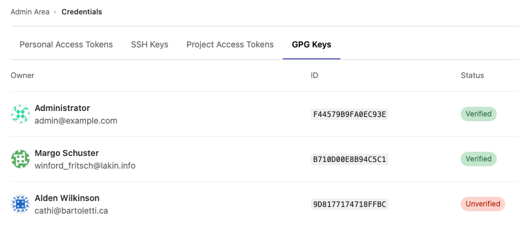

# Credentials inventory **(ULTIMATE SELF)**

> - [Introduced](https://gitlab.com/gitlab-org/gitlab/-/merge_requests/20912) in GitLab 12.6.
> - [Bot-created access tokens not displayed in personal access token list](https://gitlab.com/gitlab-org/gitlab/-/issues/351759) in GitLab 14.9.

GitLab administrators are responsible for the overall security of their instance. To assist, GitLab
provides a Credentials inventory to keep track of all the credentials that can be used to access
their self-managed instance.

Use Credentials inventory to see for your GitLab instance all:

- Personal access tokens (PAT).
- Project access tokens (GitLab 14.8 and later).
- SSH keys.
- GPG keys.

You can also [revoke](#revoke-a-users-personal-access-token) and [delete](#delete-a-users-ssh-key) and see:

- Who they belong to.
- Their access scope.
- Their usage pattern.
- When they expire. [Introduced](https://gitlab.com/gitlab-org/gitlab/-/issues/214809) in GitLab 13.2.
- When they were revoked. [Introduced](https://gitlab.com/gitlab-org/gitlab/-/issues/214809) in GitLab 13.2.

To access the Credentials inventory:

1. On the top bar, select **Main menu > Admin**.
1. On the left sidebar, select **Credentials**.

## Revoke a user's personal access token

> [Introduced](https://gitlab.com/gitlab-org/gitlab/-/issues/214811) in GitLab 13.4.

If you see a **Revoke** button, you can revoke that user's PAT. Whether you see a **Revoke** button depends on the token state, and if an expiration date has been set. For more information, see the following table:

| Token state | Show Revoke button? | Comments                                                                   |
|-------------|---------------------|----------------------------------------------------------------------------|
| Active      | Yes                 | Allows administrators to revoke the PAT, such as for a compromised account |
| Expired     | No                  | Not applicable; token is already expired                                   |
| Revoked     | No                  | Not applicable; token is already revoked                                   |

When a PAT is revoked from the credentials inventory, the instance notifies the user by email.

## Revoke a user's project access token

> [Introduced](https://gitlab.com/gitlab-org/gitlab/-/issues/243833) in GitLab 14.8.

The **Revoke** button next to a project access token can be selected to revoke that particular project access token. This both:

- Revokes the token project access token.
- Enqueues a background worker to delete the project bot user.

## Delete a user's SSH key

> [Introduced](https://gitlab.com/gitlab-org/gitlab/-/issues/225248) in GitLab 13.5.

You can **Delete** a user's SSH key by navigating to the credentials inventory's SSH Keys tab.
The instance then notifies the user.

## Review existing GPG keys

> - [Introduced](https://gitlab.com/gitlab-org/gitlab/-/issues/282429) in GitLab 13.10.
> - [Feature flag removed](https://gitlab.com/gitlab-org/gitlab/-/issues/292961) in GitLab 13.12.

You can view all existing GPG in your GitLab instance by navigating to the
credentials inventory GPG Keys tab, as well as the following properties:

- Who the GPG key belongs to.
- The ID of the GPG key.
- Whether the GPG key is [verified or unverified](../project/repository/gpg_signed_commits/index.md)

