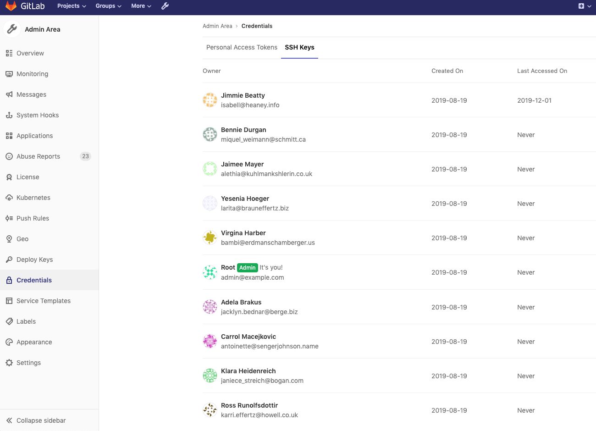

# Credentials inventory **(ULTIMATE ONLY)**

> [Introduced](https://gitlab.com/gitlab-org/gitlab/merge_requests/20912) in GitLab 12.6.

## Overview

GitLab administrators are responsible for the overall security of their instance. To assist, GitLab provides a Credentials inventory to keep track of all the credentials that can be used to access their self-managed instance.

Using Credentials inventory, GitLab administrators can see all the personal access tokens and SSH keys that exist in their instance and:

- Who they belong to.
- Their access scope.
- Their usage pattern.

To access the Credentials inventory, navigate to **Admin Area > Credentials**.

The following is an example of the Credentials inventory page:

