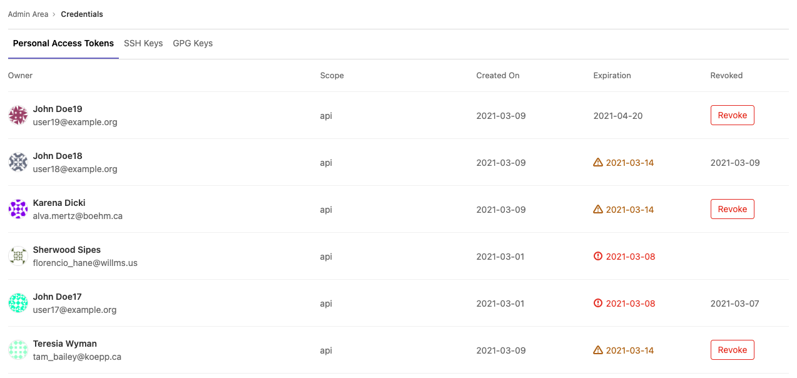
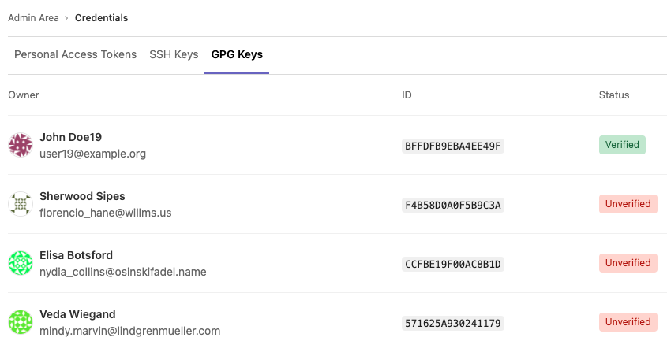

# Credentials inventory **(ULTIMATE SELF)**

> [Introduced](https://gitlab.com/gitlab-org/gitlab/-/merge_requests/20912) in GitLab 12.6.

GitLab administrators are responsible for the overall security of their instance. To assist, GitLab provides a Credentials inventory to keep track of all the credentials that can be used to access their self-managed instance.

Using Credentials inventory, you can see all the personal access tokens (PAT), SSH keys, and GPG keys
that exist in your GitLab instance. In addition, you can [revoke](#revoke-a-users-personal-access-token)
and [delete](#delete-a-users-ssh-key) and see:

- Who they belong to.
- Their access scope.
- Their usage pattern.
- When they expire. [Introduced](https://gitlab.com/gitlab-org/gitlab/-/issues/214809) in GitLab 13.2.
- When they were revoked. [Introduced](https://gitlab.com/gitlab-org/gitlab/-/issues/214809) in GitLab 13.2.

To access the Credentials inventory, navigate to **Admin Area > Credentials**.

The following is an example of the Credentials inventory page:



## Revoke a user's personal access token

> [Introduced](https://gitlab.com/gitlab-org/gitlab/-/issues/214811) in GitLab 13.4.

If you see a **Revoke** button, you can revoke that user's PAT. Whether you see a **Revoke** button depends on the token state, and if an expiration date has been set. For more information, see the following table:

| Token state | [Token expiration enforced?](settings/account_and_limit_settings.md#optional-non-enforcement-of-personal-access-token-expiration) | Show Revoke button? | Comments |
|-------------|------------------------|--------------------|----------------------------------------------------------------------------|
| Active      | Yes                    | Yes                | Allows administrators to revoke the PAT, such as for a compromised account |
| Active      | No                     | Yes                | Allows administrators to revoke the PAT, such as for a compromised account |
| Expired     | Yes                    | No                 | PAT expires automatically                                                  |
| Expired     | No                     | Yes                | The administrator may revoke the PAT to prevent indefinite use             |
| Revoked     | Yes                    | No                 | Not applicable; token is already revoked                                   |
| Revoked     | No                     | No                 | Not applicable; token is already revoked                                   |

When a PAT is revoked from the credentials inventory, the instance notifies the user by email.

## Delete a user's SSH key

> [Introduced](https://gitlab.com/gitlab-org/gitlab/-/issues/225248) in GitLab 13.5.

You can **Delete** a user's SSH key by navigating to the credentials inventory's SSH Keys tab.
The instance then notifies the user.


## Review existing GPG keys

> - [Introduced](https://gitlab.com/gitlab-org/gitlab/-/issues/282429) in GitLab 13.10.
> - [Deployed behind a feature flag](../feature_flags.md), disabled by default.
> - [Enabled by default](https://gitlab.com/gitlab-org/gitlab/-/issues/292961) in GitLab 13.11.
> - Enabled on GitLab.com.
> - Recommended for production use.
> - For GitLab self-managed instances, GitLab administrators can opt to [disable it](#enable-or-disable-the-gpg-keys-view).

WARNING:
This feature might not be available to you. Check the **version history** note above for details.

You can view all existing GPG in your GitLab instance by navigating to the
credentials inventory GPG Keys tab, as well as the following properties:

- Who the GPG key belongs to.
- The ID of the GPG key.
- Whether the GPG key is [verified or unverified](../project/repository/gpg_signed_commits/index.md)



### Enable or disable the GPG keys view

Enabling or disabling the GPG keys view is under development but ready for production use.
It is deployed behind a feature flag that is **enabled by default**.
[GitLab administrators with access to the GitLab Rails console](../../administration/feature_flags.md)
can opt to disable it.

To enable it:

```ruby
Feature.enable(:credential_inventory_gpg_keys)
```

To disable it:

```ruby
Feature.disable(:credential_inventory_gpg_keys)
```
