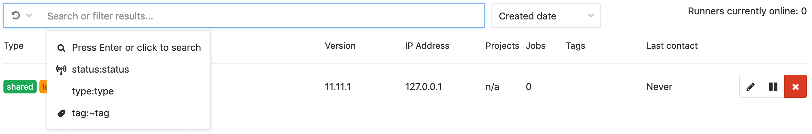

# GitLab Admin Area **(CORE ONLY)**

The Admin Area provides a web UI for administering some features of GitLab self-managed instances.

To access the Admin Area, either:

- Click the Admin Area icon (the spanner or wrench icon).
- Visit `/admin` on your self-managed instance.

NOTE: **Note:**
Only admin users can access the Admin Area.

## Admin Area sections

The Admin Area is made up of the following sections:

| Section                         | Description                                                                                                                                                                                                                                                                              |
|:--------------------------------|:-----------------------------------------------------------------------------------------------------------------------------------------------------------------------------------------------------------------------------------------------------------------------------------------|
| [Overview](#overview-section)   | View your GitLab [Dashboard](#admin-dashboard), and administer [projects](#administering-projects), [users](#administering-users), [groups](#administering-groups), [jobs](#administering-jobs), [Runners](#administering-runners), and [Gitaly servers](#administering-gitaly-servers). |
| Monitoring                      | View GitLab [system information](#system-info), and information on [background jobs](#background-jobs), [logs](#logs), [health checks](monitoring/health_check.md), [requests profiles](#requests-profiles), and [audit logs](#audit-log-premium-only).                                  |
| Messages                        | Send and manage [broadcast messages](broadcast_messages.md) for your users.                                                                                                                                                                                                              |
| System Hooks                    | Configure [system hooks](../../system_hooks/system_hooks.md) for many events.                                                                                                                                                                                                            |
| Applications                    | Create system [OAuth applications](../../integration/oauth_provider.md) for integrations with other services.                                                                                                                                                                            |
| Abuse Reports                   | Manage [abuse reports](abuse_reports.md) submitted by your users.                                                                                                                                                                                                                        |
| License **(STARTER ONLY)**      | Upload, display, and remove [licenses](license.md).                                                                                                                                                                                                                                      |
| Push Rules **(STARTER)**        | Configure pre-defined Git [push rules](../../push_rules/push_rules.md) for projects.                                                                                                                                                                                                     |
| Geo **(PREMIUM ONLY)**          | Configure and maintain [Geo nodes](geo_nodes.md).                                                                                                                                                                                                                                        |
| Deploy Keys                     | Create instance-wide [SSH deploy keys](../../ssh/README.md#deploy-keys).                                                                                                                                                                                                                 |
| Credentials **(ULTIMATE ONLY)** | View [credentials](credentials_inventory.md) that can be used to access your instance.                                                                                                                                                                                                   |
| Service Templates               | Create [service templates](../project/integrations/services_templates.md) for projects.                                                                                                                                                                                                  |
| Labels                          | Create and maintain [labels](labels.md) for your GitLab instance.                                                                                                                                                                                                                        |
| Appearance                      | Customize [GitLab's appearance](appearance.md).                                                                                                                                                                                                                                          |
| Settings                        | Modify the [settings](settings/index.md) for your GitLab instance.                                                                                                                                                                                                                       |

## Admin Dashboard

The Dashboard provides statistics and system information about the GitLab instance.

To access the Dashboard, either:

- Click the Admin Area icon (the wrench icon).
- Visit `/admin` on your self-managed instance.

The Dashboard is the default view of the Admin Area, and is made up of the following sections:

| Section    | Description                                                                                                                                              |
|:-----------|:---------------------------------------------------------------------------------------------------------------------------------------------------------|
| Projects   | The total number of projects, up to 10 of the latest projects, and the option of creating a new project.                                                 |
| Users      | The total number of users, up to 10 of the latest users, and the option of creating a new user.                                                          |
| Groups     | The total number of groups, up to 10 of the latest groups, and the option of creating a new group.                                                       |
| Statistics | Totals of all elements of the GitLab instance.                                                                                                           |
| Features   | All features available on the GitLab instance. Enabled features are marked with a green circle icon, and disabled features are marked with a power icon. |
| Components | The major components of GitLab and the version number of each. A link to the Gitaly Servers is also included.                                            |

## Overview section

The following topics document the **Overview** section of the Admin Area.

### Administering Projects

You can administer all projects in the GitLab instance from the Admin Area's Projects page.

To access the Projects page, go to **Admin Area > Overview > Projects**.

Click the **All**, **Private**, **Internal**, or **Public** tab to list only projects of that
criteria.

By default, all projects are listed, in reverse order of when they were last updated. For each
project, the following information is listed:

- Name.
- Namespace.
- Description.
- Size, updated every 15 minutes at most.

Projects can be edited or deleted.

The list of projects can be sorted by:

- Name.
- Last created.
- Oldest created.
- Last updated.
- Oldest updated.
- Owner.

A user can choose to hide or show archived projects in the list.

In the **Filter by name** field, type the project name you want to find, and GitLab will filter
them as you type.

Select from the **Namespace** dropdown to filter only projects in that namespace.

You can combine the filter options. For example, to list only public projects with `score` in their name:

1. Click the **Public** tab.
1. Enter `score` in the **Filter by name...** input box.

### Administering Users

You can administer all users in the GitLab instance from the Admin Area's Users page.

To access the Users page, go to **Admin Area > Overview > Users**.

To list users matching a specific criteria, click on one of the following tabs on the **Users** page:

- **Active**
- **Admins**
- **2FA Enabled**
- **2FA Disabled**
- **External**
- **[Blocked](blocking_unblocking_users.md)**
- **[Deactivated](activating_deactivating_users.md)**
- **Without projects**

For each user, their username, email address, are listed, also the date their account was
created and the date of last activity. To edit a user, click the **Edit** button in that user's
row. To delete the user, or delete the user and their contributions, click the cog dropdown in
that user's row, and select the desired option.

To change the sort order:

1. Click the sort dropdown.
1. Select the desired order.

By default the sort dropdown shows **Name**.

To search for users, enter your criteria in the search field. The user search is case
insensitive, and applies partial matching to name and username. To search for an email address,
you must provide the complete email address.

### Administering Groups

You can administer all groups in the GitLab instance from the Admin Area's Groups page.

To access the Groups page, go to **Admin Area > Overview > Groups**.

For each group, the page displays their name, description, size, number of projects in the group,
number of members, and whether the group is private, internal, or public. To edit a group, click
the **Edit** button in that group's row. To delete the group, click the **Delete** button in
that group's row.

To change the sort order, click the sort dropdown and select the desired order. The default
sort order is by **Last created**.

To search for groups by name, enter your criteria in the search field. The group search is case
insensitive, and applies partial matching.

To [Create a new group](../group/index.md#create-a-new-group) click **New group**.

### Administering Jobs

You can administer all jobs in the GitLab instance from the Admin Area's Jobs page.

To access the Jobs page, go to **Admin Area > Overview > Jobs**.

All jobs are listed, in descending order of job ID.

Click the **All** tab to list all jobs. Click the **Pending**, **Running**, or **Finished** tab to list only jobs of that status.

For each job, the following details are listed:

| Field    | Description |
|--------- | ----------- |
| Status   | Job status, either **passed**, **skipped**, or **failed**.              |
| Job      | Includes links to the job, branch, and the commit that started the job. |
| Pipeline | Includes a link to the specific pipeline.                               |
| Project  | Name of the project, and organization, to which the job belongs.        |
| Runner   | Name of the CI runner assigned to execute the job.                      |
| Stage    | Stage that the job is declared in a `.gitlab-ci.yml` file.              |
| Name     | Name of the job specified in a `.gitlab-ci.yml` file.                   |
| Timing   | Duration of the job, and how long ago the job completed.                |
| Coverage | Percentage of tests coverage.                                           |

### Administering Runners

You can administer all Runners in the GitLab instance from the Admin Area's **Runners** page. See
[GitLab Runner](https://docs.gitlab.com/runner/) for more information on Runner itself.

To access the **Runners** page, go to **Admin Area > Overview > Runners**.

The **Runners** page features:

- A description of Runners, and their possible states.
- Instructions on installing a Runner.
- A list of all registered Runners.

Runners are listed in descending order by the date they were created, by default. You can change
the sort order to *Last Contacted* from the dropdown beside the search field.

To search Runners' descriptions:

1. In the **Search or filter results...** field, type the description of the Runner you want to
   find.
1. Press Enter.

You can also filter Runners by status, type, and tag. To filter:

1. Click in the **Search or filter results...** field.
1. Select **status:**, **type:**, or **tag:**.
1. Select or enter your search criteria.

For each Runner, the following attributes are listed:

| Attribute    | Description |
| ------------ | ----------- |
| Type         | One or more of the following states: shared, group, specific, locked, or paused |
| Runner token | Token used to identify the Runner, and which the Runner uses to communicate with the GitLab instance |
| Description  | Description given to the Runner when it was created |
| Version      | GitLab Runner version |
| IP address   | IP address of the host on which the Runner is registered |
| Projects     | Projects to which the Runner is assigned |
| Jobs         | Total of jobs run by the Runner |
| Tags         | Tags associated with the Runner |
| Last contact | Timestamp indicating when the GitLab instance last contacted the Runner |

You can also edit, pause, or remove each Runner.

### Administering Gitaly servers

You can list all Gitaly servers in the GitLab instance from the Admin Area's **Gitaly Servers**
page. For more details, see [Gitaly](../../administration/gitaly/index.md).

To access the **Gitaly Servers** page, go to **Admin Area > Overview > Gitaly Servers**.

For each Gitaly server, the following details are listed:

| Field          | Description |
| -------------- | ----------- |
| Storage        | Repository storage |
| Address        | Network address on which the Gitaly server is listening |
| Server version | Gitaly version |
| Git version    | Version of Git installed on the Gitaly server |
| Up to date     | Indicates if the Gitaly server version is the latest version available. A green dot indicates the server is up to date. |

## Monitoring section

The following topics document the **Monitoring** section of the Admin Area.

### System Info

The **System Info** page provides the following statistics:

| Field        | Description |
| :----------- | :---------- |
| CPU          | Number of CPU cores available |
| Memory Usage | Memory in use, and total memory available |
| Disk Usage   | Disk space in use, and total disk space available |
| Uptime       | Approximate uptime of the GitLab instance |

These statistics are updated only when you navigate to the **System Info** page, or you refresh the page in your browser.

### Background Jobs

The **Background Jobs** page displays the Sidekiq dashboard. Sidekiq is used by GitLab to
perform processing in the background.

The Sidekiq dashboard consists of the following elements:

- A tab per jobs' status.
- A breakdown of background job statistics.
- A live graph of **Processed** and **Failed** jobs, with a selectable polling interval.
- An historical graph of **Processed** and **Failed** jobs, with a selectable time span.
- Redis statistics, including:
  - Version number
  - Uptime, measured in days
  - Number of connections
  - Current memory usage, measured in MB
  - Peak memory usage, measured in MB

### Logs

The **Logs** page provides access to the following log files:

| Log file                | Contents |
| :---------------------- | :------- |
| `application.log`       | GitLab user activity |
| `git_json.log`          | Failed GitLab interaction with Git repositories |
| `production.log`        | Requests received from Unicorn, and the actions taken to serve those requests |
| `sidekiq.log`           | Background jobs |
| `repocheck.log`         | Repository activity |
| `integrations_json.log` | Activity between GitLab and integrated systems |
| `kubernetes.log`        | Kubernetes activity |

The contents of these log files can be useful when troubleshooting a problem. Access is available to GitLab admins, without requiring direct access to the log files.

For details of these log files and their contents, see [Log system](../../administration/logs.md).

The content of each log file is listed in chronological order. To minimize performance issues, a maximum 2000 lines of each log file are shown.

### Requests Profiles

The **Requests Profiles** page contains the token required for profiling. For more details, see [Request Profiling](../../administration/monitoring/performance/request_profiling.md).

### Audit Log **(PREMIUM ONLY)**

The **Audit Log** page lists changes made within the GitLab server. With this information you can control, analyze, and track every change.
