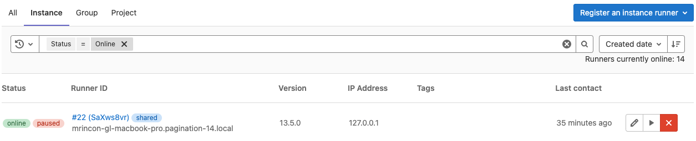

# GitLab Admin Area **(FREE SELF)**

The Admin Area provides a web UI to manage and configure some features of GitLab
self-managed instances. If you are an administrator, you can access the Admin Area
by visiting `/admin` on your self-managed instance. You can also access it through
the UI:

- GitLab versions 14.0 and later: on the top bar, select **Main menu > Admin**.
- GitLab versions 13.12 and earlier: on the top bar, select the Admin Area icon (**{admin}**).

NOTE:
Only administrators can access the Admin Area.

## Admin Area sections

The Admin Area is made up of the following sections:

| Section                                        | Description |
|:-----------------------------------------------|:------------|
| **{overview}** [Overview](#overview-section)   | View your GitLab [Dashboard](#admin-area-dashboard), and administer [projects](#administering-projects), [users](#administering-users), [groups](#administering-groups), [topics](#administering-topics), [jobs](#administering-jobs), [runners](#administering-runners), and [Gitaly servers](#administering-gitaly-servers). |
| **{monitor}** Monitoring                       | View GitLab [system information](#system-information), and information on [background jobs](#background-jobs), [logs](#logs), [health checks](monitoring/health_check.md), and [audit events](#audit-events). |
| **{messages}** Messages                        | Send and manage [broadcast messages](broadcast_messages.md) for your users. |
| **{hook}** System Hooks                        | Configure [system hooks](../../administration/system_hooks.md) for many events. |
| **{applications}** Applications                | Create system [OAuth applications](../../integration/oauth_provider.md) for integrations with other services. |
| **{slight-frown}** Abuse Reports               | Manage [abuse reports](review_abuse_reports.md) submitted by your users. |
| **{license}** License                          | Add, display, and remove [licenses](license.md). |
| **{cloud-gear}** Kubernetes                    | Create and manage instance-level [Kubernetes clusters](../instance/clusters/index.md). |
| **{push-rules}** Push rules | Configure pre-defined Git [push rules](../project/repository/push_rules.md) for projects. Also, configure [merge requests approvers rules](merge_requests_approvals.md). |
| **{location-dot}** Geo                         | Configure and maintain [Geo sites](geo_sites.md). |
| **{key}** Deploy keys                          | Create instance-wide [SSH deploy keys](../project/deploy_keys/index.md). |
| **{lock}** Credentials                         | View [credentials](credentials_inventory.md) that can be used to access your instance. |
| **{template}** Integrations                    | Manage [instance-level default settings](settings/project_integration_management.md) for a project integration. |
| **{labels}** Labels                            | Create and maintain [labels](labels.md) for your GitLab instance. |
| **{appearance}** Appearance                    | Customize [GitLab appearance](appearance.md). |
| **{settings}** Settings                        | Modify the [settings](settings/index.md) for your GitLab instance. |

## Admin Area dashboard

The Dashboard provides statistics and system information about the GitLab instance.

To access the Dashboard, either:

- On the top bar, select **Main menu > Admin**.
- Visit `/admin` on your self-managed instance.

The Dashboard is the default view of the Admin Area, and is made up of the following sections:

| Section    | Description |
|:-----------|:------------|
| Projects   | The total number of projects, up to 10 of the latest projects, and the option of creating a new project. |
| Users      | The total number of users, up to 10 of the latest users, the option of creating a new user, and a link to [**Users statistics**](#users-statistics). |
| Groups     | The total number of groups, up to 10 of the latest groups, and the option of creating a new group. |
| Statistics | Totals of all elements of the GitLab instance. |
| Features   | All features available on the GitLab instance. Enabled features are marked with a green circle icon, and disabled features are marked with a power icon. |
| Components | The major components of GitLab and the version number of each. A link to the Gitaly Servers is also included. |

## Overview section

The following topics document the **Overview** section of the Admin Area.

### Administering Projects

You can administer all projects in the GitLab instance from the Admin Area's Projects page.

To access the Projects page:

1. On the top bar, select **Main menu > Admin**.
1. On the left sidebar, select **Overview > Projects**.
1. Select the **All**, **Private**, **Internal**, or **Public** tab to list only
   projects of that criteria.

By default, all projects are listed, in reverse order of when they were last updated. For each
project, the following information is listed:

- Name
- Namespace
- Description
- Size, updated every 15 minutes at most

Projects can be edited or deleted.

To edit a project's name or description:

1. In the Projects overview, next to the project you want to edit, select **Edit**.
1. Edit the **Project name** or **Project description**.
1. Select **Save Changes**.

To delete a project:

1. In the Projects overview, next to the project you want to delete, select **Delete**.

The list of projects can be sorted by:

- Updated date
- Last created
- Name
- Most stars
- Oldest created
- Oldest updated
- Largest repository

A user can choose to hide or show archived projects in the list.

In the **Filter by name** field, type the project name you want to find, and GitLab filters
them as you type.

To filter only projects in that namespace, select from the **Namespace** dropdown list.

You can combine the filter options. For example, to list only public projects with `score` in their name:

1. Select the **Public** tab.
1. Enter `score` in the **Filter by name...** input box.

### Administering Users

You can administer all users in the GitLab instance from the Admin Area's Users page:

1. On the top bar, select **Main menu > Admin**.
1. On the left sidebar, select **Overview > Users**.

To list users matching a specific criteria, select one of the following tabs on the **Users** page:

- **Active**
- **Admins**
- **2FA Enabled**
- **2FA Disabled**
- **External**
- **[Blocked](moderate_users.md#block-a-user)**
- **[Deactivated](moderate_users.md#deactivate-a-user)**
- **Without projects**

For each user, the following are listed:

1. Username
1. Email address
1. Project membership count
1. Group membership count ([introduced](https://gitlab.com/gitlab-org/gitlab/-/issues/276215) in GitLab 13.12)
1. Date of account creation
1. Date of last activity

To edit a user, in the user's row, select **Edit**. To delete the user, or delete the user and their contributions, select the cog dropdown list in
that user's row, and select the desired option.

To change the sort order:

1. Select the sort dropdown list.
1. Select the desired order.

By default the sort dropdown list shows **Name**.

To search for users, enter your criteria in the search field. The user search is case
insensitive, and applies partial matching to name and username. To search for an email address,
you must provide the complete email address.

#### User impersonation

An administrator can "impersonate" any other user, including other administrators.
This allows the administrator to "see what the user sees," and take actions on behalf of the user.
You can impersonate a user in the following ways:

- Through the UI:
  1. On the top bar, select **Main menu > Admin**.
  1. On the left sidebar, select **Overview > Users**.
  1. From the list of users, select a user.
  1. Select **Impersonate**.
- With the API, using [impersonation tokens](../../api/rest/index.md#impersonation-tokens).

All impersonation activities are [captured with audit events](../../administration/audit_events.md#user-impersonation).

By default, impersonation is enabled. GitLab can be configured to [disable impersonation](../../api/rest/index.md#disable-impersonation).

#### User identities

> The ability to see a user's SCIM identity was [introduced](https://gitlab.com/gitlab-org/gitlab/-/issues/294608) in GitLab 15.3.

When using authentication providers, administrators can see the identities for a user:

1. On the top bar, select **Main menu > Admin**.
1. On the left sidebar, select **Overview > Users**.
1. From the list of users, select a user.
1. Select **Identities**.

This list shows the user's identities, including SCIM identities. Administrators can use this information to troubleshoot SCIM-related issues and confirm
the identities being used for an account.

#### User Permission Export **(PREMIUM SELF)**

> - [Introduced](https://gitlab.com/gitlab-org/gitlab/-/issues/1772) in GitLab 13.8.
> - [Feature flag removed](https://gitlab.com/gitlab-org/gitlab/-/issues/292436) in GitLab 13.9.

An administrator can export user permissions for all users in the GitLab instance from the Admin Area's Users page.
The export lists direct membership the users have in groups and projects.

The following data is included in the export:

- Username
- Email
- Type
- Path
- Access level ([Project](../permissions.md#project-members-permissions) and [Group](../permissions.md#group-members-permissions))
- Date of last activity ([introduced](https://gitlab.com/gitlab-org/gitlab/-/issues/345388) in GitLab 14.6). For a list of activities that populate this column, see the [Users API documentation](../../api/users.md#get-user-activities).

Only the first 100,000 user accounts are exported.

#### Users statistics

The **Users statistics** page provides an overview of user accounts by role. These statistics are
calculated daily, so user changes made since the last update are not reflected.

The following totals are also included:

- Billable users
- Blocked users
- Total users

GitLab billing is based on the number of [**Billable users**](../../subscriptions/self_managed/index.md#billable-users).

#### Add email to user

You must be an administrator to manually add emails to users:

1. On the top bar, select **Main menu > Admin**.
1. On the left sidebar, select **Overview > Users** (`/admin/users`).
1. Locate the user and select them.
1. Select **Edit**.
1. In **Email**, enter the new email address. This adds the new email address to the
   user and sets the previous email address to be a secondary.
1. Select **Save changes**.

### User cohorts

The [Cohorts](user_cohorts.md) tab displays the monthly cohorts of new users and their activities over time.

### Prevent a user from creating groups

By default, users can create groups. To prevent a user from creating a top level group:

1. On the top bar, select **Main menu > Admin**.
1. On the left sidebar, select **Overview > Users** (`/admin/users`).
1. Locate the user and select them.
1. Select **Edit**.
1. Clear the **Can create group** checkbox.
1. Select **Save changes**.

It is also possible to [limit which roles can create a subgroup within a group](../group/subgroups/index.md#change-who-can-create-subgroups).

### Administering Groups

You can administer all groups in the GitLab instance from the Admin Area's Groups page.

To access the Groups page:

1. On the top bar, select **Main menu > Admin**.
1. On the left sidebar, select **Overview > Groups**.

For each group, the page displays their name, description, size, number of projects in the group,
number of members, and whether the group is private, internal, or public. To edit a group, in the group's row, select **Edit**. To delete the group, in the group's row, select **Delete**.

To change the sort order, select the sort dropdown list and select the desired order. The default
sort order is by **Last created**.

To search for groups by name, enter your criteria in the search field. The group search is case
insensitive, and applies partial matching.

To [Create a new group](../group/manage.md#create-a-group) select **New group**.

### Administering Topics

- > [Introduced](https://gitlab.com/gitlab-org/gitlab/-/issues/340920) in GitLab 14.4.
- > Merging topics [introduced](https://gitlab.com/gitlab-org/gitlab/-/issues/366884) in GitLab 15.5.

[Topics](../project/working_with_projects.md#explore-topics) are used to categorize and find similar projects.

You can administer all topics in the GitLab instance from the Admin Area's Topics page.

To access the Topics page:

1. On the top bar, select **Main menu > Admin**.
1. On the left sidebar, select **Overview > Topics**.

For each topic, the page displays its name and the number of projects labeled with the topic.

To create a new topic, select **New topic**.

To edit a topic, select **Edit** in that topic's row.

To remove a topic, select **Remove** in that topic's row.

To remove a topic and move all assigned projects to another topic, select **Merge topics**.

To search for topics by name, enter your criteria in the search box. The topic search is case
insensitive and applies partial matching.

NOTE:
The assigned topics are visible only to everyone with access to the project,
but everyone can see which topics exist on the GitLab instance.
Do not include sensitive information in the name of a topic.

### Administering Gitaly servers

You can list all Gitaly servers in the GitLab instance from the Admin Area's **Gitaly Servers**
page. For more details, see [Gitaly](../../administration/gitaly/index.md).

To access the **Gitaly Servers** page:

1. On the top bar, select **Main menu > Admin**.
1. On the left sidebar, select **Overview > Gitaly Servers**.

For each Gitaly server, the following details are listed:

| Field          | Description |
|----------------|-------------|
| Storage        | Repository storage |
| Address        | Network address on which the Gitaly server is listening |
| Server version | Gitaly version |
| Git version    | Version of Git installed on the Gitaly server |
| Up to date     | Indicates if the Gitaly server version is the latest version available. A green dot indicates the server is up to date. |

## CI/CD section

### Administering runners

> [Moved](https://gitlab.com/gitlab-org/gitlab/-/issues/340859) from **Overview > Runners** to **CI/CD > Runners** in GitLab 15.8.

You can administer all runners in the GitLab instance from the Admin Area's **Runners** page. See
[GitLab Runner](https://docs.gitlab.com/runner/) for more information.

To access the **Runners** page:

1. On the top bar, select **Main menu > Admin**.
1. On the left sidebar, select **Overview > Runners**.

#### Search and filter runners

To search runners' descriptions:

1. In the **Search or filter results...** field, type the description of the runner you want to
   find.
1. Press <kbd>Enter</kbd>.

You can also filter runners by status, type, and tag. To filter:

1. Select a tab or the **Search or filter results...** field.
1. Select any **Type**, or filter by **Status** or **Tags**.
1. Select or enter your search criteria.

#### Bulk delete runners

> - [Introduced](https://gitlab.com/gitlab-org/gitlab/-/issues/370241) in GitLab 15.4.
> - [Feature flag removed](https://gitlab.com/gitlab-org/gitlab/-/issues/353981) in GitLab 15.5.

You can delete multiple runners at the same time.

1. On the top bar, select **Main menu > Admin**.
1. On the left sidebar, select **Overview > Runners**.
1. To the left of the runners you want to delete, select the checkbox.
   To select all of the runners on the page, select the checkbox above
   the list.
1. Select **Delete selected**.

#### Runner attributes

For each runner, the following attributes are listed:

| Attribute    | Description |
|--------------|-------------|
| Status       | The status of the runner. In [GitLab 15.1 and later](https://gitlab.com/gitlab-org/gitlab/-/issues/22224), for the **Ultimate** tier, the upgrade status is available. |
| Runner details | Information about the runner, including partial token and details about the computer the runner was registered from. |
| Version      | GitLab Runner version. |
| Jobs         | Total number of jobs run by the runner. |
| Tags         | Tags associated with the runner. |
| Last contact | Timestamp indicating when the runner last contacted the GitLab instance. |

You can also edit, pause, or remove each runner.

### Administering Jobs

> [Moved](https://gitlab.com/gitlab-org/gitlab/-/issues/386311) from **Overview > Jobs** to **CI/CD > Jobs** in GitLab 15.8.

You can administer all jobs in the GitLab instance from the Admin Area's Jobs page.

To access the Jobs page:

1. On the top bar, select **Main menu > Admin**.
1. On the left sidebar, select **CI/CD > Jobs**. All jobs are listed, in descending order of job ID.
1. Select the **All** tab to list all jobs. Select the **Pending**, **Running**, or **Finished**
   tab to list only jobs of that status.

For each job, the following details are listed:

| Field    | Description |
|----------|-------------|
| Status   | Job status, either **passed**, **skipped**, or **failed**.              |
| Job      | Includes links to the job, branch, and the commit that started the job. |
| Pipeline | Includes a link to the specific pipeline.                               |
| Project  | Name of the project, and organization, to which the job belongs.        |
| Runner   | Name of the CI runner assigned to execute the job.                      |
| Stage    | Stage that the job is declared in a `.gitlab-ci.yml` file.              |
| Name     | Name of the job specified in a `.gitlab-ci.yml` file.                   |
| Timing   | Duration of the job, and how long ago the job completed.                |
| Coverage | Percentage of tests coverage.                                           |

## Monitoring section

The following topics document the **Monitoring** section of the Admin Area.

### System Information

> [Introduced](https://gitlab.com/gitlab-org/gitlab/-/issues/341248) in GitLab 15.2, support for relative time. "Uptime" statistic was renamed to "System started".

The **System Info** page provides the following statistics:

| Field          | Description                                       |
|:---------------|:--------------------------------------------------|
| CPU            | Number of CPU cores available                     |
| Memory Usage   | Memory in use, and total memory available         |
| Disk Usage     | Disk space in use, and total disk space available |
| System started | When the system hosting GitLab was started. In GitLab 15.1 and earlier, this was an uptime statistic. |

These statistics are updated only when you navigate to the **System Info** page, or you refresh the page in your browser.

### Background Jobs

The **Background Jobs** page displays the Sidekiq dashboard. Sidekiq is used by GitLab to
perform processing in the background.

The Sidekiq dashboard consists of the following elements:

- A tab per jobs' status.
- A breakdown of background job statistics.
- A live graph of **Processed** and **Failed** jobs, with a selectable polling interval.
- An historical graph of **Processed** and **Failed** jobs, with a selectable time span.
- Redis statistics, including:
  - Version number
  - Uptime, measured in days
  - Number of connections
  - Current memory usage, measured in MB
  - Peak memory usage, measured in MB

### Logs

Since GitLab 13.0, **Log** view has been removed from the Admin Area dashboard since the logging does not work in multi-node setups and could cause confusion for administrators by displaying partial information.

For multi-node systems we recommend ingesting the logs into services like Elasticsearch and Splunk.

| Log file                | Contents |
|:------------------------|:---------|
| `application_json.log`  | GitLab user activity |
| `git_json.log`          | Failed GitLab interaction with Git repositories |
| `production.log`        | Requests received from Puma, and the actions taken to serve those requests |
| `sidekiq.log`           | Background jobs |
| `repocheck.log`         | Repository activity |
| `integrations_json.log` | Activity between GitLab and integrated systems |
| `kubernetes.log`        | Kubernetes activity |

The contents of these log files can be useful when troubleshooting a problem.

For details of these log files and their contents, see [Log system](../../administration/logs/index.md).

The content of each log file is listed in chronological order. To minimize performance issues, a maximum 2000 lines of each log file are shown.

### Audit Events **(PREMIUM SELF)**

The **Audit Events** page lists changes made within the GitLab server. With this information you can control, analyze, and track every change.
