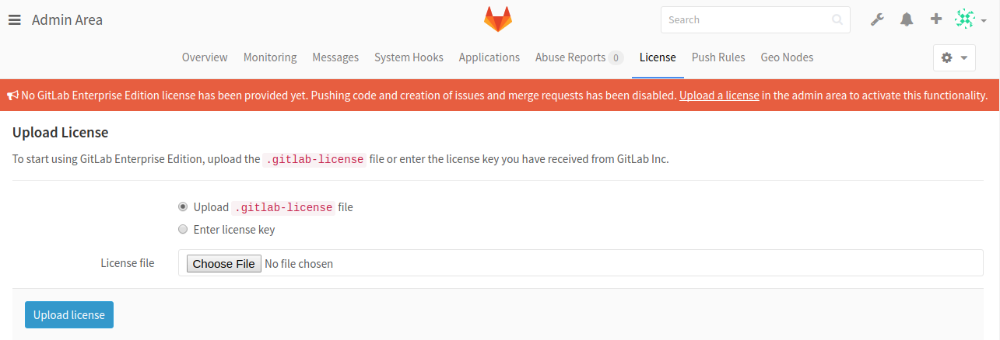
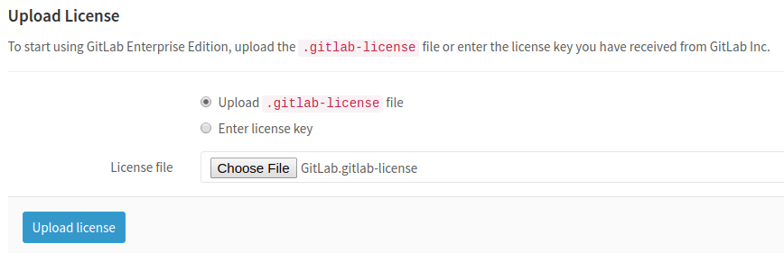
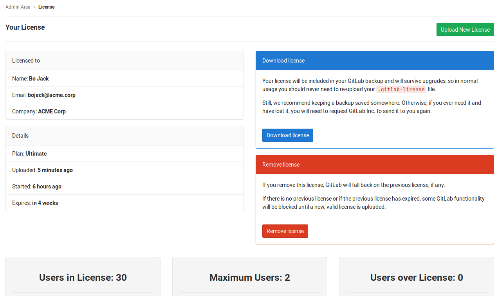

# Activate all GitLab Enterprise Edition functionality with a license **(STARTER ONLY)**

To activate all GitLab Enterprise Edition (EE) functionality, you need to upload
a license. Once you've received your license from GitLab Inc., you can upload it
by **signing into your GitLab instance as an admin** or add it at
installation time.

The license has the form of a base64 encoded ASCII text with a `.gitlab-license`
extension and can be obtained when you [purchase one][pricing] or when you sign
up for a [free trial].

NOTE: **Note:**
As of GitLab Enterprise Edition 9.4.0, a newly-installed instance without an
uploaded license will only have the Core features active. A trial license will
activate all Ultimate features, but after
[the trial expires](#what-happens-when-your-license-expires), some functionality
will be locked.

## Uploading your license

The very first time you visit your GitLab EE installation signed in as an admin,
you should see a note urging you to upload a license with a link that takes you
straight to **Admin Area > License**.

Otherwise, you can:

1. Navigate manually to the **Admin Area** by clicking the wrench icon in the menu bar.

   

1. And then going to the **License** tab and click on **Upload New License**.

   

1. If you've received a `.gitlab-license` file, you should have already downloaded
   it in your local machine. You can then upload it directly by choosing the
   license file and clicking the **Upload license** button. In the image below,
   you can see that the selected license file is named `GitLab.gitlab-license`.

   

   If you've received your license as plain text, you need to select the
   "Enter license key" option, copy the license, paste it into the "License key"
   field and click **Upload license**.

## Add your license at install time

A license can be automatically imported at install time, by placing a file named
`Gitlab.gitlab-license` in `/etc/gitlab/` for Omnibus, or `config/` for source installations.

It is also possible to specify a custom location and filename for the license.

Source installations should set the `GITLAB_LICENSE_FILE` environment
variable with the path to a valid GitLab Enterprise Edition license.

```sh
export GITLAB_LICENSE_FILE="/path/to/license/file"
```

Omnibus installations should add this entry to `gitlab.rb`:

```ruby
gitlab_rails['license_file'] = "/path/to/license/file"
```

CAUTION: **Caution:**
These methods will only add a license at the time of installation. Use the
Admin Area in the web ui to renew or upgrade licenses.

---

Once the license is uploaded, all GitLab Enterprise Edition functionality
will be active until the end of the license period. When that period ends, the
instance will [fall back](#what-happens-when-your-license-expires) to Core-only
functionality.

You can review the license details at any time in the License section of the
Admin Area.



## Notification before the license expires

One month before the license expires, a message informing when the expiration
is due to, will start appearing to GitLab admins. Make sure that you update your
license, otherwise you will miss all the paid features if it expires.

## What happens when your license expires

In case your license expires, GitLab will lock down some features like Git pushes,
issue creation, etc., and a message to inform of the expired license will be
presented to all admins.

In order to get back all the previous functionality, a new license must be uploaded.
To fall back to having only the Core features active, you'll need to delete the
expired license(s).

## License history

It's possible to upload and view more than one license,
but only the latest license will be used as the active license.

[free trial]: https://about.gitlab.com/free-trial/
[pricing]: https://about.gitlab.com/pricing/

<!-- ## Troubleshooting

Include any troubleshooting steps that you can foresee. If you know beforehand what issues
one might have when setting this up, or when something is changed, or on upgrading, it's
important to describe those, too. Think of things that may go wrong and include them here.
This is important to minimize requests for support, and to avoid doc comments with
questions that you know someone might ask.

Each scenario can be a third-level heading, e.g. `### Getting error message X`.
If you have none to add when creating a doc, leave this section in place
but commented out to help encourage others to add to it in the future. -->
