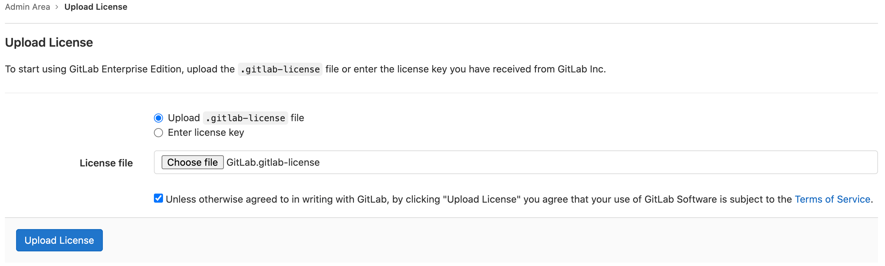

# Activating GitLab EE

To enable features of GitLab Enterprise Edition (EE), you need to activate your instance. Ensure you are running an enterprise edition. To verify, sign in to GitLab and browse to `/help`. The GitLab edition and version are listed at the top of the **Help** page.

If you are running GitLab Community Edition (CE), upgrade your installation to GitLab Enterprise Edition (EE). For more details, see [Upgrading between editions](../../update/index.md#upgrading-between-editions). If you have questions or need assistance upgrading from GitLab CE to EE please [contact GitLab Support](https://about.gitlab.com/support/#contact-support).

As of GitLab Enterprise Edition 9.4.0, a newly-installed instance without an
uploaded license only has the Free features active. A trial license activates all Ultimate features, but after [the trial expires](#what-happens-when-your-license-expires), some functionality
is locked.

## Activate GitLab EE with an Activation Code **(PREMIUM SELF)**

As of GitLab Enterprise Edition 14.0, you need an activation code to activate your instance. You can obtain an activation code by [purchasing a license](https://about.gitlab.com/pricing/) or by signing up for a [free trial](https://about.gitlab.com/free-trial/). This activation code is a 24-character alphanumeric string you receive in a confirmation email. You can also sign in to the [Customers Portal](https://customers.gitlab.com/customers/sign_in) to copy the activation code to your clipboard.

To begin the activation process with your activation code:

1. Sign in to your GitLab self-managed instance.
1. From the top menu, select the Admin Area **{admin}**.
1. From the left sidebar, select **Subscriptions**.
1. Paste the activation code onto the input field.
1. Read and accept the terms of service.
1. Select **Activate**.

## Activate GitLab EE with a License File **(PREMIUM SELF)**

If you receive a license file from GitLab (for example a new trial), you can upload it by signing into your GitLab instance as an admin or adding it during installation. The license is a base64-encoded ASCII text file with a `.gitlab-license` extension. 

## Uploading your license

The first time you visit your GitLab EE installation signed in as an administrator,
you should see a note urging you to upload a license with a link that takes you
to the **License** area.

Otherwise, to manually go to the **License** area:

1. On the top bar, select **Menu >** **{admin}** **Admin**.

1. On the left sidebar, select **License**, and select **Upload New License**.

   - *If you've received a `.gitlab-license` file:*
     1. Download the license file to your local machine.
     1. Select **Upload `.gitlab-license` file**.
     1. Select **Choose file** and select the license file.
        In this example the license file is named `GitLab.gitlab-license`.
     1. Select the **Terms of Service** checkbox.
     1. Select **Upload License**.

     

   - *If you've received your license as plain text:*
     1. Select **Enter license key**.
     1. Copy the license and paste it into the **License key** field.
     1. Select the **Terms of Service** checkbox.
     1. Select **Upload License**.

## Add your license at install time

A license can be automatically imported at install time by placing a file named
`Gitlab.gitlab-license` in `/etc/gitlab/` for Omnibus GitLab, or `config/` for source installations.

You can also specify a custom location and filename for the license:

- Source installations should set the `GITLAB_LICENSE_FILE` environment
  variable with the path to a valid GitLab Enterprise Edition license.

  ```shell
  export GITLAB_LICENSE_FILE="/path/to/license/file"
  ```

- Omnibus GitLab installations should add this entry to `gitlab.rb`:

  ```ruby
  gitlab_rails['initial_license_file'] = "/path/to/license/file"
  ```

WARNING:
These methods only add a license at the time of installation. Use the
**{admin}** **Admin Area** in the web user interface to renew or upgrade licenses.

---

After the license is uploaded, all GitLab Enterprise Edition functionality
is active until the end of the license period. When that period ends, the
instance will [fall back](#what-happens-when-your-license-expires) to Free-only
functionality.

You can review the license details at any time by going to **Admin Area > License**.

## Notification before the license expires

One month before the license expires, a message informing about the expiration
date is displayed to GitLab administrators. Make sure that you update your
license, otherwise you miss all the paid features if your license expires.

## What happens when your license expires

When your license expires, GitLab locks down features, like Git pushes
and issue creation. Then, your instance becomes read-only and
an expiration message is displayed to all administrators.

For GitLab self-managed instances, you have a 14-day grace period
before this occurs.

- To resume functionality, upload a new license.
- To fall back to Free features, delete all expired licenses.

### Remove a license

To remove a license from a self-managed instance:

1. On the top bar, select **Menu >** **{admin}** **Admin** to go to the [Admin Area](index.md).
1. On the left sidebar, select **License**.
1. Select **Remove license**.

These steps may need to be repeated to completely remove all licenses, including those applied in the past.

## License history

You can upload and view more than one license, but only the latest license in the current date
range is used as the active license. When you upload a future-dated license, it
doesn't take effect until its applicable date.

NOTE:
In GitLab 13.6 and earlier, a notification banner about an expiring license may continue to be displayed even after a new license has been uploaded.
This happens when the newly uploaded license's start date is in the future and the expiring one is still active.
The banner disappears after the new license becomes active.

## Troubleshooting

### There is no License tab in the Admin Area

If you originally installed Community Edition rather than Enterprise Edition you must
[upgrade to Enterprise Edition](../../update/index.md#community-to-enterprise-edition)
before uploading your license.

GitLab.com users can't upload and use a self-managed license. If you
want to use paid features on GitLab.com, you can
[purchase a separate subscription](../../subscriptions/gitlab_com/index.md).

### Users exceed license limit upon renewal

If you've added new users to your GitLab instance prior to renewal, you may need to
purchase additional seats to cover those users. If this is the case, and a license
without enough users is uploaded, GitLab displays a message prompting you to purchase
additional users. More information on how to determine the required number of users
and how to add additional seats can be found in the
[licensing FAQ](https://about.gitlab.com/pricing/licensing-faq/).

### There is a connectivity issue

In GitLab 14.0 and later, to activate your subscription, your GitLab instance must be connected to the internet. If you have questions or need assistance activating your instance please [contact GitLab Support](https://about.gitlab.com/support/#contact-support).
