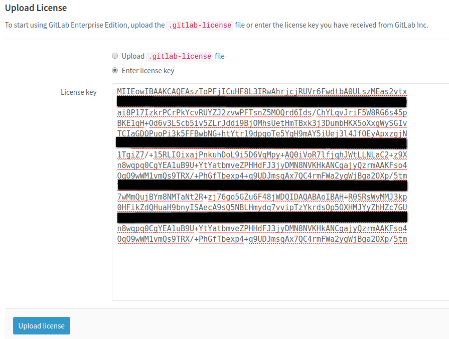
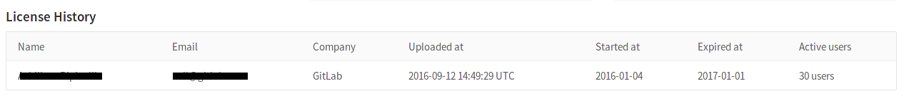
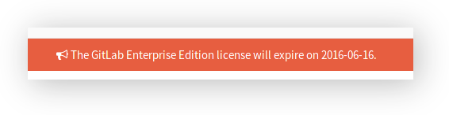

# Activate all GitLab Enterprise Edition functionality with a license

To activate all GitLab Enterprise Edition (EE) functionality, you need to upload
a license. Once you've received your license from GitLab Inc., you can upload it
by **signing into your GitLab instance as an admin**.

The license has the form of a base64 encoded ASCII text with a `.gitlab-license`
extension and can be obtained when you [purchase one][pricing] or when you sign
up for a [free trial].

> **Note:** As of GitLab Enterprise Edition 9.4.0, a new instance without a valid license
will only have Core features active. A trial license will activate all Ultimate features,
but the instance will fall back to Core only functionality after the trial expires.

## Uploading your license

The very first time you visit your GitLab EE installation, you should see a
notice urging you to upload a license with a link that takes you straight to the
License admin area.

Otherwise, you can:

1. Navigate manually to the **Admin Area** by clicking the wrench icon in the menu bar.

    

1. And then going to the **License** tab and click on **Upload New License**.

    

---

If you've received a `.gitlab-license` file, you should have already downloaded
it in your local machine. You can then upload it directly by choosing the
license file and clicking the **Upload license** button. In the image below,
you can see that the selected license file is named `GitLab.gitlab-license`.

---

If you've received your license as plain text, you need to select the
"Enter license key" option, copy the license, paste it into the "License key"
field and click **Upload license**.

Once you've uploaded your license, all GitLab Enterprise Edition functionality
will be active until the end of the license period.
You can review the license details at any time in the License section of the
Admin Area.

## License history

It's possible to upload more than one license, but only the last one will be
taken into account.

You can see your previous licenses' history at the bottom of the License page.

## Notification before the license expires

One month before the license expires, a message informing when the expiration
is due to will be shown to GitLab admins. Make sure that you update your license
beforehand otherwise you will miss important features if it expires.

## What happens when your license expires

In case your license expires, you will not be able to push any commits to
GitLab and creation of new issues and merge requests will be disabled.

A message to inform of the locked state of GitLab will be presented to all
users and admins will be able to see a link to upload a license.

[free trial]: https://about.gitlab.com/free-trial/
[pricing]: https://about.gitlab.com/pricing/
