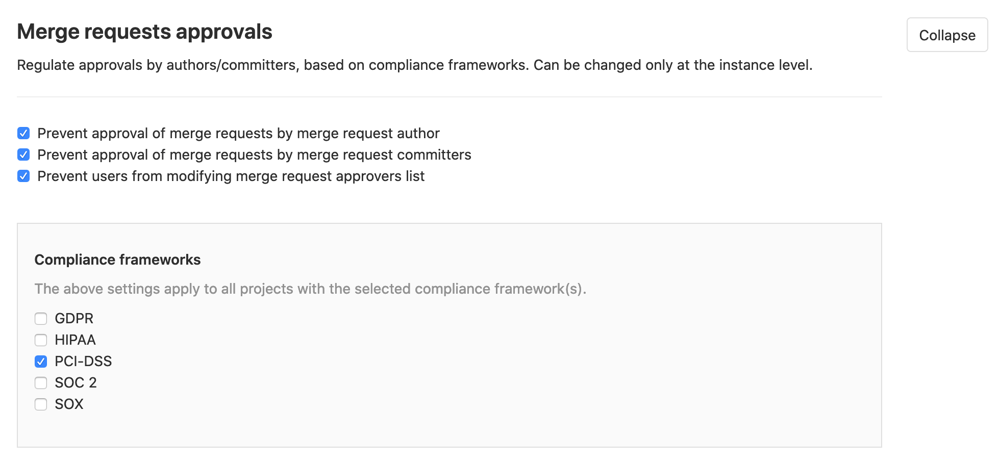
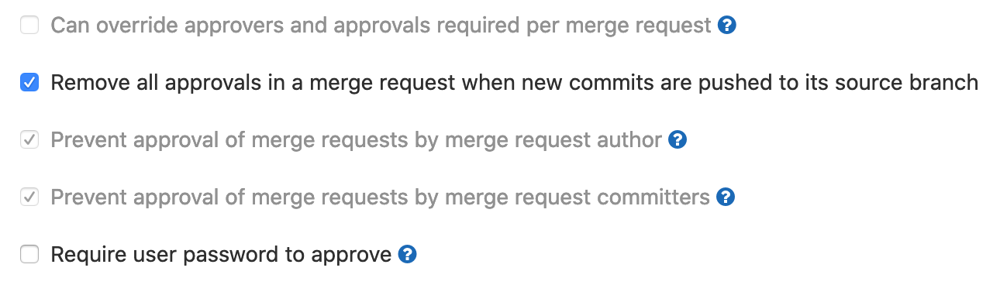

# Instance-level merge request approval rules **(PREMIUM ONLY)**

> Introduced in [GitLab Premium](https://gitlab.com/gitlab-org/gitlab/-/issues/39060) 12.8.

Merge request approvals rules prevent users overriding certain settings on a project
level. When configured, only administrators can change these settings on a project level
if they are enabled at an instance level.

To enable merge request approval rules for an instance:

1. Navigate to **{admin}** **Admin Area >** **{push-rules}** **Push Rules** and expand **Merge
   requests approvals**.
1. Set the required rule.
1. Click **Save changes**.

GitLab administrators can later override these settings in a project’s settings.

## Available rules

Merge request approval rules that can be set at an instance level are:

- **Prevent approval of merge requests by merge request author**. Prevents project
  maintainers from allowing request authors to merge their own merge requests.
- **Prevent approval of merge requests by merge request committers**. Prevents project
  maintainers from allowing users to approve merge requests if they have submitted
  any commits to the source branch.
- **Prevent users from modifying merge request approvers list**. Prevents project
  maintainers from allowing users to modify the approvers list in project settings
  or in individual merge requests.

## Scope rules to compliance-labeled projects

> Introduced in [GitLab Premium](https://gitlab.com/groups/gitlab-org/-/epics/3432) 13.1.

Merge request approval rules can be further scoped to specific compliance frameworks.

When the compliance framework label is selected and the project is assigned the compliance
label, the instance-level MR approval settings will take effect and
[project-level settings](../project/merge_requests/merge_request_approvals.md#adding--editing-a-default-approval-rule)
is locked for modification.

When the compliance framework label is not selected or the project is not assigned the
compliance label, the project-level MR approval settings will take effect and the users with
Maintainer role and above can modify these.

| Instance-level | Project-level |
| -------------- | ------------- |
|  |  |

### Enabling the feature

This feature comes with two feature flags which are disabled by default.

- The configuration in Admin area is controlled via `admin_merge_request_approval_settings`
- The application of these rules is controlled via `project_merge_request_approval_settings`

These feature flags can be managed by feature flag [API endpoint](../../api/features.md#set-or-create-a-feature) or
by [GitLab administrators with access to the GitLab Rails console](../../administration/feature_flags.md) with the following commands:

```ruby
Feature.enable(:admin_merge_request_approval_settings)
Feature.enable(:project_merge_request_approval_settings)
```
