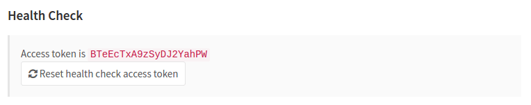

# Health Check **(CORE ONLY)**

> - Liveness and readiness probes were [introduced][ce-10416] in GitLab 9.1.
> - The `health_check` endpoint was [introduced][ce-3888] in GitLab 8.8 and was
>   deprecated in GitLab 9.1.
> - [Access token](#access-token-deprecated) has been deprecated in GitLab 9.4
>   in favor of [IP whitelist](#ip-whitelist).

GitLab provides liveness and readiness probes to indicate service health and
reachability to required services. These probes report on the status of the
database connection, Redis connection, and access to the filesystem. These
endpoints [can be provided to schedulers like Kubernetes](https://kubernetes.io/docs/tasks/configure-pod-container/configure-liveness-readiness-startup-probes/) to hold
traffic until the system is ready or restart the container as needed.

## IP whitelist

To access monitoring resources, the requesting client IP needs to be included in a whitelist.
For details, see [how to add IPs to a whitelist for the monitoring endpoints](../../../administration/monitoring/ip_whitelist.md).

## Using the endpoints locally

With default whitelist settings, the probes can be accessed from localhost using the following URLs:

```text
GET http://localhost/-/health
```

```text
GET http://localhost/-/readiness
```

```text
GET http://localhost/-/liveness
```

## Health

Checks whether the application server is running.
It does not verify the database or other services
are running. This endpoint circumvents Rails Controllers
and is implemented as additional middleware `BasicHealthCheck`
very early into the request processing lifecycle.

```text
GET /-/health
```

Example request:

```sh
curl 'https://gitlab.example.com/-/health'
```

Example response:

```text
GitLab OK
```

## Readiness

The readiness probe checks whether the GitLab instance is ready
to accept traffic via Rails Controllers. The check by default
does validate only instance-checks.

If the `all=1` parameter is specified, the check will also validate
the dependent services (Database, Redis, Gitaly etc.)
and gives a status for each.

```text
GET /-/readiness
GET /-/readiness?all=1
```

Example request:

```sh
curl 'https://gitlab.example.com/-/readiness'
```

Example response:

```json
{
   "master_check":[{
      "status":"failed",
      "message": "unexpected Master check result: false"
   }],
   ...
}
```

On failure, the endpoint will return a `503` HTTP status code.

This check does hit the database and Redis if authenticated via `token`.

This check is being exempt from Rack Attack.

## Liveness

DANGER: **Warning:**
In GitLab [12.4](https://about.gitlab.com/upcoming-releases/)
the response body of the Liveness check was changed
to match the example below.

Checks whether the application server is running.
This probe is used to know if Rails Controllers
are not deadlocked due to a multi-threading.

```text
GET /-/liveness
```

Example request:

```sh
curl 'https://gitlab.example.com/-/liveness'
```

Example response:

On success, the endpoint will return a `200` HTTP status code, and a response like below.

```json
{
   "status": "ok"
}
```

On failure, the endpoint will return a `503` HTTP status code.

This check is being exempt from Rack Attack.

## Access token (Deprecated)

> NOTE: **Note:**
> Access token has been deprecated in GitLab 9.4 in favor of [IP whitelist](#ip-whitelist).

An access token needs to be provided while accessing the probe endpoints. The current
accepted token can be found under the **Admin Area ➔ Monitoring ➔ Health check**
(`admin/health_check`) page of your GitLab instance.



The access token can be passed as a URL parameter:

```text
https://gitlab.example.com/-/readiness?token=ACCESS_TOKEN
```

<!-- ## Troubleshooting

Include any troubleshooting steps that you can foresee. If you know beforehand what issues
one might have when setting this up, or when something is changed, or on upgrading, it's
important to describe those, too. Think of things that may go wrong and include them here.
This is important to minimize requests for support, and to avoid doc comments with
questions that you know someone might ask.

Each scenario can be a third-level heading, e.g. `### Getting error message X`.
If you have none to add when creating a doc, leave this section in place
but commented out to help encourage others to add to it in the future. -->

[ce-10416]: https://gitlab.com/gitlab-org/gitlab-foss/merge_requests/10416
[ce-3888]: https://gitlab.com/gitlab-org/gitlab-foss/merge_requests/3888
[pingdom]: https://www.pingdom.com
[nagios-health]: https://nagios-plugins.org/doc/man/check_http.html
[newrelic-health]: https://docs.newrelic.com/docs/alerts/alert-policies/downtime-alerts/availability-monitoring
