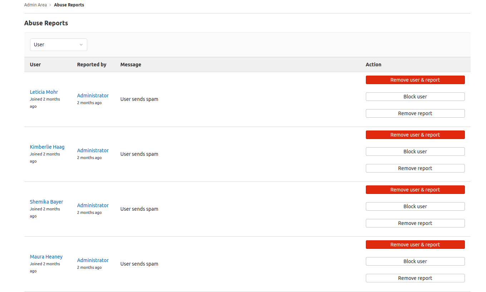
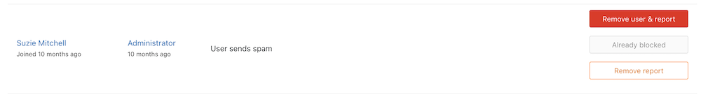

# Review abuse reports **(FREE SELF)**

View and resolve abuse reports from GitLab users.

GitLab administrators can view and [resolve](#resolving-abuse-reports) abuse
reports in the Admin Area.

## Receiving notifications of abuse reports

To receive notifications of new abuse reports by email, follow these steps:

1. On the top bar, select **Menu >** **{admin}** **Admin**.
1. On the left sidebar, select **Settings > Reporting**.
1. Expand the **Abuse reports** section.
1. Provide an email address.

The notification email address can also be set and retrieved
[using the API](../../api/settings.md#list-of-settings-that-can-be-accessed-via-api-calls).

## Reporting abuse

To find out more about reporting abuse, see [abuse reports user
documentation](../report_abuse.md).

## Resolving abuse reports

To access abuse reports:

1. On the top bar, select **Menu >** **{admin}** **Admin**.
1. On the left sidebar, select **Abuse Reports**.

There are 3 ways to resolve an abuse report, with a button for each method:

- Remove user & report. This:
  - [Deletes the reported user](../profile/account/delete_account.md) from the
    instance.
  - Removes the abuse report from the list.
- [Block user](#blocking-users).
- Remove report. This:
  - Removes the abuse report from the list.
  - Removes access restrictions for the reported user.

The following is an example of the **Abuse Reports** page:



### Blocking users

A blocked user cannot log in or access any repositories, but all of their data
remains.

Blocking a user:

- Leaves them in the abuse report list.
- Changes the **Block user** button to a disabled **Already blocked** button.

The user is notified with the following message:

```plaintext
Your account has been blocked. If you believe this is in error, contact a staff member.
```

After blocking, you can still either:

- Remove the user and report if necessary.
- Remove the report.

The following is an example of a blocked user listed on the **Abuse Reports**
page:



NOTE:
Users can be [blocked](../../api/users.md#block-user) and
[unblocked](../../api/users.md#unblock-user) using the GitLab API.

<!-- ## Troubleshooting

Include any troubleshooting steps that you can foresee. If you know beforehand what issues
one might have when setting this up, or when something is changed, or on upgrading, it's
important to describe those, too. Think of things that may go wrong and include them here.
This is important to minimize requests for support, and to avoid doc comments with
questions that you know someone might ask.

Each scenario can be a third-level heading, e.g. `### Getting error message X`.
If you have none to add when creating a doc, leave this section in place
but commented out to help encourage others to add to it in the future. -->
