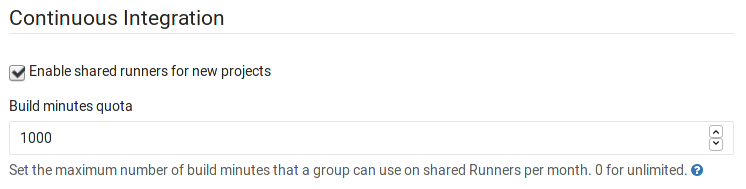
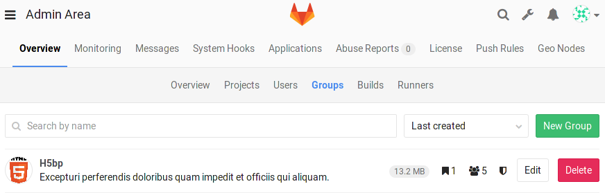
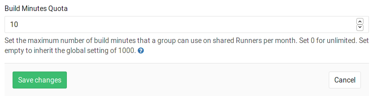
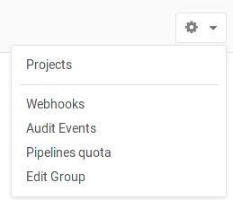

# Continuous integration Admin settings

## Maximum artifacts size

The maximum size of the [job artifacts][art-yml] can be set in the Admin area
of your GitLab instance. The value is in *MB* and the default is 100MB. Note
that this setting is set for each job.

1. Go to the **Admin area ➔ Settings** (`/admin/application_settings`).

    

1. Change the value of maximum artifacts size (in MB):

    

1. Hit **Save** for the changes to take effect.

## Default artifacts expiration

The default expiration time of the [job artifacts][art-yml] can be set in
the Admin area of your GitLab instance. The syntax of duration is described
in [artifacts:expire_in][duration-syntax]. The default is `30 days`. Note that
this setting is set for each job. Set it to 0 if you don't want default
expiration.

1. Go to **Admin area > Settings** (`/admin/application_settings`).

    

1. Change the value of default expiration time ([syntax][duration-syntax]):

    

1. Hit **Save** for the changes to take effect.

[art-yml]: ../../../administration/job_artifacts.md
[duration-syntax]: ../../../ci/yaml/README.md#artifacts-expire_in

## Shared Runners pipeline minutes quota

> [Introduced][ee-1078] in GitLab Enterprise Edition 8.16.

If you have enabled shared Runners for your GitLab instance, you can limit their
usage by setting a maximum number of pipeline minutes that a group can use on
shared Runners per month. Set 0 to grant unlimited pipeline minutes.
While build limits are stored as minutes, the counting is done in seconds.
Usage resets on the first day of each month.

1. Go to the **Admin area ➔ Settings** (`/admin/application_settings`).

    

1. Navigate to the **Continuous Integration** block and enable the Shared
   Runners setting. Then set the pipeline minutes quota limit.

    

1. Hit **Save** for the changes to take effect.

---

While the setting in the Admin area has a global effect, as an admin you can
also change each group's pipeline minutes quota to override the global value.

1. Navigate to the **Groups** admin area and hit the **Edit** button for the
   group you wish to change the pipeline minutes quota.

    

1. Set the pipeline minutes quota to the desired value and hit **Save changes** for
   the changes to take effect.

    

Once saved, you can see the build quota in the group admin view.

The quota can also be viewed in the project admin view if shared Runners
are enabled.

When the pipeline minutes quota for a group is set to a value different than 0,
the **Pipelines quota** page is available to the group page settings list.

You can see there an overview of the pipeline minutes quota of all projects of
the group.

[art-yml]: ../../../administration/job_artifacts.md
[ee-1078]: https://gitlab.com/gitlab-org/gitlab-ee/merge_requests/1078
