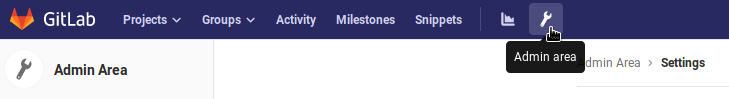
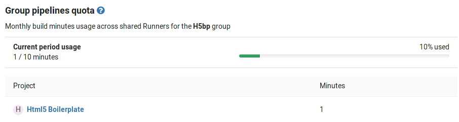
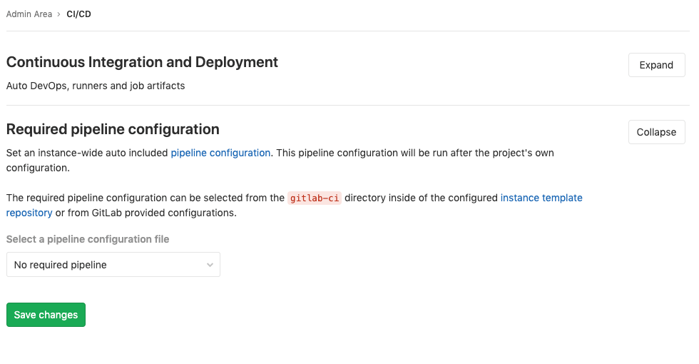

# Continuous Integration and Deployment Admin settings **(CORE ONLY)**

In this area, you will find settings for Auto DevOps, Runners and job artifacts.
You can find it in the **Admin Area > Settings > CI/CD**.

## Auto DevOps **(CORE ONLY)**

To enable (or disable) [Auto DevOps](../../../topics/autodevops/index.md)
for all projects:

1. Go to **Admin Area > Settings > CI/CD**
1. Check (or uncheck to disable) the box that says "Default to Auto DevOps pipeline for all projects"
1. Optionally, set up the [Auto DevOps base domain](../../../topics/autodevops/index.md#auto-devops-base-domain)
   which is going to be used for Auto Deploy and Auto Review Apps.
1. Hit **Save changes** for the changes to take effect.

From now on, every existing project and newly created ones that don't have a
`.gitlab-ci.yml`, will use the Auto DevOps pipelines.

If you want to disable it for a specific project, you can do so in
[its settings](../../../topics/autodevops/index.md#enablingdisabling-auto-devops).

## Maximum artifacts size **(CORE ONLY)**

The maximum size of the [job artifacts](../../../administration/job_artifacts.md)
can be set at:

- The instance level.
- [From GitLab 12.4](https://gitlab.com/gitlab-org/gitlab/issues/21688), the project and group level.

The value is:

- In *MB* and the default is 100MB per job.
- [Set to 1G](../../gitlab_com/index.md#gitlab-cicd) on GitLab.com.

To change it at the:

- Instance level:

   1. Go to **Admin Area > Settings > CI/CD**.
   1. Change the value of maximum artifacts size (in MB).
   1. Hit **Save changes** for the changes to take effect.

- [Group level](../../group/index.md#group-settings) (this will override the instance setting):

  1. Go to the group's **Settings > CI / CD > General Pipelines**.
  1. Change the value of **maximum artifacts size (in MB)**.
  1. Press **Save changes** for the changes to take effect.

- [Project level](../../project/pipelines/settings.md) (this will override the instance and group settings):

  1. Go to the project's **Settings > CI / CD > General Pipelines**.
  1. Change the value of **maximum artifacts size (in MB)**.
  1. Press **Save changes** for the changes to take effect.

NOTE: **Note**
The setting at all levels is only available to GitLab administrators.

## Default artifacts expiration **(CORE ONLY)**

The default expiration time of the [job artifacts](../../../administration/job_artifacts.md)
can be set in the Admin Area of your GitLab instance. The syntax of duration is
described in [`artifacts:expire_in`](../../../ci/yaml/README.md#artifactsexpire_in)
and the default value is `30 days`. On GitLab.com they
[never expire](../../gitlab_com/index.md#gitlab-cicd).

1. Go to **Admin Area > Settings > CI/CD**.
1. Change the value of default expiration time.
1. Hit **Save changes** for the changes to take effect.

This setting is set per job and can be overridden in
[`.gitlab-ci.yml`](../../../ci/yaml/README.md#artifactsexpire_in).
To disable the expiration, set it to `0`. The default unit is in seconds.

NOTE: **Note**
Any changes to this setting will apply to new artifacts only. The expiration time will not
be updated for artifacts created before this setting was changed.
The administrator may need to manually search for and expire previously-created
artifacts, as described in the [troubleshooting documentation](../../../administration/troubleshooting/gitlab_rails_cheat_sheet.md#remove-artifacts-more-than-a-week-old).

## Shared Runners pipeline minutes quota **(STARTER ONLY)**

> [Introduced](https://gitlab.com/gitlab-org/gitlab/merge_requests/1078)
in GitLab Starter 8.16.

If you have enabled shared Runners for your GitLab instance, you can limit their
usage by setting a maximum number of pipeline minutes that a group can use on
shared Runners per month. Setting this to `0` (default value) will grant
unlimited pipeline minutes. While build limits are stored as minutes, the
counting is done in seconds. Usage resets on the first day of each month.
On GitLab.com, the quota is calculated based on your
[subscription plan](https://about.gitlab.com/pricing/#gitlab-com).

To change the pipelines minutes quota:

1. Go to **Admin Area > Settings > CI/CD**
1. Set the pipeline minutes quota limit.
1. Hit **Save changes** for the changes to take effect

---

While the setting in the Admin Area has a global effect, as an admin you can
also change each group's pipeline minutes quota to override the global value.

1. Navigate to the **Admin Area > Overview > Groups** and hit the **Edit**
   button for the group you wish to change the pipeline minutes quota.
1. Set the pipeline minutes quota to the desired value
1. Hit **Save changes** for the changes to take effect.

Once saved, you can see the build quota in the group admin view.
The quota can also be viewed in the project admin view if shared Runners
are enabled.

You can see an overview of the pipeline minutes quota of all projects of
a group in the **Usage Quotas** page available to the group page settings list.

## Archive jobs **(CORE ONLY)**

Archiving jobs is useful for reducing the CI/CD footprint on the system by
removing some of the capabilities of the jobs (metadata needed to run the job),
but persisting the traces and artifacts for auditing purposes.

To set the duration for which the jobs will be considered as old and expired:

1. Go to **Admin Area > Settings > CI/CD**.
1. Expand the **Continuous Integration and Deployment** section.
1. Set the value of **Archive jobs**.
1. Hit **Save changes** for the changes to take effect.

Once that time passes, the jobs will be archived and no longer able to be
retried. Make it empty to never expire jobs. It has to be no less than 1 day,
for example: <code>15 days</code>, <code>1 month</code>, <code>2 years</code>.

## Default CI configuration path

> [Introduced](https://gitlab.com/gitlab-org/gitlab/merge_requests/18073) in GitLab 12.5.

The default CI configuration file path for new projects can be set in the Admin
Area of your GitLab instance (`.gitlab-ci.yml` if not set):

1. Go to **Admin Area > Settings > CI/CD**.
1. Input the new path in the **Default CI configuration path** field.
1. Hit **Save changes** for the changes to take effect.

It is also possible to specify a [custom CI configuration path for a specific project](../../project/pipelines/settings.md#custom-ci-configuration-path).

<!-- ## Troubleshooting

Include any troubleshooting steps that you can foresee. If you know beforehand what issues
one might have when setting this up, or when something is changed, or on upgrading, it's
important to describe those, too. Think of things that may go wrong and include them here.
This is important to minimize requests for support, and to avoid doc comments with
questions that you know someone might ask.

Each scenario can be a third-level heading, e.g. `### Getting error message X`.
If you have none to add when creating a doc, leave this section in place
but commented out to help encourage others to add to it in the future. -->

## Required pipeline configuration **(PREMIUM ONLY)**

CAUTION: **Caution:**
This feature is being re-evaluated in favor of a different
[compliance solution](https://gitlab.com/gitlab-org/gitlab/issues/34830).
We recommend that users who haven't yet implemented this feature wait for
the new solution.

GitLab administrators can force a pipeline configuration to run on every
pipeline.

The configuration applies to all pipelines for a GitLab instance and is
sourced from:

- The [instance template repository](instance_template_repository.md).
- GitLab-supplied configuration.

To set required pipeline configuration:

1. Go to **Admin Area > Settings > CI/CD**.
1. Expand the **Required pipeline configuration** section.
1. Select the required configuration from the provided dropdown.
1. Click **Save changes**.

