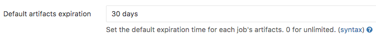

# Continuous integration Admin settings

## Maximum artifacts size

The maximum size of the [job artifacts][art-yml] can be set in the Admin area
of your GitLab instance. The value is in *MB* and the default is 100MB. Note
that this setting is set for each job.

1. Go to **Admin area > Settings** (`/admin/application_settings`).

    

1. Change the value of maximum artifacts size (in MB):

    

1. Hit **Save** for the changes to take effect.

## Default artifacts expiration

The default expiration time of the [job artifacts][art-yml] can be set in
the Admin area of your GitLab instance. The syntax of duration is described
in [artifacts:expire_in][duration-syntax]. The default is `30 days`. Note that
this setting is set for each job. Set it to `0` if you don't want default
expiration. The default unit is in seconds.

1. Go to **Admin area > Settings** (`/admin/application_settings`).

    

1. Change the value of default expiration time ([syntax][duration-syntax]):

    

1. Hit **Save** for the changes to take effect.

[art-yml]: ../../../administration/job_artifacts.md
[duration-syntax]: ../../../ci/yaml/README.md#artifactsexpire_in
