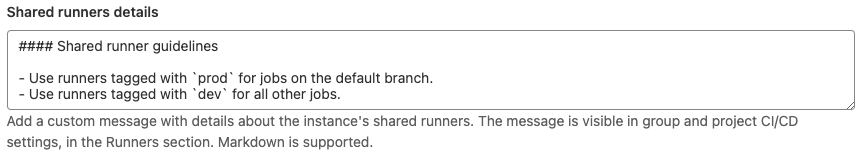
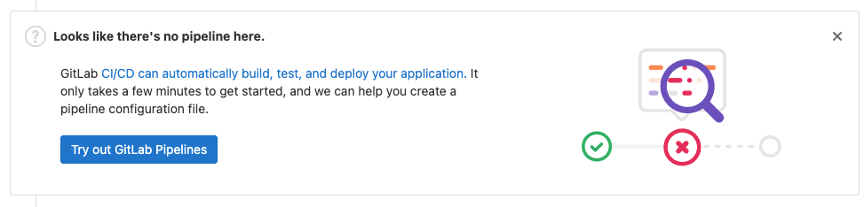

# Continuous Integration and Deployment Admin Area settings **(FREE SELF)**

The [Admin Area](index.md) has the instance settings for Auto DevOps, runners, and
job artifacts.

## Auto DevOps

To enable (or disable) [Auto DevOps](../../../topics/autodevops/index.md)
for all projects:

1. On the top bar, select **Main menu > Admin**.
1. On the left sidebar, select **Settings > CI/CD**.
1. Check (or uncheck to disable) the box that says **Default to Auto DevOps pipeline for all projects**.
1. Optionally, set up the [Auto DevOps base domain](../../../topics/autodevops/requirements.md#auto-devops-base-domain)
   which is used for Auto Deploy and Auto Review Apps.
1. Select **Save changes** for the changes to take effect.

From now on, every existing project and newly created ones that don't have a
`.gitlab-ci.yml` use the Auto DevOps pipelines.

If you want to disable it for a specific project, you can do so in
[its settings](../../../topics/autodevops/index.md#enable-or-disable-auto-devops).

## Enable shared runners for new projects

You can set all new projects to have the instance's shared runners available by default.

1. On the top bar, select **Main menu > Admin**.
1. On the left sidebar, select **Settings > CI/CD**.
1. Expand **Continuous Integration and Deployment**.
1. Select the **Enable shared runners for new projects** checkbox.

Any time a new project is created, the shared runners are available.

## Shared runners CI/CD minutes

As an administrator you can set either a global or namespace-specific
limit on the number of [CI/CD minutes](../../../ci/pipelines/cicd_minutes.md) you can use.

## Enable a project runner for multiple projects

If you have already registered a [project runner](../../../ci/runners/runners_scope.md#project-runners)
you can assign that runner to other projects.

To enable a project runner for more than one project:

1. On the top bar, select **Main menu > Admin**.
1. From the left sidebar, select **CI/CD > Runners**.
1. Select the runner you want to edit.
1. In the upper-right corner, select **Edit** (**{pencil}**).
1. Under **Restrict projects for this runner**, search for a project.
1. To the left of the project, select **Enable**.
1. Repeat this process for each additional project.

## Add a message for shared runners

To display details about the instance's shared runners in all projects'
runner settings:

1. On the top bar, select **Main menu > Admin**.
1. On the left sidebar, select **Settings > CI/CD**.
1. Expand **Continuous Integration and Deployment**.
1. Enter text, including Markdown if you want, in the **Shared runner details** field. For example:

   

To view the rendered details:

1. On the top bar, select **Main menu**, and:
   - For a project, select **Projects** and find your project.
   - For a group, select **Groups** and find your group.
1. On the left sidebar, select **Settings > CI/CD**.
1. Expand **Runners**.


## Maximum artifacts size

The maximum size of the [job artifacts](../../../administration/job_artifacts.md)
can be set at:

- The instance level.
- [From GitLab 12.4](https://gitlab.com/gitlab-org/gitlab/-/issues/21688), the project and group level.

For the setting on GitLab.com, see [Artifacts maximum size](../../gitlab_com/index.md#gitlab-cicd).

The value is in MB and the default is 100 MB per job. To change it at the:

- Instance level:

  1. On the top bar, select **Main menu > Admin**.
  1. On the left sidebar, select **Settings > CI/CD > Continuous Integration and Deployment**.
  1. Change the value of **Maximum artifacts size (MB)**.
  1. Select **Save changes** for the changes to take effect.

- Group level (this overrides the instance setting):

  1. Go to the group's **Settings > CI/CD > General Pipelines**.
  1. Change the value of **Maximum artifacts size** (in MB).
  1. Select **Save changes** for the changes to take effect.

- Project level (this overrides the instance and group settings):

  1. Go to the project's **Settings > CI/CD > General Pipelines**.
  1. Change the value of **maximum artifacts size** (in MB).
  1. Select **Save changes** for the changes to take effect.

NOTE:
The setting at all levels is only available to GitLab administrators.

## Default artifacts expiration

The default expiration time of the [job artifacts](../../../administration/job_artifacts.md)
can be set in the Admin Area of your GitLab instance. The syntax of duration is
described in [`artifacts:expire_in`](../../../ci/yaml/index.md#artifactsexpire_in)
and the default value is `30 days`.

1. On the top bar, select **Main menu > Admin**.
1. On the left sidebar, select **Settings > CI/CD**.
1. Change the value of default expiration time.
1. Select **Save changes** for the changes to take effect.

This setting is set per job and can be overridden in
[`.gitlab-ci.yml`](../../../ci/yaml/index.md#artifactsexpire_in).
To disable the expiration, set it to `0`. The default unit is in seconds.

NOTE:
Any changes to this setting applies to new artifacts only. The expiration time is not
be updated for artifacts created before this setting was changed.
The administrator may need to manually search for and expire previously-created
artifacts, as described in the [troubleshooting documentation](../../../administration/job_artifacts.md#delete-job-artifacts-from-jobs-completed-before-a-specific-date).

## Keep the latest artifacts for all jobs in the latest successful pipelines

> [Introduced](https://gitlab.com/gitlab-org/gitlab/-/merge_requests/50889) in GitLab 13.9.

When enabled (default), the artifacts of the most recent pipeline for each Git ref
([branches and tags](https://git-scm.com/book/en/v2/Git-Internals-Git-References))
are locked against deletion and kept regardless of the expiry time.

When disabled, the latest artifacts for any **new** successful or fixed pipelines
are allowed to expire.

This setting takes precedence over the [project level setting](../../../ci/jobs/job_artifacts.md#keep-artifacts-from-most-recent-successful-jobs).
If disabled at the instance level, you cannot enable this per-project.

To disable the setting:

1. On the top bar, select **Main menu > Admin**.
1. On the left sidebar, select **Settings > CI/CD**.
1. Expand **Continuous Integration and Deployment**.
1. Clear the **Keep the latest artifacts for all jobs in the latest successful pipelines** checkbox.
1. Select **Save changes**

When you disable the feature, the latest artifacts do not immediately expire.
A new pipeline must run before the latest artifacts can expire and be deleted.

NOTE:
All application settings have a [customizable cache expiry interval](../../../administration/application_settings_cache.md) which can delay the settings affect.

## Archive jobs

Archiving jobs is useful for reducing the CI/CD footprint on the system by removing some
of the capabilities of the jobs (metadata stored in the database needed to run the job),
but persisting the traces and artifacts for auditing purposes.

To set the duration for which the jobs are considered as old and expired:

1. On the top bar, select **Main menu > Admin**.
1. On the left sidebar, select **Settings > CI/CD**.
1. Expand the **Continuous Integration and Deployment** section.
1. Set the value of **Archive jobs**.
1. Select **Save changes** for the changes to take effect.

After that time passes, the jobs are archived in the background and no longer able to be
retried. Make it empty to never expire jobs. It has to be no less than 1 day,
for example: <code>15 days</code>, <code>1 month</code>, <code>2 years</code>.

For the value set for GitLab.com, see [Scheduled job archiving](../../gitlab_com/index.md#gitlab-cicd).

## Protect CI/CD variables by default

To set all new [CI/CD variables](../../../ci/variables/index.md) as
[protected](../../../ci/variables/index.md#protect-a-cicd-variable) by default:

1. On the top bar, select **Main menu > Admin**.
1. On the left sidebar, select **Settings > CI/CD**.
1. Select **Protect CI/CD variables by default**.

## Maximum includes

The maximum number of [includes](../../../ci/yaml/includes.md) per pipeline can be set at the instance level.
The default is `150`.

1. On the top bar, select **Main menu > Admin**.
1. On the left sidebar, select **Settings > CI/CD**.
1. Change the value of **Maximum includes**.
1. Select **Save changes** for the changes to take effect.

## Default CI/CD configuration file

> [Introduced](https://gitlab.com/gitlab-org/gitlab/-/merge_requests/18073) in GitLab 12.5.

The default CI/CD configuration file and path for new projects can be set in the Admin Area
of your GitLab instance (`.gitlab-ci.yml` if not set):

1. On the top bar, select **Main menu > Admin**.
1. On the left sidebar, select **Settings > CI/CD**.
1. Input the new file and path in the **Default CI/CD configuration file** field.
1. Select **Save changes** for the changes to take effect.

It is also possible to specify a [custom CI/CD configuration file for a specific project](../../../ci/pipelines/settings.md#specify-a-custom-cicd-configuration-file).

## Set CI/CD limits

> [Introduced](https://gitlab.com/gitlab-org/gitlab/-/issues/352175) in GitLab 14.10.

You can configure some [CI/CD limits](../../../administration/instance_limits.md#cicd-limits)
from the Admin Area:

1. On the top bar, select **Main menu > Admin**.
1. On the left sidebar, select **Settings > CI/CD**.
1. Expand the **Continuous Integration and Deployment** section.
1. In the **CI/CD limits** section, you can set the following limits:
   - **Maximum number of jobs in a single pipeline**
   - **Total number of jobs in currently active pipelines**
   - **Maximum number of active pipelines per project**
   - **Maximum number of pipeline subscriptions to and from a project**
   - **Maximum number of pipeline schedules**
   - **Maximum number of DAG dependencies that a job can have**
   - **Maximum number of runners registered per group**
   - **Maximum number of runners registered per project**
   - **Maximum number of downstream pipelines in a pipeline's hierarchy tree**

## Enable or disable the pipeline suggestion banner

By default, a banner displays in merge requests with no pipeline suggesting a
walkthrough on how to add one.



To enable or disable the banner:

1. On the top bar, select **Main menu > Admin**.
1. On the left sidebar, select **Settings > CI/CD**.
1. Select or clear the **Enable pipeline suggestion banner** checkbox.
1. Select **Save changes**.

## Required pipeline configuration **(ULTIMATE SELF)**

> - [Moved](https://gitlab.com/gitlab-org/gitlab/-/issues/352316) from GitLab Premium to GitLab Ultimate in 15.0.
> - [Deprecated](https://gitlab.com/gitlab-org/gitlab/-/issues/389467) in GitLab 15.9.

WARNING:
This feature was [deprecated](https://gitlab.com/gitlab-org/gitlab/-/issues/389467) in GitLab 15.9
and is planned for removal in 17.0. Use [compliance pipelines](../../group/compliance_frameworks.md#compliance-pipelines)
instead. This change is a breaking change.

You can set a [CI/CD template](../../../ci/examples/index.md#cicd-templates)
as a required pipeline configuration for all projects on a GitLab instance. You can
use a template from:

- The default CI/CD templates.
- A custom template stored in an [instance template repository](instance_template_repository.md).

  NOTE:
  When you use a configuration defined in an instance template repository,
  nested [`include:`](../../../ci/yaml/index.md#include) keywords
  (including `include:file`, `include:local`, `include:remote`, and `include:template`)
  [do not work](https://gitlab.com/gitlab-org/gitlab/-/issues/35345).

The project CI/CD configuration merges into the required pipeline configuration when
a pipeline runs. The merged configuration is the same as if the required pipeline configuration
added the project configuration with the [`include` keyword](../../../ci/yaml/index.md#include).
To view a project's full merged configuration, [View the merged YAML](../../../ci/pipeline_editor/index.md#view-expanded-configuration)
in the pipeline editor.

To select a CI/CD template for the required pipeline configuration:

1. On the top bar, select **Main menu > Admin**.
1. On the left sidebar, select **Settings > CI/CD**.
1. Expand the **Required pipeline configuration** section.
1. Select a CI/CD template from the dropdown list.
1. Select **Save changes**.

## Package Registry configuration

### Maven Forwarding **(PREMIUM SELF)**

GitLab administrators can disable the forwarding of Maven requests to [Maven Central](https://search.maven.org/).

To disable forwarding Maven requests:

1. On the top bar, select **Menu > Admin**.
1. On the left sidebar, select **Settings > CI/CD**.
1. Expand the **Package Registry** section.
1. Clear the checkbox **Forward Maven package requests to the Maven Registry if the packages are not found in the GitLab Package Registry**.
1. Select **Save changes**.

### npm Forwarding **(PREMIUM SELF)**

GitLab administrators can disable the forwarding of npm requests to [npmjs.com](https://www.npmjs.com/).

To disable it:

1. On the top bar, select **Main menu > Admin**.
1. On the left sidebar, select **Settings > CI/CD**.
1. Expand the **Package Registry** section.
1. Clear the checkbox **Forward npm package requests to the npm Registry if the packages are not found in the GitLab Package Registry**.
1. Select **Save changes**.

### PyPI Forwarding **(PREMIUM SELF)**

GitLab administrators can disable the forwarding of PyPI requests to [pypi.org](https://pypi.org/).

To disable it:

1. On the top bar, select **Main menu > Admin**.
1. On the left sidebar, select **Settings > CI/CD**.
1. Expand the **Package Registry** section.
1. Clear the checkbox **Forward PyPI package requests to the PyPI Registry if the packages are not found in the GitLab Package Registry**.
1. Select **Save changes**.

### Package file size limits

GitLab administrators can adjust the maximum allowed file size for each package type.

To set the maximum file size:

1. On the top bar, select **Main menu > Admin**.
1. On the left sidebar, select **Settings > CI/CD**.
1. Expand the **Package Registry** section.
1. Find the package type you would like to adjust.
1. Enter the maximum file size, in bytes.
1. Select **Save size limits**.

## Restrict runner registration by all users in an instance

> - [Introduced](https://gitlab.com/gitlab-org/gitlab/-/issues/22225) in GitLab 14.1.
> - [Enabled on GitLab.com and self-managed](https://gitlab.com/gitlab-org/gitlab/-/issues/368008) in GitLab 15.5.

GitLab administrators can adjust who is allowed to register runners, by showing and hiding areas of the UI.

When the registration sections are hidden in the UI, members of the project or group must contact administrators to enable runner registration in the group or project. If you plan to prevent registration, ensure users have access to the runners they need to run jobs.

By default, all members of a project and group are able to register runners.

To restrict all users in an instance from registering runners:

1. On the top bar, select **Main menu > Admin**.
1. On the left sidebar, select **Settings > CI/CD**.
1. Expand **Runners**.
1. In the **Runner registration** section, clear the **Members of the project can register runners** and
   **Members of the group can register runners** checkboxes to remove runner registration from the UI.
1. Select **Save changes**.

NOTE:
After you disable runner registration by members of a project, the registration
token automatically rotates. The token is no longer valid and you must
use the new registration token for the project.

## Restrict runner registration by all members in a group

Prerequisites:

- Runner registration must be enabled for [all users in the instance](#restrict-runner-registration-by-all-users-in-an-instance).

GitLab administrators can adjust group permissions to restrict runner registration by group members.

To restrict runner registration by members in a specific group:

1. On the top bar, select **Main menu > Admin**.
1. On the left sidebar, select **Overview > Groups** and find your group.
1. Select **Edit**.
1. Clear the **New group runners can be registered** checkbox if you want to disable runner registration by all members in the group. If the setting is read-only, you must enable runner registration for the [instance](#restrict-runner-registration-by-all-users-in-an-instance).
1. Select **Save changes**.

## Disable runner version management

> [Introduced](https://gitlab.com/gitlab-org/gitlab/-/merge_requests/114041) in GitLab 15.10.

By default, GitLab instances periodically fetch official runner version data from GitLab.com to [determine whether the runners need upgrades](../../../ci/runners/configure_runners.md#determine-which-runners-need-to-be-upgraded).

To disable your instance fetching this data:

1. On the top bar, select **Main menu > Admin**.
1. On the left sidebar, select **Settings > CI/CD**.
1. Expand **Runners**.
1. In the **Runner version management** section, clear the **Fetch GitLab Runner release version data from GitLab.com** checkbox.
1. Select **Save changes**.

## Troubleshooting

### 413 Request Entity Too Large

When build jobs fail with the following error,
increase the [maximum artifacts size](#maximum-artifacts-size).

```plaintext
Uploading artifacts as "archive" to coordinator... too large archive <job-id> responseStatus=413 Request Entity Too Large status=413" at end of a build job on pipeline when trying to store artifacts to <object-storage>.
```
