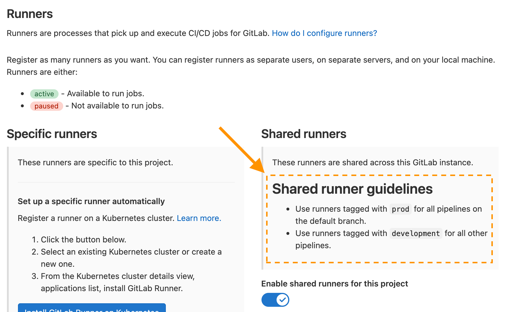
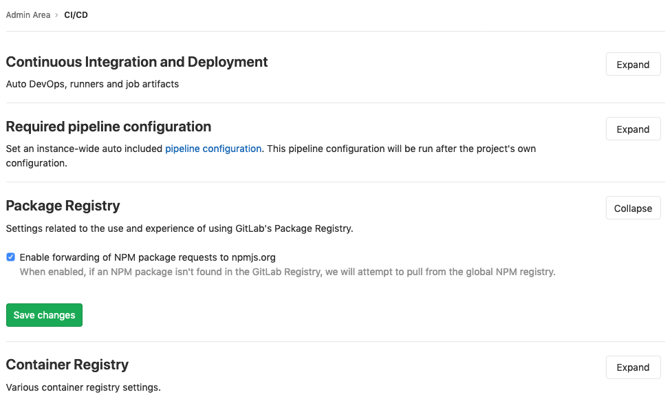

# Continuous Integration and Deployment Admin Area settings **(FREE SELF)**

The [Admin Area](index.md) has the instance settings for Auto DevOps, runners, and
job artifacts.

## Auto DevOps

To enable (or disable) [Auto DevOps](../../../topics/autodevops/index.md)
for all projects:

1. On the top bar, select **Menu >** **{admin}** **Admin**.
1. On the left sidebar, select **Settings > CI/CD**.
1. Check (or uncheck to disable) the box that says **Default to Auto DevOps pipeline for all projects**.
1. Optionally, set up the [Auto DevOps base domain](../../../topics/autodevops/index.md#auto-devops-base-domain)
   which is used for Auto Deploy and Auto Review Apps.
1. Hit **Save changes** for the changes to take effect.

From now on, every existing project and newly created ones that don't have a
`.gitlab-ci.yml`, uses the Auto DevOps pipelines.

If you want to disable it for a specific project, you can do so in
[its settings](../../../topics/autodevops/index.md#enable-or-disable-auto-devops).

## Shared runner details

To display details about the instance's shared runners in all projects'
runner settings:

1. On the top bar, select **Menu >** **{admin}** **Admin**.
1. On the left sidebar, select **Settings > CI/CD**.
1. Expand **Continuous Integration and Deployment**.
1. Enter your shared runner details in the **Shared runner details** field.

You can use [Markdown](../../markdown.md) for improved formatting. To see the rendered
details:

1. On the top bar, select **Menu > Project** and select any group or project.
1. On the left sidebar, select **Settings > CI/CD**.
1. Expand **Runners**.



## Maximum artifacts size **(FREE SELF)**

The maximum size of the [job artifacts](../../../administration/job_artifacts.md)
can be set at:

- The instance level.
- [From GitLab 12.4](https://gitlab.com/gitlab-org/gitlab/-/issues/21688), the project and group level.

The value is:

- In *MB* and the default is 100MB per job.
- [Set to 1G](../../gitlab_com/index.md#gitlab-cicd) on GitLab.com.

To change it at the:

- Instance level:

  1. On the top bar, select **Menu >** **{admin}** **Admin**.
  1. On the left sidebar, select **Settings > CI/CD**.
  1. Change the value of maximum artifacts size (in MB).
  1. Click **Save changes** for the changes to take effect.

- Group level (this overrides the instance setting):

  1. Go to the group's **Settings > CI/CD > General Pipelines**.
  1. Change the value of **maximum artifacts size (in MB)**.
  1. Click **Save changes** for the changes to take effect.

- Project level (this overrides the instance and group settings):

  1. Go to the project's **Settings > CI/CD > General Pipelines**.
  1. Change the value of **maximum artifacts size (in MB)**.
  1. Click **Save changes** for the changes to take effect.

NOTE:
The setting at all levels is only available to GitLab administrators.

## Default artifacts expiration

The default expiration time of the [job artifacts](../../../administration/job_artifacts.md)
can be set in the Admin Area of your GitLab instance. The syntax of duration is
described in [`artifacts:expire_in`](../../../ci/yaml/index.md#artifactsexpire_in)
and the default value is `30 days`.

1. On the top bar, select **Menu >** **{admin}** **Admin**.
1. On the left sidebar, select **Settings > CI/CD**.
1. Change the value of default expiration time.
1. Click **Save changes** for the changes to take effect.

This setting is set per job and can be overridden in
[`.gitlab-ci.yml`](../../../ci/yaml/index.md#artifactsexpire_in).
To disable the expiration, set it to `0`. The default unit is in seconds.

NOTE:
Any changes to this setting applies to new artifacts only. The expiration time is not
be updated for artifacts created before this setting was changed.
The administrator may need to manually search for and expire previously-created
artifacts, as described in the [troubleshooting documentation](../../../administration/troubleshooting/gitlab_rails_cheat_sheet.md#remove-artifacts-more-than-a-week-old).

## Keep the latest artifacts for all jobs in the latest successful pipelines

> [Introduced](https://gitlab.com/gitlab-org/gitlab/-/merge_requests/50889) in GitLab 13.9.

When enabled (default), the artifacts of the most recent pipeline for each Git ref
([branches and tags](https://git-scm.com/book/en/v2/Git-Internals-Git-References))
are locked against deletion and kept regardless of the expiry time.

When disabled, the latest artifacts for any **new** successful or fixed pipelines
are allowed to expire.

This setting takes precedence over the [project level setting](../../../ci/pipelines/job_artifacts.md#keep-artifacts-from-most-recent-successful-jobs).
If disabled at the instance level, you cannot enable this per-project.

To disable the setting:

1. On the top bar, select **Menu >** **{admin}** **Admin**.
1. On the left sidebar, select **Settings > CI/CD**.
1. Expand **Continuous Integration and Deployment**.
1. Clear the **Keep the latest artifacts for all jobs in the latest successful pipelines** checkbox.
1. Click **Save changes**

When you disable the feature, the latest artifacts do not immediately expire.
A new pipeline must run before the latest artifacts can expire and be deleted.

NOTE:
All application settings have a [customizable cache expiry interval](../../../administration/application_settings_cache.md) which can delay the settings affect.

## Shared runners pipeline minutes quota **(PREMIUM SELF)**

> [Moved](https://about.gitlab.com/blog/2021/01/26/new-gitlab-product-subscription-model/) to GitLab Premium in 13.9.

If you have enabled shared runners for your GitLab instance, you can limit their
usage by setting a maximum number of pipeline minutes that a group can use on
shared runners per month. Setting this to `0` (default value) grants
unlimited pipeline minutes. While build limits are stored as minutes, the
counting is done in seconds. Usage resets on the first day of each month.
On GitLab.com, the quota is calculated based on your
[subscription plan](../../../subscriptions/gitlab_com/index.md#ci-pipeline-minutes).

To change the pipelines minutes quota:

1. On the top bar, select **Menu >** **{admin}** **Admin**.
1. On the left sidebar, select **Settings > CI/CD**.
1. Expand **Continuous Integration and Deployment**.
1. In the **Pipeline minutes quota** box, enter the maximum number of minutes.
1. Click **Save changes** for the changes to take effect.

While the setting in the Admin Area has a global effect, as an administrator you can
also change each group's pipeline minutes quota to override the global value.

1. Navigate to the **Admin Area > Overview > Groups** and hit the **Edit**
   button for the group you wish to change the pipeline minutes quota.
1. In the **Pipeline Minutes Quota** box, enter the maximum number of minutes.
1. Click **Save changes** for the changes to take effect.

Once saved, you can see the build quota in the group settings.
The quota can also be viewed in the project settings if shared runners
are enabled.


You can see an overview of the pipeline minutes quota of all projects of
a group in the **Usage Quotas** page available to the group page settings list.


## Archive jobs

Archiving jobs is useful for reducing the CI/CD footprint on the system by
removing some of the capabilities of the jobs (metadata needed to run the job),
but persisting the traces and artifacts for auditing purposes.

To set the duration for which the jobs are considered as old and expired:

1. On the top bar, select **Menu >** **{admin}** **Admin**.
1. On the left sidebar, select **Settings > CI/CD**.
1. Expand the **Continuous Integration and Deployment** section.
1. Set the value of **Archive jobs**.
1. Hit **Save changes** for the changes to take effect.

After that time passes, the jobs are archived and no longer able to be
retried. Make it empty to never expire jobs. It has to be no less than 1 day,
for example: <code>15 days</code>, <code>1 month</code>, <code>2 years</code>.

As of June 22, 2020 the [value is set](../../gitlab_com/index.md#gitlab-cicd) to 3 months on GitLab.com. Jobs created before that date were archived after September 22, 2020.

## Protect CI/CD variables by default

To set all new [CI/CD variables](../../../ci/variables/index.md) as
[protected](../../../ci/variables/index.md#protect-a-cicd-variable) by default:

1. On the top bar, select **Menu >** **{admin}** **Admin**.
1. On the left sidebar, select **Settings > CI/CD**.
1. Select **Protect CI/CD variables by default**.

## Default CI/CD configuration file

> [Introduced](https://gitlab.com/gitlab-org/gitlab/-/merge_requests/18073) in GitLab 12.5.

The default CI/CD configuration file and path for new projects can be set in the Admin Area
of your GitLab instance (`.gitlab-ci.yml` if not set):

1. On the top bar, select **Menu >** **{admin}** **Admin**.
1. On the left sidebar, select **Settings > CI/CD**.
1. Input the new file and path in the **Default CI/CD configuration file** field.
1. Hit **Save changes** for the changes to take effect.

It is also possible to specify a [custom CI/CD configuration file for a specific project](../../../ci/pipelines/settings.md#custom-cicd-configuration-file).

## Required pipeline configuration **(PREMIUM SELF)**

WARNING:
This feature is being re-evaluated in favor of a different
[compliance solution](https://gitlab.com/groups/gitlab-org/-/epics/3156).
We recommend that users who haven't yet implemented this feature wait for
the new solution.

You can set a [CI/CD template](../../../ci/examples/index.md#cicd-templates)
as a required pipeline configuration for all projects on a GitLab instance. You can
use a template from:

- The default CI/CD templates.
- A custom template stored in an [instance template repository](instance_template_repository.md).

  NOTE:
  When you use a configuration defined in an instance template repository,
  nested [`include:`](../../../ci/yaml/index.md#include) keywords
  (including `include:file`, `include:local`, `include:remote`, and `include:template`)
  [do not work](https://gitlab.com/gitlab-org/gitlab/-/issues/35345).

The project CI/CD configuration merges into the required pipeline configuration when
a pipeline runs. The merged configuration is the same as if the required pipeline configuration
added the project configuration with the [`include` keyword](../../../ci/yaml/index.md#include).
To view a project's full merged configuration, [View the merged YAML](../../../ci/pipeline_editor/index.md#view-expanded-configuration)
in the pipeline editor.

To select a CI/CD template for the required pipeline configuration:

1. On the top bar, select **Menu >** **{admin}** **Admin**.
1. On the left sidebar, select **Settings > CI/CD**.
1. Expand the **Required pipeline configuration** section.
1. Select a CI/CD template from the dropdown.
1. Click **Save changes**.

## Package Registry configuration

### npm Forwarding **(PREMIUM SELF)**

GitLab administrators can disable the forwarding of npm requests to [npmjs.com](https://www.npmjs.com/).

To disable it:

1. On the top bar, select **Menu >** **{admin}** **Admin**.
1. On the left sidebar, select **Settings > CI/CD**.
1. Expand the **Package Registry** section.
1. Uncheck **Enable forwarding of npm package requests to npmjs.org**.
1. Click **Save changes**.



### Package file size limits

GitLab administrators can adjust the maximum allowed file size for each package type.

To set the maximum file size:

1. On the top bar, select **Menu >** **{admin}** **Admin**.
1. On the left sidebar, select **Settings > CI/CD**.
1. Expand the **Package Registry** section.
1. Find the package type you would like to adjust.
1. Enter the maximum file size, in bytes.
1. Click **Save size limits**.

## Runner registration

> - [Introduced](https://gitlab.com/gitlab-org/gitlab/-/issues/22225) in GitLab 14.1.
> - [Deployed behind a feature flag](../../feature_flags.md), disabled by default.
> - Disabled on GitLab.com.
> - Not recommended for production use.
> - To use in GitLab self-managed instances, ask a GitLab administrator to enable it. **(FREE SELF)**

GitLab administrators can adjust who is allowed to register runners, by showing and hiding areas of the UI.

By default, all members of a project and group are able to register runners.

To change this:

1. On the top bar, select **Menu >** **{admin}** **Admin**.
1. Go to **Settings > CI/CD**.
1. Expand the **Runner registration** section.
1. Select the desired options.
1. Click **Save changes**.

When the registration sections are hidden in the UI, members of the project or group that need to register runners must contact the administrators.

This feature is currently behind a feature flag.
To enable it:

**In Omnibus installations:**

1. Enter the Rails console:

   ```shell
   sudo gitlab-rails console
   ```

1. Flip the switch and enable the feature flag:

   ```ruby
   Feature.enable(:runner_registration_control)
   ```

## Troubleshooting

### 413 Request Entity Too Large

When build jobs fail with the following error,
increase the [maximum artifacts size](#maximum-artifacts-size).

```plaintext
Uploading artifacts as "archive" to coordinator... too large archive <job-id> responseStatus=413 Request Entity Too Large status=413" at end of a build job on pipeline when trying to store artifacts to <object-storage>.
```
