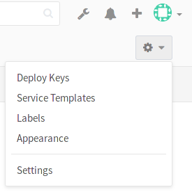
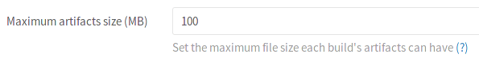

# Continuous integration Admin settings

## Maximum artifacts size

The maximum size of the [build artifacts][art-yml] can be set in the Admin area
of your GitLab instance. The value is in MB and the default is 100MB. Note that
this setting is set for each build.

1. Go to **Admin area > Settings** (`/admin/application_settings`).

    

1. Change the value of the maximum artifacts size (in MB):

    

1. Hit **Save** for the changes to take effect.

[art-yml]: ../../../administration/build_artifacts.md
