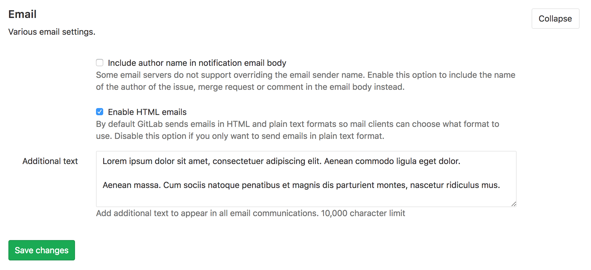

# Email

## Custom logo

The logo in the header of some emails can be customized, see the [logo customization section](../../../customization/branded_page_and_email_header.md).
<<<<<<< HEAD

## Custom additional text

>[Introduced][ee-5031] in [GitLab Premium][eep] 10.7.

The additional text will appear at the bottom of any email and can be used for
legal/auditing/compliance reasons.

1. Go to **Admin area > Settings** (`/admin/application_settings`).
1. Under the **Email** section, change the **Additional text** field.
1. Hit **Save** for the changes to take effect.

[ee-5031]: https://gitlab.com/gitlab-org/gitlab-ee/merge_requests/5031
[eep]: https://about.gitlab.com/pricing/
=======
>>>>>>> upstream/master
