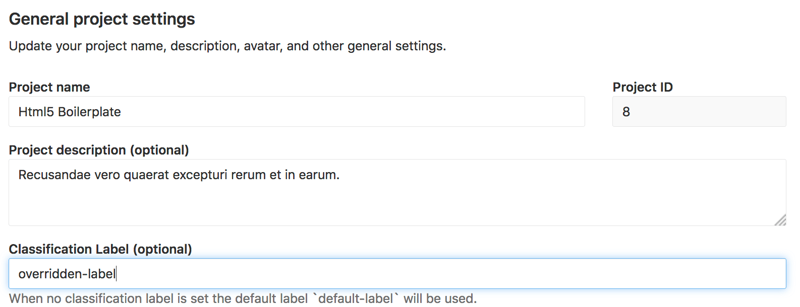

# External authorization service

> [Introduced][ee-3709] GitLab Enterprise Edition 10.6.

In highly controlled environments, it may be necessary for access policy to be
controlled by an external service that permits access based on project
classification and user access. GitLab provides a way to check project
authorization with an external service.

When a project is accessed, a request is made to the external service with the
user information and project classification label assigned to the project. When
the service replies with a known response, the result is cached for 6 hours.

Enabling this feature disables all cross project features in GitLab: This is to
prevent performing to many requests at once to the external authorization
service.

## Enabling external authorization service

The external authorization service can be enabled by an admin on the settings
page:


The available properties are:

- Service URL: The URL to make authorization requests to
- Default classification label: The classification label to use when requesting
  authorization if no specific label is defined on the project.

## The external authorization service

### The request

When GitLab requests access, it will send a JSON POST request with this body:

```json
{
  "user_identifier": "jane@acme.org",
  "project_classification_label": "project-label",
  "user_ldap_dn": "CN=Jane Doe,CN=admin,DC=acme"
}
```

The `user_ldap_dn` is optional, it is only sent when the user is logged in
through LDAP.

### The response

#### Access allowed

When the external authorization service responds with a status code 200, the
user is granted access and the result is cached for 6 hours.

#### Denying access

When the external service responds with a status code 401, the user is denied
access and the request is cached for 6 hours.

Optionally a reason can be specified in the JSON body:

```json
{
  "reason": "You are not allowed access to this project."
}
```

Any other status code than 401 or 200 will also deny access to the user, but the
response will not be cached.

## Classification labels

The classification label used for a project will be shown on all project pages:


When the external authorization service is enabled, a classification label can
be specified for a project on the project settings page



When no classification label is specified on a project, the default label
defined in the global settings is used.

[ee-3709]: https://gitlab.com/gitlab-org/gitlab-ee/merge_requests/3709
