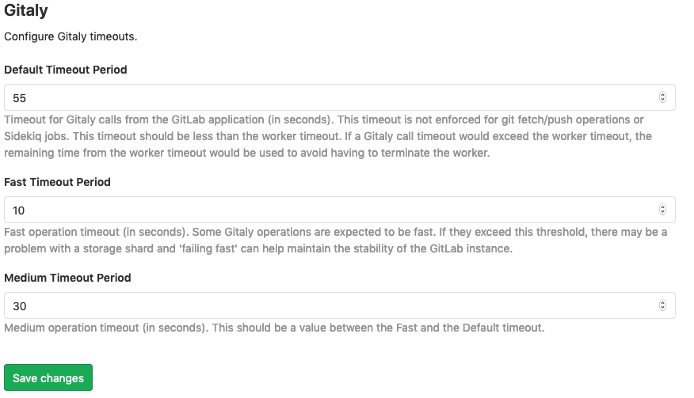

# Gitaly timeouts

3 timeout types can be configured to make sure that long running
Gitaly calls don't needlessly take up resources.

- Default timeout

This timeout is the default for most Gitaly calls.
It should be shorter than the worker timeout that can be configured
for
[Puma](https://docs.gitlab.com/omnibus/settings/puma.html#puma-settings)
or [Unicorn](https://docs.gitlab.com/omnibus/settings/unicorn.html).
This makes sure that Gitaly calls made within a web request cannot
exceed these the entire request timeout.

The default for this timeout is 55 seconds.

- Fast timeout

This is the timeout for very short Gitaly calls.

The default for this timeout is 10 seconds.

- Medium timeout

This timeout should be between the default and the fast timeout

The default for this timeout is 30 seconds.
