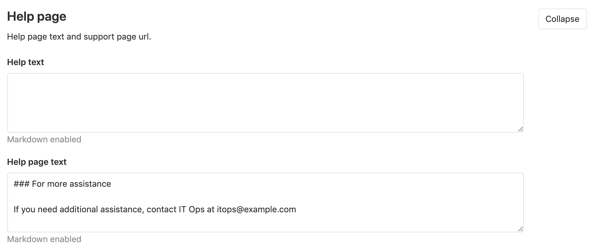
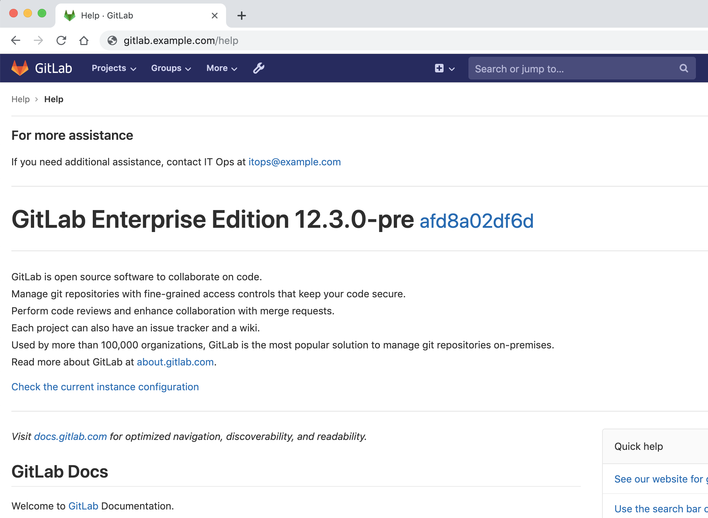
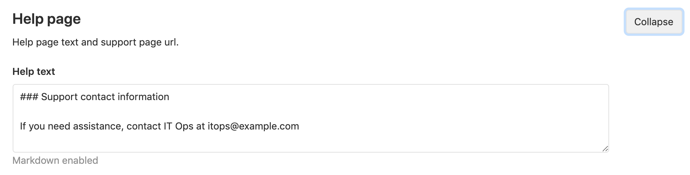
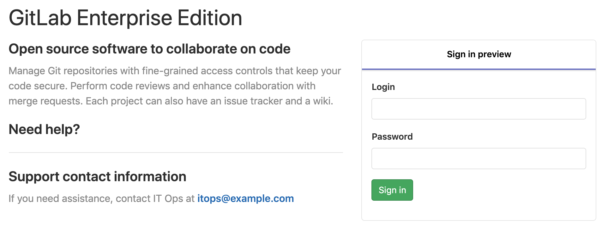

# Customizing the 'Help' and login page messages

In large organizations, it is useful to have information about who to contact or where
to go for help. You can customize and display this information on the GitLab server's
`/help` page and on the GitLab login page.

## Adding a help message to the help page

You can add a help message, which will be shown on the GitLab `/help` page (e.g.,
<https://gitlab.com/help>) in a new section at the top of the `/help` page:

1. Navigate to **Admin Area > Settings > Preferences**, then expand **Help page**.
1. Under **Help page text**, fill in the information you wish to display on `/help`.

   

1. Save your changes. You can now see the message on `/help`.

## Adding a help message to the login page **(STARTER)**

You can add a help message, which will be shown on the GitLab login page in a new section
titled `Need Help?`, located below the login page message:

1. Navigate to **Admin Area > Settings > Preferences**, then expand **Help page**.
1. Under **Help text**, fill in the information you wish to display on the login page.

   

1. Save your changes.

<!-- ## Troubleshooting

Include any troubleshooting steps that you can foresee. If you know beforehand what issues
one might have when setting this up, or when something is changed, or on upgrading, it's
important to describe those, too. Think of things that may go wrong and include them here.
This is important to minimize requests for support, and to avoid doc comments with
questions that you know someone might ask.

Each scenario can be a third-level heading, e.g. `### Getting error message X`.
If you have none to add when creating a doc, leave this section in place
but commented out to help encourage others to add to it in the future. -->
