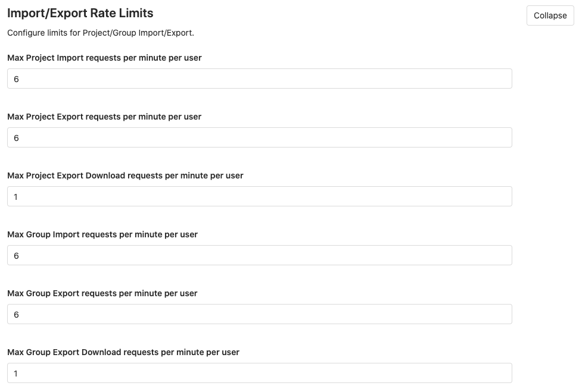

# Project/group import/export rate limits **(FREE SELF)**

> [Introduced](https://gitlab.com/gitlab-org/gitlab/-/merge_requests/35728) in GitLab 13.2.

The following table includes configurable rate limits. The following table includes limits on a
per minute per user basis:

| Limit                    | Default (per minute per user) |
|--------------------------|-------------------------------|
| Project Import           | 6                             |
| Project Export           | 6                             |
| Project Export Download  | 1                             |
| Group Import             | 6                             |
| Group Export             | 6                             |
| Group Export Download    | 1                             |

All rate limits are:

- Configurable through the top bar at **Menu > Admin > Settings > Network > Import/Export Rate Limits**
- Applied per minute per user
- Not applied per IP address
- Active by default. To disable, set the option to `0`
- Logged to `auth.log` file if exceed rate limit

