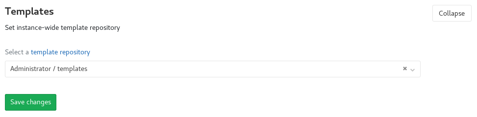

# Instance template repository **(PREMIUM ONLY)**

> [Introduced](https://gitlab.com/gitlab-org/gitlab/issues/5986) in
> [GitLab Premium](https://about.gitlab.com/pricing/) 11.3.

## Overview

In hosted systems, enterprises often have a need to share their own templates
across teams. This feature allows an administrator to pick a project to be the
instance-wide collection of file templates. These templates are then exposed to
all users [via the web editor](../../project/repository/web_editor.md#template-dropdowns)
while the project remains secure.

## Configuration

As an administrator, navigate to **Admin Area > Settings > Templates** and
select the project to serve as the custom template repository.



Once a project has been selected, you can add custom templates to the repository,
and they will appear in the appropriate places in the
[frontend](../../project/repository/web_editor.md#template-dropdowns) and
[API](../../../api/settings.md).

Templates must be added to a specific subdirectory in the repository,
corresponding to the kind of template. The following types of custom templates
are supported:

| Type              | Directory     | Extension     |
| :---------------: | :-----------: | :-----------: |
| `Dockerfile`      | `Dockerfile`  | `.dockerfile` |
| `.gitignore`      | `gitignore`   | `.gitignore`  |
| `.gitlab-ci.yml`  | `gitlab-ci`   | `.yml`        |
| `LICENSE`         | `LICENSE`     | `.txt`        |

Each template must go in its respective subdirectory, have the correct
extension and not be empty. So, the hierarchy should look like this:

```text
|-- README.md
|-- Dockerfile
    |-- custom_dockerfile.dockerfile
    |-- another_dockerfile.dockerfile
|-- gitignore
    |-- custom_gitignore.gitignore
    |-- another_gitignore.gitignore
|-- gitlab-ci
    |-- custom_gitlab-ci.yml
    |-- another_gitlab-ci.yml
|-- LICENSE
    |-- custom_license.txt
    |-- another_license.txt
```

Once this is established, the list of custom templates will be included when
creating a new file and the template type is selected. These will appear at the
top of the list.


If this feature is disabled or no templates are present, there will be
no "Custom" section in the selection dropdown.

<!-- ## Troubleshooting

Include any troubleshooting steps that you can foresee. If you know beforehand what issues
one might have when setting this up, or when something is changed, or on upgrading, it's
important to describe those, too. Think of things that may go wrong and include them here.
This is important to minimize requests for support, and to avoid doc comments with
questions that you know someone might ask.

Each scenario can be a third-level heading, e.g. `### Getting error message X`.
If you have none to add when creating a doc, leave this section in place
but commented out to help encourage others to add to it in the future. -->
