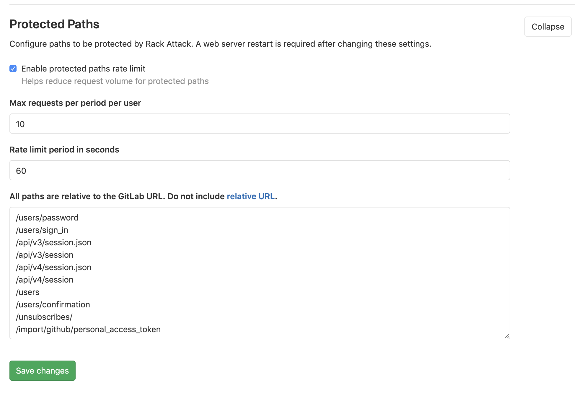

# Protected paths **(CORE ONLY)**

GitLab protects the following paths with Rack Attack by default:

```
'/users/password',
'/users/sign_in',
'/api/#{API::API.version}/session.json',
'/api/#{API::API.version}/session',
'/users',
'/users/confirmation',
'/unsubscribes/',
'/import/github/personal_access_token',
'/admin/session'
```

GitLab responds with HTTP status code `429` to POST requests at protected paths
that exceed 10 requests per minute per IP address.

This header is included in responses to blocked requests:

```
Retry-After: 60
```

For example, the following are limited to a maximum 10 requests per minute:

- User sign-in
- User sign-up (if enabled)
- User password reset

After 10 requests, the client must wait 60 seconds before it can
try again.

## Configure using GitLab UI

> Introduced in [GitLab 12.4](https://gitlab.com/gitlab-org/gitlab-ce/merge_requests/31246).

Throttling of protected paths is enabled by default and can be disabled or
customized on **Admin > Network > Protected Paths**, along with these options:

- Maximum number of requests per period per user.
- Rate limit period in seconds.
- Paths to be protected.



Requests over the rate limit are logged into `auth.log`.

## Migrate settings from GitLab 12.3 and earlier

Omnibus GitLab protected paths throttle is deprecated and is scheduled for removal in
GitLab 13.0. Please see the [GitLab issue](https://gitlab.com/gitlab-org/gitlab/issues/29952) and the [Omnibus GitLab issue](https://gitlab.com/gitlab-org/omnibus-gitlab/issues/4688) for more information.

NOTE: **Note:** If Omnibus settings are present, applications settings will be automatically ignored to avoid generating multiple requests blocks.

To migrate from Omnibus GitLab 12.3 and earlier settings:

1. Customize and enable your protected paths settings by following [Configure using GitLab UI](#configure-using-gitlab-ui) section.

1. SSH into your frontend nodes and add to `/etc/gitlab/gitlab.rb`:

   ```ruby
   gitlab_rails['rack_attack_admin_area_protected_paths_enabled'] = true
   ```

1. [Reconfigure GitLab](../../../administration/restart_gitlab.md#omnibus-gitlab-reconfigure) for the changes to take effect.

That's it. Protected paths throttle are now managed by GitLab admin settings.
