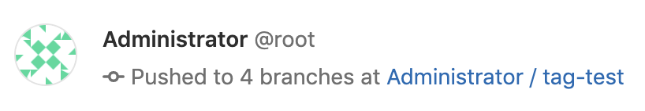
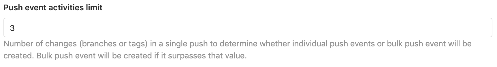

# Push event activities limit and bulk push events

> [Introduced](https://gitlab.com/gitlab-org/gitlab/-/issues/31007) in GitLab 12.4.

This allows you to set the number of changes (branches or tags) in a single push
to determine whether individual push events or bulk push event will be created.
Bulk push events will be created if it surpasses that value.

For example, if 4 branches are pushed and the limit is currently set to 3,
you'll see the following in the activity feed:

With this feature, when a single push includes a lot of changes (e.g. 1,000
branches), only 1 bulk push event will be created instead of creating 1,000 push
events. This helps in maintaining good system performance and preventing spam on
the activity feed.

This setting can be modified in **Admin Area > Settings > Network > Performance Optimization**.
This can also be configured via the [Application settings API](../../../api/settings.md#list-of-settings-that-can-be-accessed-via-api-calls)
as `push_event_activities_limit`. The default value is 3, but it can be greater
than or equal 0.

