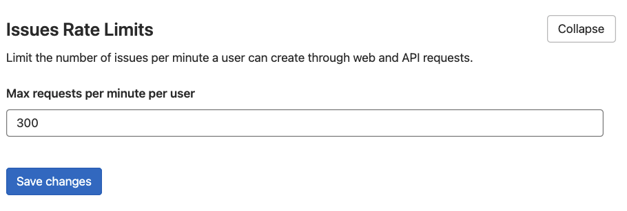

# Rate limits on issue creation **(FREE SELF)**

> [Introduced](https://gitlab.com/gitlab-org/gitlab/-/merge_requests/28129) in GitLab 12.10.

This setting allows you to rate limit the requests to the issue and epic creation endpoints.
To can change its value:

1. On the top bar, select **Main menu > Admin**.
1. On the left sidebar, select **Settings > Network**.
1. Expand **Issues Rate Limits**.
1. Under **Max requests per minute**, enter the new value.
1. Select **Save changes**.

For example, if you set a limit of 300, requests using the
[Projects::IssuesController#create](https://gitlab.com/gitlab-org/gitlab/blob/master/app/controllers/projects/issues_controller.rb)
action exceeding a rate of 300 per minute are blocked. Access to the endpoint is allowed after one minute.

When using [epics](../../group/epics/index.md), epic creation shares this rate limit with issues.

This limit is:

- Applied independently per project and per user.
- Not applied per IP address.
- Disabled by default. To enable it, set the option to any value other than `0`.

Requests over the rate limit are logged into the `auth.log` file.
