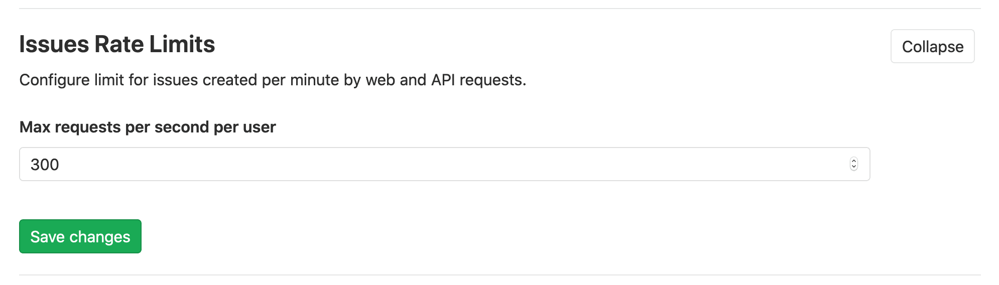

# Rate limits on issue creation

> [Introduced](https://gitlab.com/gitlab-org/gitlab/-/issues/55241) in GitLab 12.10.

This setting allows you to rate limit the requests to the issue creation endpoint.
It defaults to 300 requests per minute.
You can change it in **Admin Area > Settings > Network > Performance Optimization**.

For example, requests using the
[Projects::IssuesController#create](https://gitlab.com/gitlab-org/gitlab/raw/master/app/controllers/projects/issues_controller.rb)
action exceeding a rate of 300 per minute are blocked. Access to the endpoint is allowed after one minute.

This limit is:

- Applied independently per project and per user.
- Not applied per IP address.
- Active by default. To disable it, set the option to `0`.

Requests over the rate limit are logged into the `auth.log` file.
