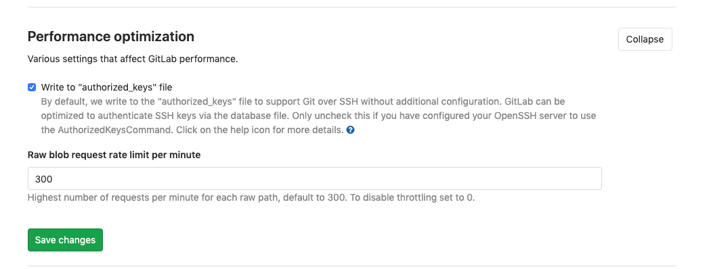

# Rate limits on raw endpoints **(FREE SELF)**

> [Introduced](https://gitlab.com/gitlab-org/gitlab-foss/-/merge_requests/30829) in GitLab 12.2.

This setting defaults to `300` requests per minute, and allows you to rate limit the requests to raw endpoints:

1. On the top bar, select **Menu >** **{admin}** **Admin**.
1. In the left sidebar, select **Settings > Network**.
1. Expand **Performance optimization**.

For example, requests over `300` per minute to `https://gitlab.com/gitlab-org/gitlab-foss/raw/master/app/controllers/application_controller.rb` are blocked. Access to the raw file is released after 1 minute.

This limit is:

- Applied independently per project, per commit and per file path.
- Not applied per IP address.
- Active by default. To disable, set the option to `0`.

Requests over the rate limit are logged into `auth.log`.
