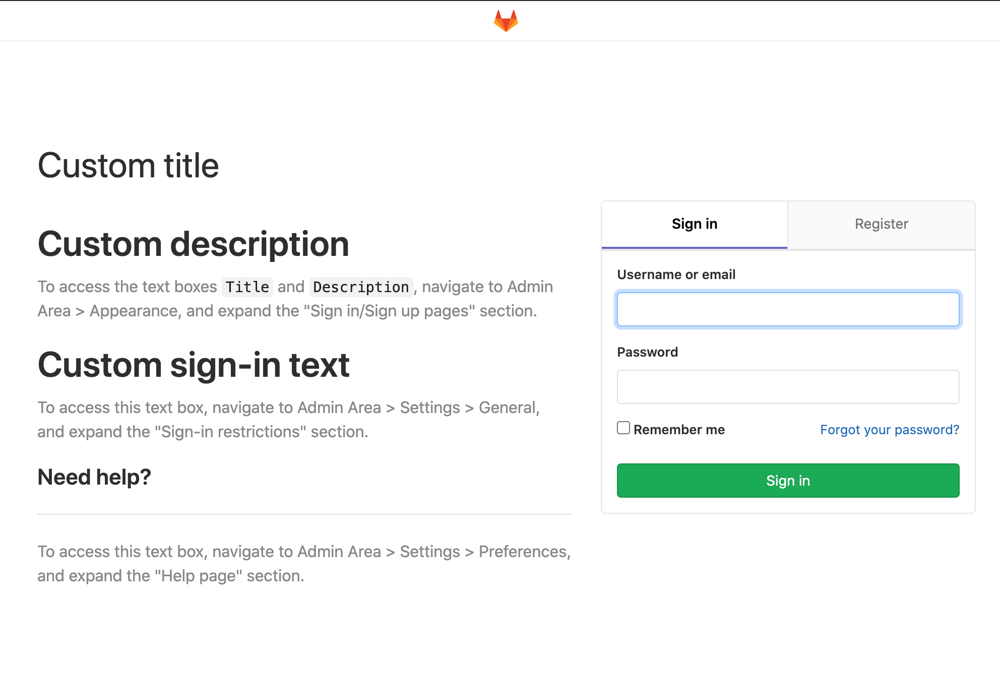

# Sign-in restrictions **(CORE ONLY)**

You can use **Sign-in restrictions** to customize authentication restrictions for web interfaces as well as Git over HTTP(S).

## Settings

To access sign-in restriction settings:

1. Navigate to the **Admin Area > Settings > General**.
1. Expand the **Sign-in restrictions** section.

## Password authentication enabled

You can restrict the password authentication for web interface and Git over HTTP(S):

- **Web interface**: When this feature is disabled, an [external authentication provider](../../../administration/auth/README.md) must be used.
- **Git over HTTP(S)**: When this feature is disabled, a [Personal Access Token](../../profile/personal_access_tokens.md) must be used to authenticate.

## Two-factor authentication

When this feature enabled, all users must use the [two-factor authentication](../../profile/account/two_factor_authentication.md).

Once the two-factor authentication is configured as mandatory, the users are allowed
to skip forced configuration of two-factor authentication for the configurable grace
period in hours.


## Email notification for unknown sign-ins

> [Introduced](https://gitlab.com/gitlab-org/gitlab/-/issues/218457) in GitLab 13.2.

When enabled, GitLab notifies users of sign-ins from unknown IP addresses or devices. For more information,
see [Email notification for unknown sign-ins](../../profile/unknown_sign_in_notification.md).


## Sign-in information

All users that are not logged in are redirected to the page represented by the configured
**Home page URL** if value is not empty.

All users are redirected to the page represented by the configured **After sign out path**
after sign out if value is not empty.

In the **Sign-in restrictions** section, scroll to the **Sign-in text** field. You can add a
custom message for your users in Markdown format.

For example, if you include the following information in the noted text box:

```markdown
# Custom sign-in text

To access this text box, navigate to Admin Area > Settings > General, and expand the "Sign-in restrictions" section.
```

Your users see the **Custom sign-in text** when they navigate to the sign-in screen for your
GitLab instance:



<!-- ## Troubleshooting

Include any troubleshooting steps that you can foresee. If you know beforehand what issues
one might have when setting this up, or when something is changed, or on upgrading, it's
important to describe those, too. Think of things that may go wrong and include them here.
This is important to minimize requests for support, and to avoid doc comments with
questions that you know someone might ask.

Each scenario can be a third-level heading, e.g. `### Getting error message X`.
If you have none to add when creating a doc, leave this section in place
but commented out to help encourage others to add to it in the future. -->
