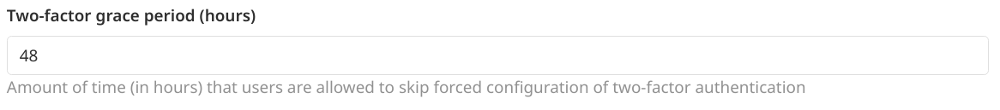

# Sign-in restrictions **(FREE SELF)**

You can use **Sign-in restrictions** to customize authentication restrictions for web interfaces as well as Git over HTTP(S).

## Settings

To access sign-in restriction settings:

1. On the top bar, select **Menu >** **{admin}** **Admin**.
1. In the left sidebar, select **Settings > General**.
1. Expand the **Sign-in restrictions** section.

## Password authentication enabled

You can restrict the password authentication for web interface and Git over HTTP(S):

- **Web interface**: When this feature is disabled, the **Standard** sign-in tab is removed and an [external authentication provider](../../../administration/auth/index.md) must be used.
- **Git over HTTP(S)**: When this feature is disabled, a [Personal Access Token](../../profile/personal_access_tokens.md) must be used to authenticate.

## Admin Mode

> - [Introduced](https://gitlab.com/groups/gitlab-org/-/epics/2158) in GitLab 13.10.

When this feature is enabled, instance administrators are limited as regular users. During that period,
they do not have access to all projects, groups, or the **Admin Area** menu.

To access potentially dangerous resources, an administrator can activate Admin Mode by:

- Selecting the *Enable Admin Mode* button
- Trying to access any part of the UI that requires an administrator role, specifically those which call `/admin` endpoints.

The main use case allows administrators to perform their regular tasks as a regular
user, based on their memberships, without having to set up a second account for
security reasons.

When Admin Mode status is disabled, administrative users cannot access resources unless
they've been explicitly granted access. For example, when Admin Mode is disabled, they
get a `404` error if they try to open a private group or project, unless
they are members of that group or project.

2FA should be enabled for administrators and is supported for the Admin Mode flow, as are
OmniAuth providers and LDAP auth. The Admin Mode status is stored in the active user
session and remains active until it is explicitly disabled (it will be disabled
automatically after a timeout otherwise).

### Limitations of Admin Mode

The following access methods are **not** protected by Admin Mode:

- Git client access (SSH using public keys or HTTPS using Personal Access Tokens).
- API access using a Personal Access Token.

In other words, administrators who are otherwise limited by Admin Mode can still use
Git clients, and access RESTful API endpoints as administrators, without additional
authentication steps.

We may address these limitations in the future. For more information see the following epic:
[Admin mode for GitLab Administrators](https://gitlab.com/groups/gitlab-org/-/epics/2158).

### Troubleshooting Admin Mode

If necessary, you can disable **Admin Mode** as an administrator by using one of these two methods:

- **API**:

  ```shell
  curl --request PUT --header "PRIVATE-TOKEN:$ADMIN_TOKEN" "<gitlab-url>/api/v4/application/settings?admin_mode=false"
  ```

- [**Rails console**](../../../administration/operations/rails_console.md#starting-a-rails-console-session):

  ```ruby
  ::Gitlab::CurrentSettings.update!(admin_mode: false)
  ```

## Two-factor authentication

When this feature is enabled, all users must use the [two-factor authentication](../../profile/account/two_factor_authentication.md).

After the two-factor authentication is configured as mandatory, users are allowed
to skip forced configuration of two-factor authentication for the configurable grace
period in hours.



## Email notification for unknown sign-ins

> [Introduced](https://gitlab.com/gitlab-org/gitlab/-/issues/218457) in GitLab 13.2.

When enabled, GitLab notifies users of sign-ins from unknown IP addresses or devices. For more information,
see [Email notification for unknown sign-ins](../../profile/unknown_sign_in_notification.md).


## Sign-in information

All users that are not logged in are redirected to the page represented by the configured
**Home page URL** if value is not empty.

All users are redirected to the page represented by the configured **After sign out path**
after sign out if value is not empty.

In the **Sign-in restrictions** section, scroll to the **Sign-in text** field. You can add a
custom message for your users in Markdown format.

For example, if you include the following information in the noted text box:

```markdown
# Custom sign-in text

To access this text box:

1. On the top bar, select **Menu > Admin**.
1. In the left sidebar, select **Settings > General**, and expand the **Sign-in restrictions** section.
```

Your users see the **Custom sign-in text** when they navigate to the sign-in screen for your
GitLab instance.

<!-- ## Troubleshooting

Include any troubleshooting steps that you can foresee. If you know beforehand what issues
one might have when setting this up, or when something is changed, or on upgrading, it's
important to describe those, too. Think of things that may go wrong and include them here.
This is important to minimize requests for support, and to avoid doc comments with
questions that you know someone might ask.

Each scenario can be a third-level heading, e.g. `### Getting error message X`.
If you have none to add when creating a doc, leave this section in place
but commented out to help encourage others to add to it in the future. -->
