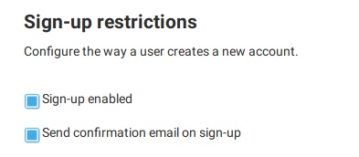
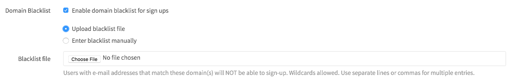

# Sign-up restrictions **(CORE ONLY)**

You can use sign-up restrictions to require user email confirmation, as well as
to blacklist or whitelist email addresses belonging to specific domains.

>**Note**: These restrictions are only applied during sign-up. An admin is
able to add a user through the admin panel with a disallowed domain. Also
note that the users can change their email addresses after signup to
disallowed domains.

## Require email confirmation

You can send confirmation emails during sign-up and require that users confirm
their email address before they are allowed to sign in.

## Minimum password length limit

> [Introduced](https://gitlab.com/gitlab-org/gitlab/merge_requests/20661) in GitLab 12.6

You can [change](../../../security/password_length_limits.md#modify-minimum-password-length-using-gitlab-ui)
the minimum number of characters a user must have in their password using the GitLab UI.

## Whitelist email domains

> [Introduced][ce-598] in GitLab 7.11.0

You can restrict users to only sign up using email addresses matching the given
domains list.

## Blacklist email domains

> [Introduced][ce-5259] in GitLab 8.10.

With this feature enabled, you can block email addresses of a specific domain
from creating an account on your GitLab server. This is particularly useful
to prevent malicious users from creating spam accounts with disposable email
addresses.

## Settings

To access this feature:

1. Navigate to the **Settings > General** in the Admin area.
1. Expand the **Sign-up restrictions** section.

For the blacklist, you can enter the list manually or upload a `.txt` file that
contains list entries.

For the whitelist, you must enter the list manually.

Both the whitelist and blacklist accept wildcards. For example, you can use
`*.company.com` to accept every `company.com` subdomain, or `*.io` to block all
domains ending in `.io`. Domains should be separated by a whitespace,
semicolon, comma, or a new line.

<!-- ## Troubleshooting

Include any troubleshooting steps that you can foresee. If you know beforehand what issues
one might have when setting this up, or when something is changed, or on upgrading, it's
important to describe those, too. Think of things that may go wrong and include them here.
This is important to minimize requests for support, and to avoid doc comments with
questions that you know someone might ask.

Each scenario can be a third-level heading, e.g. `### Getting error message X`.
If you have none to add when creating a doc, leave this section in place
but commented out to help encourage others to add to it in the future. -->

[ce-5259]: https://gitlab.com/gitlab-org/gitlab-foss/merge_requests/5259
[ce-598]: https://gitlab.com/gitlab-org/gitlab-foss/merge_requests/598
