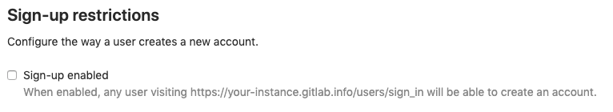
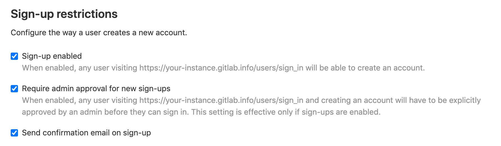

# Sign-up restrictions **(CORE ONLY)**

You can use sign-up restrictions to:

- Disable new sign-ups.
- Require admin approval for new sign-ups.
- Require user email confirmation.
- Denylist or allowlist email addresses belonging to specific domains.

NOTE: **Note:**
These restrictions are only applied during sign-up from an external user. An admin can add a user through the admin panel with a disallowed domain. Also, note that the users can change their email addresses after sign-up to
disallowed domains.

## Disable new signups

When this setting is enabled, any user visiting your GitLab domain will be able to sign up for an account.

You can restrict new users from signing up by themselves for an account in your instance by disabling this setting.

### Recommendations

For customers running public-facing GitLab instances, we highly recommend that you
consider disabling new sign-ups if you do not expect public users to sign up for an
account.

Alternatively, you could also consider setting up a
[allowlist](#allowlist-email-domains) or [denylist](#denylist-email-domains) on
email domains to prevent malicious users from creating accounts.

## Require admin approval for new sign-ups

> [Introduced](https://gitlab.com/groups/gitlab-org/-/epics/4491) in GitLab 13.5.

When this setting is enabled, any user visiting your GitLab domain and signing up for a new account will have to be explicitly [approved](../approving_users.md#approving-a-user) by an administrator before they can start using their account.

## Require email confirmation

You can send confirmation emails during sign-up and require that users confirm
their email address before they are allowed to sign in.

## Minimum password length limit

> [Introduced](https://gitlab.com/gitlab-org/gitlab/-/merge_requests/20661) in GitLab 12.6

You can [change](../../../security/password_length_limits.md#modify-minimum-password-length-using-gitlab-ui)
the minimum number of characters a user must have in their password using the GitLab UI.

## Allowlist email domains

> [Introduced](https://gitlab.com/gitlab-org/gitlab-foss/-/merge_requests/598) in GitLab 7.11.0

You can restrict users only to sign up using email addresses matching the given
domains list.

## Denylist email domains

> [Introduced](https://gitlab.com/gitlab-org/gitlab-foss/-/merge_requests/5259) in GitLab 8.10.

With this feature enabled, you can block email addresses of a specific domain
from creating an account on your GitLab server. This is particularly useful
to prevent malicious users from creating spam accounts with disposable email
addresses.

## Settings

To access this feature:

1. Navigate to the **Admin Area > Settings > General**.
1. Expand the **Sign-up restrictions** section.

For the denylist, you can enter the list manually or upload a `.txt` file that
contains list entries.

For the allowlist, you must enter the list manually.

Both the allowlist and denylist accept wildcards. For example, you can use
`*.company.com` to accept every `company.com` subdomain, or `*.io` to block all
domains ending in `.io`. Domains should be separated by a whitespace,
semicolon, comma, or a new line.

<!-- ## Troubleshooting

Include any troubleshooting steps that you can foresee. If you know beforehand what issues
one might have when setting this up, or when something is changed, or on upgrading, it's
important to describe those, too. Think of things that may go wrong and include them here.
This is important to minimize requests for support, and to avoid doc comments with
questions that you know someone might ask.

Each scenario can be a third-level heading, e.g. `### Getting error message X`.
If you have none to add when creating a doc, leave this section in place
but commented out to help encourage others to add to it in the future. -->
