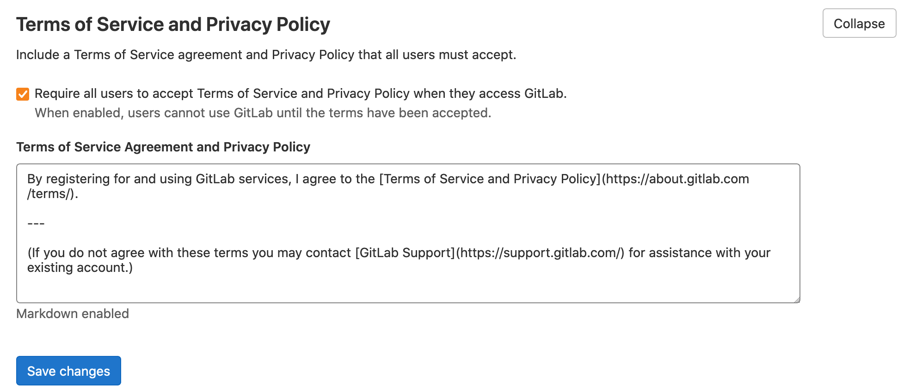

# Enforce accepting Terms of Service **(FREE SELF)**

An administrator can enforce acceptance of a terms of service and privacy policy. When this option is enabled, new and existing users must accept the terms.

If configured, the Terms of Service page can be viewed via `https://your-instance.com/-/users/terms` at anytime.

## Configuration

To enforce acceptance of a Terms of Service and Privacy Policy:

1. Log in to the GitLab instance as an admin user.
1. On the top bar, select **Menu >** **{admin}** **Admin**.
1. In the left sidebar, select **Settings > General**.
1. Expand the **Terms of Service and Privacy Policy** section.
1. Check the **Require all users to accept Terms of Service and Privacy Policy when they access
   GitLab.** checkbox.
1. Input the text of the **Terms of Service and Privacy Policy**. Markdown formatting can be used in this input box.
1. Click **Save changes**.
1. When you are presented with the **Terms of Service** statement, click **Accept terms**.

For each update to the terms, a new version is stored. When a user accepts or declines the terms,
GitLab records which version they accepted or declined.

## New users

When this feature is enabled, a checkbox is added to the sign-up form.

This checkbox is required during sign up.

Users can review the terms entered in the admin panel before
accepting. The page is opened in a new window so they can
continue their registration afterwards.

## Accepting terms

When this feature is enabled, the users that have not accepted the
terms of service are presented with a screen where they can either
accept or decline the terms.

If the user accepts the terms, they are directed to where they
were going. After a sign-in or sign-up this is most likely the
dashboard.

If the user was already logged in when the feature was turned on,
they are asked to accept the terms on their next interaction.

If a user declines the terms, they are signed out.

<!-- ## Troubleshooting

Include any troubleshooting steps that you can foresee. If you know beforehand what issues
one might have when setting this up, or when something is changed, or on upgrading, it's
important to describe those, too. Think of things that may go wrong and include them here.
This is important to minimize requests for support, and to avoid doc comments with
questions that you know someone might ask.

Each scenario can be a third-level heading, e.g. `### Getting error message X`.
If you have none to add when creating a doc, leave this section in place
but commented out to help encourage others to add to it in the future. -->
