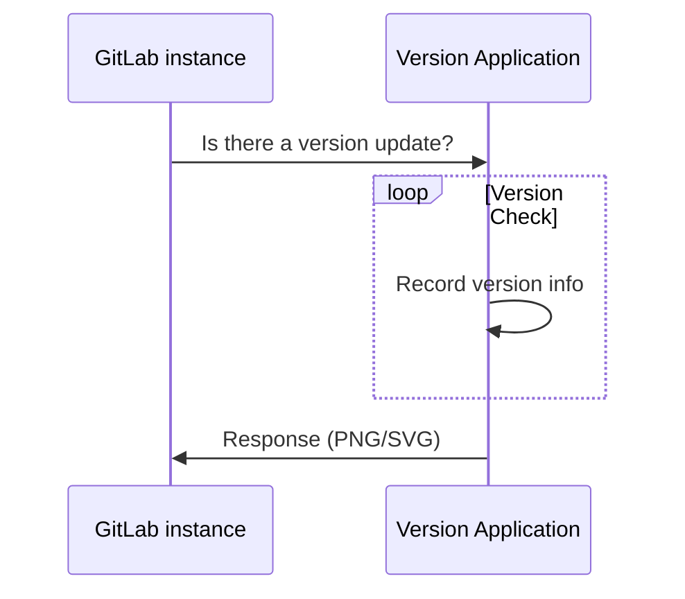

# Usage statistics **(FREE SELF)**

GitLab Inc. periodically collects information about your instance in order
to perform various actions.

All usage statistics are [opt-out](#enable-or-disable-usage-statistics).

## Service Ping

Service Ping is a process that collects and sends a weekly payload to GitLab Inc.
For more information, see the [Service Ping guide](../../../development/service_ping/index.md). When Service Ping is enabled, GitLab gathers data from other instances and enables certain [instance-level analytics features](../analytics/index.md)
that are dependent on Service Ping.

### Why enable Service Ping?

The main purpose of Service Ping is to build a better GitLab. We collect data about how GitLab is used
to understand feature or stage adoption and usage. This data gives an insight into how GitLab adds
value and helps our team understand the reasons why people use GitLab, and with this knowledge we're able to make better product decisions.

There are several other benefits to enabling Service Ping:

- Analyze the users' activities over time of your GitLab installation.
- A [DevOps Score](../analytics/dev_ops_reports.md#devops-score) to give you an overview of your entire instance's adoption of concurrent DevOps from planning to monitoring.
- More proactive support (assuming that our [Customer Success Managers (CSMs)](https://handbook.gitlab.com/job-families/sales/customer-success-management/) and support organization used the data to deliver more value).
- Insight and advice into how to get the most value out of your investment in GitLab.
- Reports that show how you compare against other similar organizations (anonymized), with specific advice and recommendations on how to improve your DevOps processes.
- Participation in our [Registration Features Program](#registration-features-program) to receive free paid features.

## Registration Features Program

> Introduced in GitLab 14.1.

In GitLab versions 14.1 and later, GitLab Free customers with a self-managed instance running
GitLab Enterprise Edition can receive paid features by registering with GitLab and sending us
activity data through Service Ping. Features introduced here do not remove the feature from its paid
tier. Users can continue to access the features in a paid tier without sharing usage data.

### Features available in 14.1 and later

- [Email from GitLab](../email_from_gitlab.md).

### Features available in 14.4 and later

- [Repository size limit](../settings/account_and_limit_settings.md#repository-size-limit).
- [Group access restriction by IP address](../../group/access_and_permissions.md#restrict-group-access-by-ip-address).

### Features available in 16.0 and later

- [Maintenance mode](../../../administration/maintenance_mode/index.md).

NOTE:
Registration is not yet required for participation, but may be added in a future milestone.

### Enable registration features

1. Sign in as a user with administrator access.
1. On the top bar, select **Main menu > Admin**.
1. On the left sidebar, select **Settings > Metrics and profiling**.
1. Expand the **Usage statistics** section.
1. If not enabled, select the **Enable Service Ping** checkbox.
1. Select the **Enable Registration Features** checkbox.
1. Select **Save changes**.

## Version check

If enabled, version check informs you if a new version is available and the
importance of it through a status. The status displays on the help pages (`/help`)
for all authenticated users, and on the Admin Area pages. The statuses are:

- Green: You are running the latest version of GitLab.
- Orange: An updated version of GitLab is available.
- Red: The version of GitLab you are running is vulnerable. You should install
  the latest version with security fixes as soon as possible.


GitLab Inc. collects your instance's version and hostname (through the HTTP
referer) as part of the version check. No other information is collected.

This information is used, among other things, to identify to which versions
patches must be backported, making sure active GitLab instances remain
secure.

If you [disable version check](#enable-or-disable-usage-statistics), this information isn't collected.

### Request flow example

The following example shows a basic request/response flow between a
self-managed GitLab instance and the GitLab Version Application:



## Configure your network

To send usage statistics to GitLab Inc., you must allow network traffic from your
GitLab instance to the IP address `104.196.17.203:443`.

If your GitLab instance is behind a proxy, set the appropriate
[proxy configuration variables](https://docs.gitlab.com/omnibus/settings/environment-variables.html).

## Enable or disable usage statistics

To enable or disable Service Ping and version check:

1. On the top bar, select **Main menu > Admin**.
1. On the left sidebar, select **Settings > Metrics and profiling**.
1. Expand **Usage statistics**.
1. Select or clear the **Enable version check** and **Enable Service Ping** checkboxes.
1. Select **Save changes**.

NOTE:
Service Ping settings only control whether the data is being shared with GitLab, or used only internally.
Even if you disable Service Ping, the `gitlab_service_ping_worker` background job still periodically generates a Service Ping payload for your instance.
The payload is available in the [Service Usage data](#manually-upload-service-ping-payload) admin section.

## Disable usage statistics with the configuration file

NOTE:
The method to disable Service Ping in the GitLab configuration file does not work in
GitLab versions 9.3 to 13.12.3. For more information about how to disable it, see [troubleshooting](../../../development/service_ping/troubleshooting.md#cannot-disable-service-ping-with-the-configuration-file).

To disable Service Ping and prevent it from being configured in the future through
the Admin Area:

**For installations using the Linux package:**

1. Edit `/etc/gitlab/gitlab.rb`:

   ```ruby
   gitlab_rails['usage_ping_enabled'] = false
   ```

1. Reconfigure GitLab:

   ```shell
   sudo gitlab-ctl reconfigure
   ```

**For installations from source:**

1. Edit `/home/git/gitlab/config/gitlab.yml`:

   ```yaml
   production: &base
     # ...
     gitlab:
       # ...
       usage_ping_enabled: false
   ```

1. Restart GitLab:

   ```shell
   sudo service gitlab restart
   ```

## View the Service Ping payload

You can view the exact JSON payload sent to GitLab Inc. in the Admin Area. To view the payload:

1. Sign in as a user with administrator access.
1. On the top bar, select **Main menu > Admin**.
1. On the left sidebar, select **Settings > Metrics and profiling**.
1. Expand the **Usage statistics** section.
1. Select **Preview payload**.

For an example payload, see [Example Service Ping payload](../../../development/service_ping/index.md#example-service-ping-payload).

## Manually upload Service Ping payload

> - [Introduced](https://gitlab.com/groups/gitlab-org/-/epics/7388) in GitLab 14.8 with a flag named `admin_application_settings_service_usage_data_center`. Disabled by default.
> - [Feature flag removed](https://gitlab.com/gitlab-org/gitlab/-/merge_requests/83265) in GitLab 14.10.

You can upload the Service Ping payload to GitLab even if your instance doesn't have internet access,
or if the Service Ping [cron job](../../../development/service_ping/index.md#how-service-ping-works) is not enabled.

To upload the payload manually:

1. Sign in as a user with administrator access.
1. On the top bar, select **Main menu > Admin**.
1. On the left sidebar, select **Settings > Service** usage data.
1. Select **Download payload**.
1. Save the JSON file.
1. Visit [Service usage data center](https://version.gitlab.com/usage_data/new).
1. Select **Choose file** and choose the file from p5.
1. Select **Upload**.

The uploaded file is encrypted and sent using secure HTTPS protocol. HTTPS creates a secure
communication channel between web browser and the server, and protects transmitted data against man-in-the-middle attacks.

If there are problems with the manual upload:

1. Open a confidential issue in the [security fork of version app project](https://gitlab.com/gitlab-org/security/version.gitlab.com).
1. Attach the JSON payload if possible.
1. Tag `@gitlab-org/analytics-section/product-intelligence` who will triage the issue.
<!-- ## Troubleshooting

Include any troubleshooting steps that you can foresee. If you know beforehand what issues
one might have when setting this up, or when something is changed, or on upgrading, it's
important to describe those, too. Think of things that may go wrong and include them here.
This is important to minimize requests for support, and to avoid doc comments with
questions that you know someone might ask.

Each scenario can be a third-level heading, for example `### Getting error message X`.
If you have none to add when creating a doc, leave this section in place
but commented out to help encourage others to add to it in the future. -->
