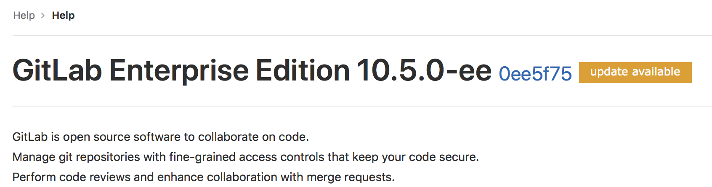
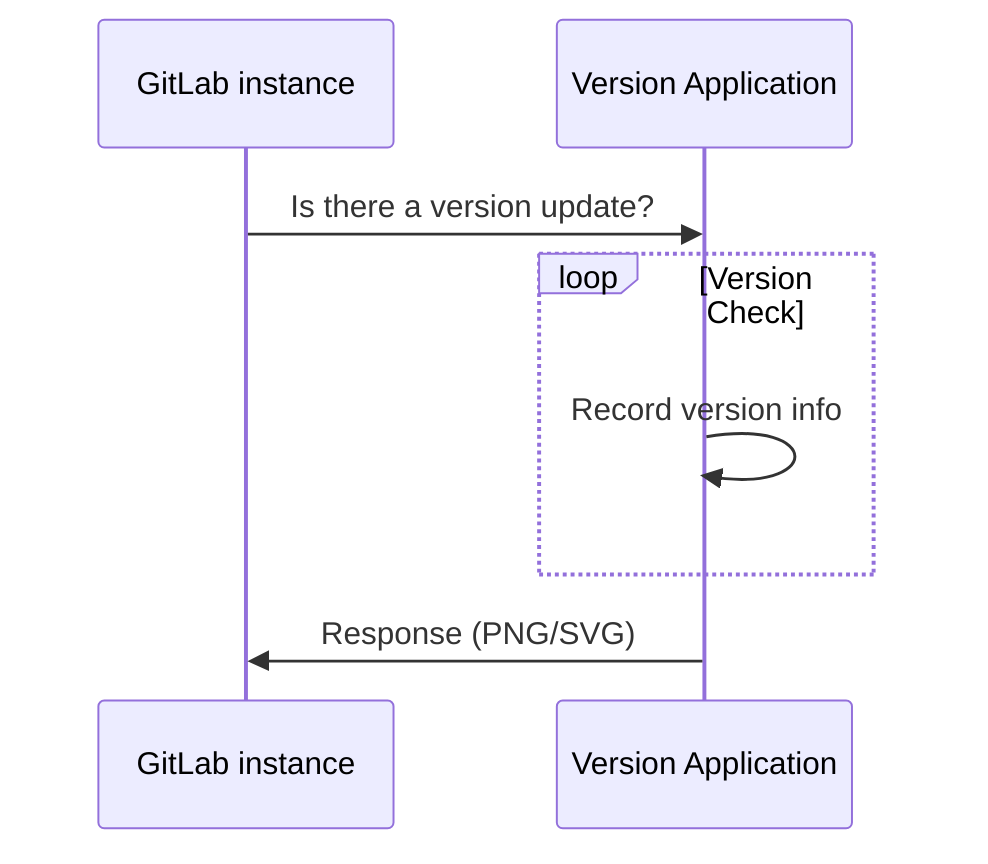

# Usage statistics **(FREE SELF)**

GitLab Inc. periodically collects information about your instance in order
to perform various actions.

All statistics are opt-out. To enable or disable them:

1. On the top bar, select **Menu >** **{admin}** **Admin**.
1. In the left sidebar, select **Settings > Metrics and profiling**, and expand **Usage statistics**.
1. Enable or disable **Version check** and **Service ping**.
1. Select **Save changes**.

## Network configuration

Allow network traffic from your GitLab instance to IP address `104.196.17.203:443`, to send
usage statistics to GitLab Inc.

If your GitLab instance is behind a proxy, set the appropriate [proxy configuration variables](https://docs.gitlab.com/omnibus/settings/environment-variables.html).

## Version Check **(FREE SELF)**

If enabled, version check informs you if a new version is available and the
importance of it through a status. This is shown on the help page (i.e. `/help`)
for all signed in users, and on the admin pages. The statuses are:

- Green: You are running the latest version of GitLab.
- Orange: An updated version of GitLab is available.
- Red: The version of GitLab you are running is vulnerable. You should install
  the latest version with security fixes as soon as possible.

GitLab Inc. collects your instance's version and hostname (through the HTTP
referer) as part of the version check. No other information is collected.

This information is used, among other things, to identify to which versions
patches must be backported, making sure active GitLab instances remain
secure.

If you disable version check, this information isn't collected. To enable or disable it:

1. On the top bar, select **Menu >** **{admin}** **Admin**.
1. In the left sidebar, select **Settings > Metrics and profiling**, and expand **Usage statistics**.
1. Enable or disable **Version check**.
1. Select **Save changes**.

### Request flow example

The following example shows a basic request/response flow between the self-managed GitLab instance
and the GitLab Version Application:

## Service Ping **(FREE SELF)**

See [Service Ping guide](../../../development/usage_ping/index.md).

## Instance-level analytics availability

After Service Ping is enabled, GitLab gathers data from other instances and
enables certain [instance-level analytics features](../analytics/index.md) that are dependent on Service Ping.

<!-- ## Troubleshooting

Include any troubleshooting steps that you can foresee. If you know beforehand what issues
one might have when setting this up, or when something is changed, or on upgrading, it's
important to describe those, too. Think of things that may go wrong and include them here.
This is important to minimize requests for support, and to avoid doc comments with
questions that you know someone might ask.

Each scenario can be a third-level heading, e.g. `### Getting error message X`.
If you have none to add when creating a doc, leave this section in place
but commented out to help encourage others to add to it in the future. -->
