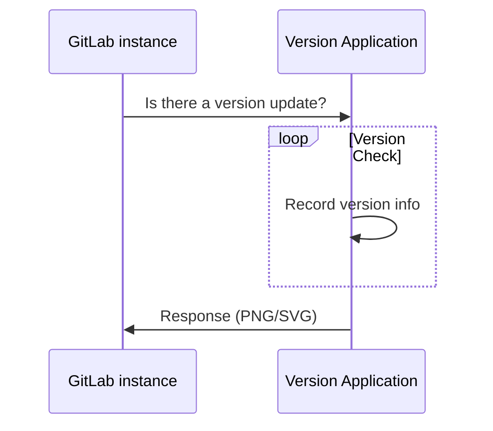
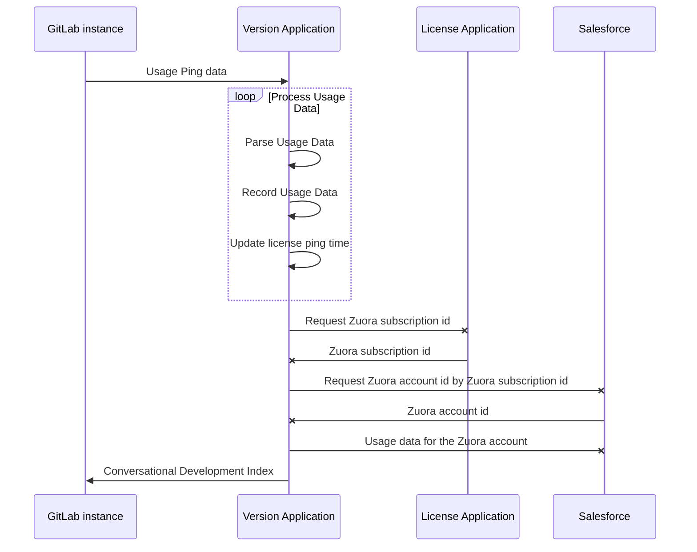

# Usage statistics **(CORE ONLY)**

GitLab Inc. will periodically collect information about your instance in order
to perform various actions.

All statistics are opt-out. You can enable/disable them in the
**Admin Area > Settings > Metrics and profiling** section **Usage statistics**.

## Version Check **(CORE ONLY)**

If enabled, version check will inform you if a new version is available and the
importance of it through a status. This is shown on the help page (i.e. `/help`)
for all signed in users, and on the admin pages. The statuses are:

- Green: You are running the latest version of GitLab.
- Orange: An updated version of GitLab is available.
- Red: The version of GitLab you are running is vulnerable. You should install
  the latest version with security fixes as soon as possible.


GitLab Inc. collects your instance's version and hostname (through the HTTP
referer) as part of the version check. No other information is collected.

This information is used, among other things, to identify to which versions
patches will need to be backported, making sure active GitLab instances remain
secure.

If you disable version check, this information will not be collected.  Enable or
disable the version check in **Admin Area > Settings > Metrics and profiling > Usage statistics**.

### Request flow example

The following example shows a basic request/response flow between the self-managed GitLab instance
and the GitLab Version Application:



## Usage Ping **(CORE ONLY)**

> [Introduced][ee-557] in GitLab Enterprise Edition 8.10. More statistics
[were added][ee-735] in GitLab Enterprise Edition
8.12. [Moved to GitLab Core][ce-23361] in 9.1. More statistics
[were added][ee-6602] in GitLab Ultimate 11.2.

GitLab sends a weekly payload containing usage data to GitLab Inc. The usage
ping uses high-level data to help our product, support, and sales teams. It does
not send any project names, usernames, or any other specific data. The
information from the usage ping is not anonymous, it is linked to the hostname
of the instance.

You can view the exact JSON payload in the administration panel. To view the payload:

1. Navigate to the **Admin Area > Settings > Metrics and profiling**.
1. Expand the **Usage statistics** section.
1. Click the **Preview payload** button.

You can see how [the usage ping data maps to different stages of the product](https://gitlab.com/gitlab-data/analytics/blob/master/transform/snowflake-dbt/data/version_usage_stats_to_stage_mappings.csv).

### Request flow example

The following example shows a basic request/response flow between the self-managed GitLab instance, GitLab Version Application,
GitLab License Application and Salesforce:



### Deactivate the usage ping

The usage ping is opt-out. If you want to deactivate this feature, go to
the Settings page of your administration panel and uncheck the Usage ping
checkbox.

To disable the usage ping and prevent it from being configured in future through
the administration panel, Omnibus installs can set the following in
[`gitlab.rb`](https://docs.gitlab.com/omnibus/settings/configuration.html#configuration-options):

```ruby
gitlab_rails['usage_ping_enabled'] = false
```

And source installs can set the following in `gitlab.yml`:

```yaml
production: &base
  # ...
  gitlab:
    # ...
    usage_ping_enabled: false
```

## Instance statistics visibility **(CORE ONLY)**

Once usage ping is enabled, GitLab will gather data from other instances and
will be able to show [usage statistics](../../instance_statistics/index.md)
of your instance to your users.

To make this visible only to admins, go to **Admin Area > Settings > Metrics and profiling**, expand
**Usage statistics**, and set the **Instance Statistics visibility** option to **Only admins**.

<!-- ## Troubleshooting

Include any troubleshooting steps that you can foresee. If you know beforehand what issues
one might have when setting this up, or when something is changed, or on upgrading, it's
important to describe those, too. Think of things that may go wrong and include them here.
This is important to minimize requests for support, and to avoid doc comments with
questions that you know someone might ask.

Each scenario can be a third-level heading, e.g. `### Getting error message X`.
If you have none to add when creating a doc, leave this section in place
but commented out to help encourage others to add to it in the future. -->

[ee-557]: https://gitlab.com/gitlab-org/gitlab/merge_requests/557
[ee-735]: https://gitlab.com/gitlab-org/gitlab/merge_requests/735
[ce-23361]: https://gitlab.com/gitlab-org/gitlab-foss/issues/23361
[ee-6602]: https://gitlab.com/gitlab-org/gitlab/merge_requests/6602
