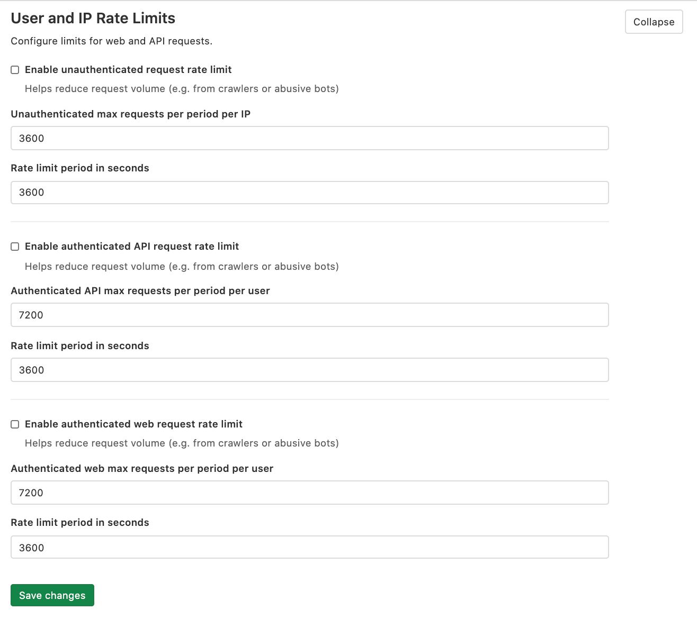

# User and IP rate limits **(FREE SELF)**

Rate limiting is a common technique used to improve the security and durability
of a web application. For more details, see
[Rate limits](../../../security/rate_limits.md).

The following limits are disabled by default:

- Unauthenticated requests
- Authenticated API requests
- Authenticated web requests

To enforce any or all of them:

1. On the top bar, select **Menu >** **{admin}** **Admin**.
1. In the left sidebar, select **Settings > Network**, and expand **User and IP rate limits**:
   

   NOTE:
   By default, all Git operations are first tried unauthenticated. Because of this, HTTP Git operations
   may trigger the rate limits configured for unauthenticated requests.

## Response text

A request that exceeds a rate limit returns a 429 response code and a
plain-text body, which by default is:

```plaintext
Retry later
```

It is possible to customize this response text in the Admin Area.

## Response headers

> [Introduced](https://gitlab.com/gitlab-com/gl-infra/scalability/-/issues/731) in GitLab 13.8, the `Rate-Limit` headers. `Retry-After` was introduced in an earlier version.

When a client exceeds the associated rate limit, the following requests are
blocked. The server may respond with rate-limiting information allowing the
requester to retry after a specific period of time. These information are
attached into the response headers.

| Header                | Example                         | Description                                                                                                                                                                                                      |
|:----------------------|:--------------------------------|:------------------------------------------------------------------------------------------------------------------------------------------------------------------------------------------------------------------|
| `RateLimit-Limit`     | `60`                            | The request quota for the client **each minute**. If the rate limit period set in the admin area is different from 1 minute, the value of this header is adjusted to approximately the nearest 60-minute period. |
| `RateLimit-Name`      | `throttle_authenticated_web`    | Name of the throttle blocking the requests.                                                                                                                                                                      |
| `RateLimit-Observed`  | `67`                            | Number of requests associated to the client in the time window.                                                                                                                                                  |
| `RateLimit-Remaining` | `0`                             | Remaining quota in the time window. The result of `RateLimit-Limit` - `RateLimit-Remaining`.                                                                                                                     |
| `RateLimit-Reset`     | `1609844400`                    | [Unix time](https://en.wikipedia.org/wiki/Unix_time)-formatted time when the request quota is reset.                                                                                                             |
| `RateLimit-ResetTime` | `Tue, 05 Jan 2021 11:00:00 GMT` | [RFC2616](https://tools.ietf.org/html/rfc2616#section-3.3.1)-formatted date and time when the request quota is reset.                                                                                            |
| `Retry-After`         | `30`                            | Remaining duration **in seconds** until the quota is reset. This is a [standard HTTP header](https://developer.mozilla.org/en-US/docs/Web/HTTP/Headers/Retry-After).                                             |

## Use an HTTP header to bypass rate limiting

> [Introduced](https://gitlab.com/gitlab-com/gl-infra/scalability/-/issues/622) in GitLab 13.6.

Depending on the needs of your organization, you may want to enable rate limiting
but have some requests bypass the rate limiter.

You can do this by marking requests that should bypass the rate limiter with a custom
header. You must do this somewhere in a load balancer or reverse proxy in front of
GitLab. For example:

1. Pick a name for your bypass header. For example, `Gitlab-Bypass-Rate-Limiting`.
1. Configure your load balancer to set `Gitlab-Bypass-Rate-Limiting: 1` on requests
   that should bypass GitLab rate limiting.
1. Configure your load balancer to either:
   - Erase `Gitlab-Bypass-Rate-Limiting`.
   - Set `Gitlab-Bypass-Rate-Limiting` to a value other than `1` on all requests that
     should be affected by rate limiting.
1. Set the environment variable  `GITLAB_THROTTLE_BYPASS_HEADER`.
   - For [Omnibus](https://docs.gitlab.com/omnibus/settings/environment-variables.html),
     set `'GITLAB_THROTTLE_BYPASS_HEADER' => 'Gitlab-Bypass-Rate-Limiting'` in `gitlab_rails['env']`.
   - For source installations, set `export GITLAB_THROTTLE_BYPASS_HEADER=Gitlab-Bypass-Rate-Limiting`
     in `/etc/default/gitlab`.

It is important that your load balancer erases or overwrites the bypass
header on all incoming traffic. Otherwise, you must trust your
users to not set that header and bypass the GitLab rate limiter.

Note that the bypass only works if the header is set to `1`.

Requests that bypassed the rate limiter because of the bypass header
are marked with `"throttle_safelist":"throttle_bypass_header"` in
[`production_json.log`](../../../administration/logs.md#production_jsonlog).

To disable the bypass mechanism, make sure the environment variable
`GITLAB_THROTTLE_BYPASS_HEADER` is unset or empty.

## Allow specific users to bypass authenticated request rate limiting

> [Introduced](https://gitlab.com/gitlab-org/gitlab/-/merge_requests/49127) in GitLab 13.7.

Similarly to the bypass header described above, it is possible to allow
a certain set of users to bypass the rate limiter. This only applies
to authenticated requests: with unauthenticated requests, by definition
GitLab does not know who the user is.

The allowlist is configured as a comma-separated list of user IDs in
the `GITLAB_THROTTLE_USER_ALLOWLIST` environment variable. If you want
users 1, 53 and 217 to bypass the authenticated request rate limiter,
the allowlist configuration would be `1,53,217`.

- For [Omnibus](https://docs.gitlab.com/omnibus/settings/environment-variables.html),
  set `'GITLAB_THROTTLE_USER_ALLOWLIST' => '1,53,217'` in `gitlab_rails['env']`.
- For source installations, set `export GITLAB_THROTTLE_USER_ALLOWLIST=1,53,217`
  in `/etc/default/gitlab`.

Requests that bypassed the rate limiter because of the user allowlist
are marked with `"throttle_safelist":"throttle_user_allowlist"` in
[`production_json.log`](../../../administration/logs.md#production_jsonlog).

At application startup, the allowlist is logged in [`auth.log`](../../../administration/logs.md#authlog).

## Try out throttling settings before enforcing them

> [Introduced](https://gitlab.com/gitlab-com/gl-infra/scalability/-/issues/629) in GitLab 13.6.

You can try out throttling settings by setting the `GITLAB_THROTTLE_DRY_RUN` environment variable to
a comma-separated list of throttle names.

The possible names are:

- `throttle_unauthenticated`
- `throttle_authenticated_api`
- `throttle_authenticated_web`
- `throttle_unauthenticated_protected_paths`
- `throttle_authenticated_protected_paths_api`
- `throttle_authenticated_protected_paths_web`
- `throttle_unauthenticated_packages_api`
- `throttle_authenticated_packages_api`

For example, to try out throttles for all authenticated requests to
non-protected paths can be done by setting
`GITLAB_THROTTLE_DRY_RUN='throttle_authenticated_web,throttle_authenticated_api'`.

To enable dry run mode for all throttles, the variable can be set to `*`.

Setting a throttle to dry run mode logs a message to the
[`auth.log`](../../../administration/logs.md#authlog) when it would hit the limit, while letting the
request continue as normal. The log message contains an `env` field set to `track`. The `matched`
field contains the name of throttle that was hit.

It is important to set the environment variable **before** enabling
the rate limiting in the settings. The settings in the Admin Area
take effect immediately, while setting the environment variable
requires a restart of all the Puma processes.

<!-- ## Troubleshooting

Include any troubleshooting steps that you can foresee. If you know beforehand what issues
one might have when setting this up, or when something is changed, or on upgrading, it's
important to describe those, too. Think of things that may go wrong and include them here.
This is important to minimize requests for support, and to avoid doc comments with
questions that you know someone might ask.

Each scenario can be a third-level heading, e.g. `### Getting error message X`.
If you have none to add when creating a doc, leave this section in place
but commented out to help encourage others to add to it in the future. -->
