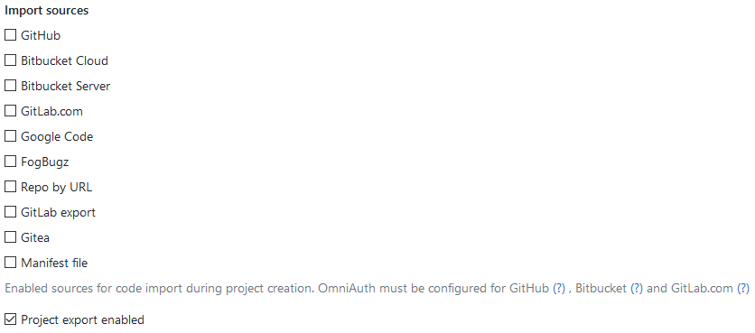

# Visibility and access controls

GitLab allows administrators to:

- Control access and visibility to GitLab resources including branches and projects.
- Select from which hosting sites code can be imported into GitLab.
- Select the protocols permitted to access GitLab.
- Enable or disable repository mirroring.
- Prevent non-administrators from deleting projects
  ([introduced](https://gitlab.com/gitlab-org/gitlab-ee/issues/5615) in GitLab 12.0).
  **(PREMIUM ONLY)**

To access the visibility and access control options:

1. Log in to GitLab as an admin.
1. Go to **Admin Area > Settings > General**.
1. Expand the **Visibility and access controls** section.

## Import sources

Choose from which hosting sites users can
[import their projects](../../project/import/index.md).

## Enabled Git access protocols

> [Introduced][ce-4696] in GitLab 8.10.

With GitLab's access restrictions, you can select with which protocols users can communicate with
GitLab.

From the **Enabled Git access protocols** dropdown, select one of the following:

- Both SSH and HTTP(S)
- Only SSH
- Only HTTP(s)

When both SSH and HTTP(S) are enabled, your users can choose either protocol.

When only one protocol is enabled:

- The project page will only show the allowed protocol's URL, with no option to
  change it.
- A tooltip will be shown when you hover over the URL's protocol, if an action
  on the user's part is required, e.g. adding an SSH key, or setting a password.

On top of these UI restrictions, GitLab will deny all Git actions on the protocol
not selected.

CAUTION: **Important:**
Starting with [GitLab 10.7][ce-18021], HTTP(s) protocol will be allowed for
git clone/fetch requests done by GitLab Runner from CI/CD Jobs, even if
_Only SSH_ was selected.

> **Note:** Please keep in mind that disabling an access protocol does not actually
block access to the server itself. The ports used for the protocol, be it SSH or
HTTP, will still be accessible. What GitLab does is restrict access on the
application level.

## Allow mirrors to be set up for projects

> [Introduced][ee-3586] in GitLab 10.3.

This option is enabled by default. By disabling it, both pull and push mirroring will no longer
work in every repository and can only be re-enabled by an admin on a per-project basis.

<!-- ## Troubleshooting

Include any troubleshooting steps that you can foresee. If you know beforehand what issues
one might have when setting this up, or when something is changed, or on upgrading, it's
important to describe those, too. Think of things that may go wrong and include them here.
This is important to minimize requests for support, and to avoid doc comments with
questions that you know someone might ask.

Each scenario can be a third-level heading, e.g. `### Getting error message X`.
If you have none to add when creating a doc, leave this section in place
but commented out to help encourage others to add to it in the future. -->

[ce-4696]: https://gitlab.com/gitlab-org/gitlab-ce/merge_requests/4696
[ce-18021]: https://gitlab.com/gitlab-org/gitlab-ce/merge_requests/18021
[ee-3586]: https://gitlab.com/gitlab-org/gitlab-ee/merge_requests/3586
