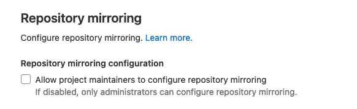

# Control access and visibility **(FREE SELF)**

GitLab enables users with administrator access to enforce
specific controls on branches, projects, snippets, groups, and more.

To access the visibility and access control options:

1. Sign in to GitLab as a user with Administrator access level.
1. On the top bar, select **Main menu > Admin**.
1. On the left sidebar, select **Settings > General**.
1. Expand the **Visibility and access controls** section.

## Define which roles can create projects

Instance-level protections for project creation define which roles can
[add projects to a group](../../group/manage.md#specify-who-can-add-projects-to-a-group)
on the instance. To alter which roles have permission to create projects:

1. Sign in to GitLab as a user with Administrator access level.
1. On the top bar, select **Main menu > Admin**.
1. On the left sidebar, select **Settings > General**.
1. Expand the **Visibility and access controls** section.
1. For **Default project creation protection**, select the desired roles:
   - No one.
   - Maintainers.
   - Developers and Maintainers.
1. Select **Save changes**.

## Restrict project deletion to administrators **(PREMIUM SELF)**

> User interface [changed](https://gitlab.com/gitlab-org/gitlab/-/issues/352960) in GitLab 15.1.

By default both administrators and anyone with the **Owner** role can delete a project. To restrict project deletion to only administrators:

1. Sign in to GitLab as a user with administrator access.
1. On the top bar, select **Main menu > Admin**.
1. On the left sidebar, select **Settings > General**.
1. Expand the **Visibility and access controls** section.
1. Scroll to:
   - (GitLab 15.1 and later) **Allowed to delete projects**, and select **Administrators**.
   - (GitLab 15.0 and earlier) **Default project deletion protection** and select **Only admins can delete project**.
1. Select **Save changes**.

## Deletion protection **(PREMIUM SELF)**

> - [Introduced](https://gitlab.com/gitlab-org/gitlab/-/issues/255449) in GitLab 14.2 for groups created after August 12, 2021.
> - [Renamed](https://gitlab.com/gitlab-org/gitlab/-/issues/352960) from default delayed project deletion in GitLab 15.1.
> - [Enabled for projects in personal namespaces](https://gitlab.com/gitlab-org/gitlab/-/merge_requests/89466) in GitLab 15.1.
> - [Disabled for projects in personal namespaces](https://gitlab.com/gitlab-org/gitlab/-/merge_requests/95495) in GitLab 15.3.
> - [Removed option to delete immediately](https://gitlab.com/gitlab-org/gitlab/-/issues/389557) in GitLab 15.11 [with a flag](../../../administration/feature_flags.md) named `always_perform_delayed_deletion`. Disabled by default.

Instance-level protection against accidental deletion of groups and projects.

### Retention period

> [Changed](https://gitlab.com/gitlab-org/gitlab/-/issues/352960) in GitLab 15.1.

Groups and projects remain restorable within a defined retention period. By default this is 7 days but it can be changed.
Setting the retention period to `0` means that groups and project are removed immediately and cannot be restored.

In GitLab 15.1 and later, the retention period must be between `1` and `90`. If the retention period was `0` before the 15.1 update,
then it gets automatically changed to `1` while also disabling deletion protection the next time any application setting is changed.

### Delayed project deletion

> User interface [changed](https://gitlab.com/gitlab-org/gitlab/-/issues/352960) in GitLab 15.1.

Administrators can enable [delayed project deletion](../../project/settings/index.md#delayed-project-deletion) by default for
newly-created groups. Group owners can choose to disable this. When disabled, existing groups retain their existing setting. When enabled
deleted groups remain restorable within a retention period.

To configure delayed project deletion:

1. Sign in to GitLab as a user with administrator access.
1. On the top bar, select **Main menu > Admin**.
1. On the left sidebar, select **Settings > General**.
1. Expand the **Visibility and access controls** section.
1. Scroll to:
   - (GitLab 15.11 and later with `always_perform_delayed_deletion` feature flag enabled) **Deletion protection** and set the retention period to a value between `1` and `90`.
   - (GitLab 15.1 and later) **Deletion protection** and select keep deleted groups and projects, and select a retention period.
   - (GitLab 15.0 and earlier) **Default delayed project protection** and select **Enable delayed project deletion by
     default for newly-created groups.** Then set a retention period in **Default deletion delay**.
1. Select **Save changes**.

Deletion protection is not available for projects only (without being also being enabled for groups).

In GitLab 15.1, and later this setting is enforced on groups when disabled and it cannot be overridden.

### Delayed group deletion

> User interface [introduced](https://gitlab.com/gitlab-org/gitlab/-/issues/352960) in GitLab 15.1.

Groups remain restorable if the retention period is `1` or more days.

In GitLab 15.1 and later, delayed group deletion can be enabled by setting **Deletion projection** to **Keep deleted**.
In GitLab 15.11 and later with the `always_perform_delayed_deletion` feature flag enabled:

- The **Keep deleted** option is removed.
- Delayed group deletion is the default.

### Override defaults and delete immediately

Alternatively, projects that are marked for removal can be deleted immediately. To do so:

1. [Restore the project](../../project/settings/index.md#restore-a-project).
1. Delete the project as described in the
   [Administering Projects page](../../admin_area/index.md#administering-projects).

## Configure project visibility defaults

To set the default [visibility levels for new projects](../../public_access.md):

1. Sign in to GitLab as a user with Administrator access level.
1. On the top bar, select **Main menu > Admin**.
1. On the left sidebar, select **Settings > General**.
1. Expand the **Visibility and access controls** section.
1. Select the desired default project visibility:
   - **Private** - Project access must be granted explicitly to each user. If this
     project is part of a group, access is granted to members of the group.
   - **Internal** - The project can be accessed by any authenticated user except external users.
   - **Public** - The project can be accessed without any authentication.
1. Select **Save changes**.

## Configure snippet visibility defaults

To set the default visibility levels for new [snippets](../../snippets.md):

1. Sign in to GitLab as a user with Administrator access level.
1. On the top bar, select **Main menu > Admin**.
1. On the left sidebar, select **Settings > General**.
1. Expand the **Visibility and access controls** section.
1. Select the desired default snippet visibility.
1. Select **Save changes**.

For more details on snippet visibility, read
[Project visibility](../../public_access.md).

## Configure group visibility defaults

To set the default visibility levels for new groups:

1. Sign in to GitLab as a user with Administrator access level.
1. On the top bar, select **Main menu > Admin**.
1. On the left sidebar, select **Settings > General**.
1. Expand the **Visibility and access controls** section.
1. Select the desired default group visibility:
   - **Private** - The group and its projects can only be viewed by members.
   - **Internal** - The group and any internal projects can be viewed by any authenticated user except external users.
   - **Public** - The group and any public projects can be viewed without any authentication.
1. Select **Save changes**.

For more details on group visibility, see
[Group visibility](../../group/index.md#group-visibility).

## Restrict visibility levels

When restricting visibility levels, consider how these restrictions interact
with permissions for subgroups and projects that inherit their visibility from
the item you're changing. 

To restrict visibility levels for groups, projects, snippets, and selected pages:

1. Sign in to GitLab as a user with Administrator access level.
1. On the top bar, select **Main menu > Admin**.
1. On the left sidebar, select **Settings > General**.
1. Expand the **Visibility and access controls** section.
1. In the **Restricted visibility levels** section, select the desired visibility levels to restrict.
   - If you restrict the **Public** level:
      - Only administrators are able to create public groups, projects, and snippets.
      - User profiles are only visible to authenticated users through the Web interface.
      - User attributes through the GraphQL API are:
         - Not visible in [GitLab 15.1 and later](https://gitlab.com/gitlab-org/gitlab/-/merge_requests/88020).
         - Only visible to authenticated users between [GitLab 13.1](https://gitlab.com/gitlab-org/gitlab/-/merge_requests/33195) and GitLab 15.0.
   - If you restrict the **Internal** level:
     - Only administrators are able to create internal groups, projects, and snippets.
   - If you restrict the **Private** level:
     - Only administrators are able to create private groups, projects, and snippets.
1. Select **Save changes**.

For more details on project visibility, see
[Project visibility](../../public_access.md). 

## Configure allowed import sources

You can specify from which hosting sites users can [import their projects](../../project/import/index.md):

1. Sign in to GitLab as a user with Administrator access level.
1. On the top bar, select **Main menu > Admin**.
1. On the left sidebar, select **Settings > General**.
1. Expand the **Visibility and access controls** section.
1. Select each of **Import sources** to allow.
1. Select **Save changes**.

## Enable project export

To enable the export of
[projects and their data](../../project/settings/import_export.md#export-a-project-and-its-data):

1. Sign in to GitLab as a user with Administrator access level.
1. On the top bar, select **Main menu > Admin**.
1. On the left sidebar, select **Settings > General**.
1. Expand the **Visibility and access controls** section.
1. Scroll to **Project export**.
1. Select the **Enabled** checkbox.
1. Select **Save changes**.

## Enable migration of groups and projects by direct transfer

> [Introduced](https://gitlab.com/gitlab-org/gitlab/-/issues/383268) in GitLab 15.8.

You can enable migration of groups by direct transfer using the UI.

To enable migration of groups by direct transfer:

1. Sign in to GitLab as a user with Administrator access level.
1. On the top bar, select **Main menu > Admin**.
1. On the left sidebar, select **Settings > General**.
1. Expand the **Visibility and access controls** section.
1. Scroll to **Allow migrating GitLab groups and projects by direct transfer**.
1. Select the **Enabled** checkbox.
1. Select **Save changes**.

The same setting
[is available](../../../api/settings.md#list-of-settings-that-can-be-accessed-via-api-calls) in the API as the
`bulk_import_enabled` attribute.

## Configure enabled Git access protocols

With GitLab access restrictions, you can select the protocols users can use to
communicate with GitLab. Disabling an access protocol does not block port access to the
server itself. The ports used for the protocol, SSH or HTTP(S), are still accessible.
The GitLab restrictions apply at the application level.

To specify the enabled Git access protocols:

1. Sign in to GitLab as a user with Administrator access level.
1. On the top bar, select **Main menu > Admin**.
1. On the left sidebar, select **Settings > General**.
1. Expand the **Visibility and access controls** section.
1. Select the desired Git access protocols:
   - Both SSH and HTTP(S)
   - Only SSH
   - Only HTTP(S)
1. Select **Save changes**.

When both SSH and HTTP(S) are enabled, users can choose either protocol.
If only one protocol is enabled:

- The project page shows only the allowed protocol's URL, with no option to
  change it.
- GitLab shows a tooltip when you hover over the protocol for the URL, if user action
  (such as adding a SSH key or setting a password) is required:

  

GitLab only allows Git actions for the protocols you select.

WARNING:
GitLab versions [10.7 and later](https://gitlab.com/gitlab-org/gitlab-foss/-/merge_requests/18021),
allow the HTTP(S) protocol for Git clone or fetch requests done by GitLab Runner
from CI/CD jobs, even if you select **Only SSH**.

## Customize Git clone URL for HTTP(S)

> [Introduced](https://gitlab.com/gitlab-org/gitlab/-/merge_requests/18422) in GitLab 12.4.

You can customize project Git clone URLs for HTTP(S), which affects the clone
panel:

For example, if:

- Your GitLab instance is at `https://example.com`, then project clone URLs are like
  `https://example.com/foo/bar.git`.
- You want clone URLs that look like `https://git.example.com/gitlab/foo/bar.git` instead,
  you can set this setting to `https://git.example.com/gitlab/`.

To specify a custom Git clone URL for HTTP(S):

1. Enter a root URL for **Custom Git clone URL for HTTP(S)**.
1. Select **Save changes**.

NOTE:
SSH clone URLs can be customized in `gitlab.rb` by setting `gitlab_rails['gitlab_ssh_host']` and
other related settings.

## Configure defaults for RSA, DSA, ECDSA, ED25519, ECDSA_SK, ED25519_SK SSH keys

These options specify the permitted types and lengths for SSH keys.

To specify a restriction for each key type:

1. Select the desired option from the dropdown list.
1. Select **Save changes**.

For more details, see [SSH key restrictions](../../../security/ssh_keys_restrictions.md).

## Enable project mirroring

This option is enabled by default. By disabling it, both
[pull mirroring](../../project/repository/mirror/pull.md) and [push mirroring](../../project/repository/mirror/push.md) no longer
work in every repository. They can only be re-enabled by an administrator user on a per-project basis.

## Configure globally-allowed IP address ranges

> - [Introduced](https://gitlab.com/gitlab-org/gitlab/-/merge_requests/87579) in GitLab 15.1 [with a flag](../../../administration/feature_flags.md) named `group_ip_restrictions_allow_global`. Disabled by default.
> - [Generally available](https://gitlab.com/gitlab-org/gitlab/-/issues/366445) in GitLab 15.4. [Feature flag `group_ip_restrictions_allow_global`](https://gitlab.com/gitlab-org/gitlab/-/issues/366445) removed.

Administrators can set IP address ranges to be combined with [group-level IP restrictions](../../group/access_and_permissions.md#restrict-group-access-by-ip-address).
Use globally-allowed IP addresses to allow aspects of the GitLab installation to work even when group-level IP address
restrictions are set.

For example, if the GitLab Pages daemon runs on the `10.0.0.0/24` range, you can specify that range as globally-allowed.
This means GitLab Pages can still fetch artifacts from pipelines even if group-level IP address restrictions don't
include the `10.0.0.0/24` range.

To add a IP address range to the group-level allowlist:

1. Sign in to GitLab as a user with Administrator access level.
1. On the top bar, select **Main menu > Admin**.
1. On the left sidebar, select **Settings > General**.
1. Expand the **Visibility and access controls** section.
1. In **Globally-allowed IP ranges**, provide a list of IP address ranges. This list:
   - Has no limit on the number of IP address ranges.
   - Has a size limit of 1 GB.
   - Applies to both SSH or HTTP authorized IP address ranges. You cannot split
     this list by type of authorization.
1. Select **Save changes**.

<!-- ## Troubleshooting

Include any troubleshooting steps that you can foresee. If you know beforehand what issues
one might have when setting this up, or when something is changed, or on upgrading, it's
important to describe those, too. Think of things that may go wrong and include them here.
This is important to minimize requests for support, and to avoid doc comments with
questions that you know someone might ask.

Each scenario can be a third-level heading, for example `### Getting error message X`.
If you have none to add when creating a doc, leave this section in place
but commented out to help encourage others to add to it in the future. -->
