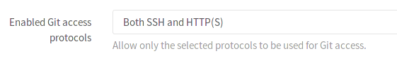
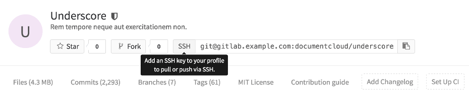
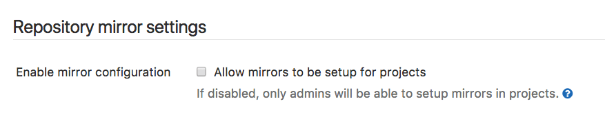

# Visibility and access controls

## Enabled Git access protocols

> [Introduced][ce-4696] in GitLab 8.10.

With GitLab's Access restrictions you can choose which Git access protocols you
want your users to use to communicate with GitLab. This feature can be enabled
via the `Application Settings` in the Admin interface.

The setting is called `Enabled Git access protocols`, and it gives you the option
to choose between:

- Both SSH and HTTP(S)
- Only SSH
- Only HTTP(s)

When both SSH and HTTP(S) are enabled, GitLab will behave as usual, it will give
your users the option to choose which protocol they would like to use.

When you choose to allow only one of the protocols, a couple of things will happen:

- The project page will only show the allowed protocol's URL, with no option to
  change it.
- A tooltip will be shown when you hover over the URL's protocol, if an action
  on the user's part is required, e.g. adding an SSH key, or setting a password.

On top of these UI restrictions, GitLab will deny all Git actions on the protocol
not selected.

CAUTION: **Important:**
Starting with [GitLab 10.7][ce-18021], HTTP(s) protocol will be allowed for
git clone/fetch requests done by GitLab Runner from CI/CD Jobs, even if
_Only SSH_ was selected.

> **Note:** Please keep in mind that disabling an access protocol does not actually
block access to the server itself. The ports used for the protocol, be it SSH or
HTTP, will still be accessible. What GitLab does is restrict access on the
application level.

## Allow mirrors to be setup for projects

> [Introduced][ee-3586] in Gitlab 10.3.

This option is enabled by default. By disabling it, both pull and push mirroring will no longer
work in every repository and can only be re-enabled on a per-project basis by an admin.

[ce-4696]: https://gitlab.com/gitlab-org/gitlab-ce/merge_requests/4696
[ee-3586]: https://gitlab.com/gitlab-org/gitlab-ee/merge_requests/3586
[ce-18021]: https://gitlab.com/gitlab-org/gitlab-ce/merge_requests/18021
