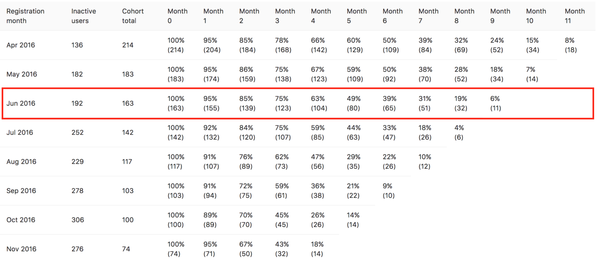

# Cohorts

> **Notes:**
> [Introduced][ce-23361] in GitLab 9.1.

As a benefit of having the [usage ping active](settings/usage_statistics.md),
GitLab lets you analyze the users' activities of your GitLab installation.
Under `/admin/cohorts`, when the usage ping is active, GitLab will show the
monthly cohorts of new users and their activities over time.

## Overview

How do we read the user cohorts table? Let's take an example with the following
user cohorts.

For the cohort of June 2016, 163 users have been added on this server and have
actually been active during this month. One month later, in July 2016, out of
these 163 users, 155 users (or 95% of the June cohort) are still active. Two
months later, 139 users (or 85%) are still active. 9 months later, we can see
that only 6% of this cohort are still active.

The Inactive users column shows the number of users who have been added during
the month, but who have never actually had any activity in the instance.

How do we measure the activity of users? GitLab considers a user active if:

* the user signs in
* the user has Git activity (whether push or pull).

## Setup

1. [Activate the usage ping](settings/usage_statistics.md)
2. Go to `/admin/cohorts` to see the user cohorts of the server

[ce-23361]: https://gitlab.com/gitlab-org/gitlab-ce/issues/23361
