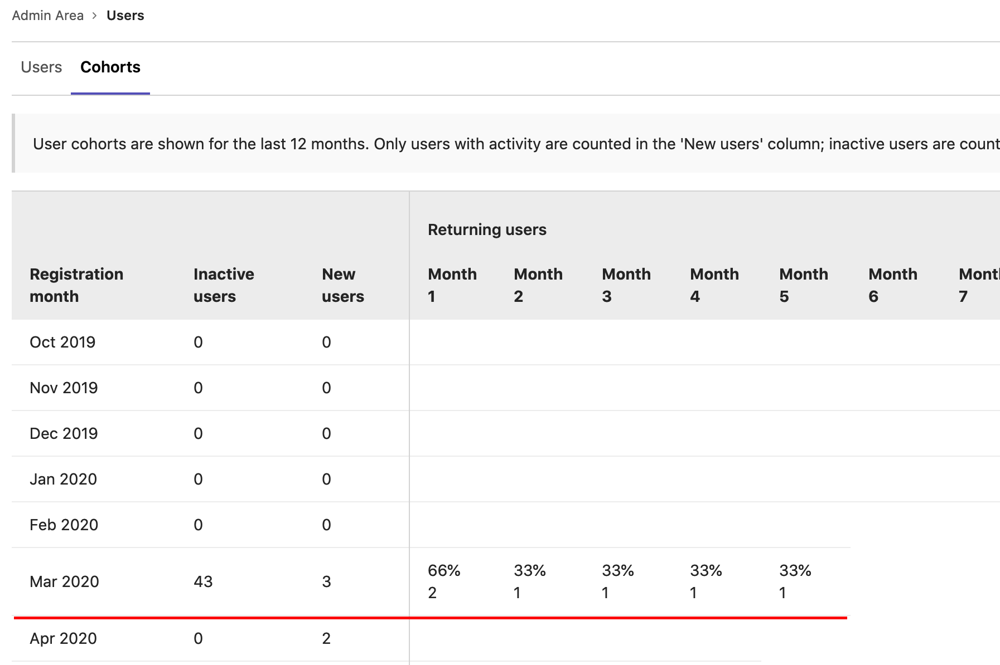

# Cohorts **(FREE)**

You can analyze your users' GitLab activities over time.

To view user cohorts:

1. On the top bar, select **Menu >** **{admin}** **Admin**.
1. In the left sidebar, select **Overview > Users**.
1. Select the **Cohorts** tab.

## Overview

How do you interpret the user cohorts table? Let's review an example with the
following user cohorts:

For the cohort of March 2020, three users were added to this server and have
been active since this month. One month later (April 2020), two users are still
active. Five months later (August 2020), one user from this cohort is still
active, or 33% of the original cohort of three that joined in March.

The **Inactive users** column shows the number of users who were added during
the month, but who never had any activity in the instance.

How do we measure the activity of users? GitLab considers a user active if:

- The user signs in.
- The user has Git activity (whether push or pull).
- The user visits pages related to dashboards, projects, issues, or merge
  requests ([introduced](https://gitlab.com/gitlab-org/gitlab-foss/-/issues/54947) in GitLab 11.8).
- The user uses the API.
- The user uses the GraphQL API.
