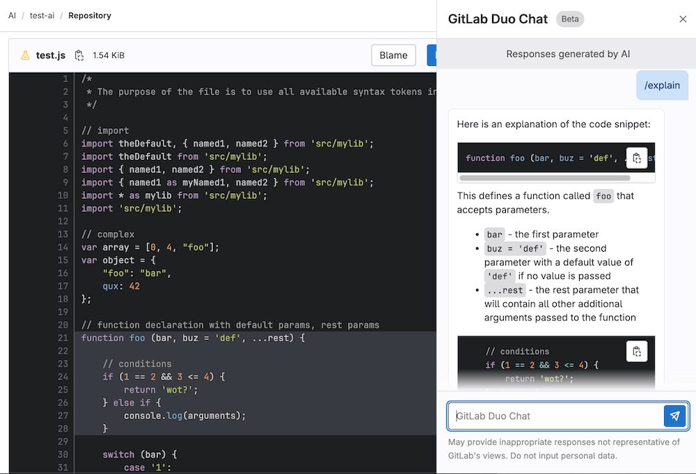

# AI/ML powered features

GitLab is creating AI-assisted features across our DevSecOps platform. These features aim to help increase velocity and solve key pain points across the software development lifecycle.

## Enable AI/ML features

> Introduced in GitLab 16.0 and is [actively being rolled out](https://gitlab.com/gitlab-org/gitlab/-/merge_requests/118222).

Prerequisites:

- You must have the Owner role for the group.

To enable AI/ML features:

- Enable the [Experiment features setting](group/manage.md#group-experiment-features-setting).
- The [third-party AI features setting](group/manage.md#group-third-party-ai-features-setting) is enabled by default. To disable AI features powered by third-party APIs, disable this setting.

These settings give you control over which features are enabled. These settings work together so you can have a mix of both experimental and third-party AI features.

## Generally Available AI features

When a feature is [Generally Available](../policy/alpha-beta-support.md#generally-available-ga), it does not require the [group-level Experiment features setting](group/manage.md#group-experiment-features-setting) to be enabled. Some of these features might require the [group-level third-party AI features setting](group/manage.md#group-third-party-ai-features-setting).

- [Suggested Reviewers](project/merge_requests/reviews/index.md#suggested-reviewers)

## Beta AI features

[Beta features](../policy/alpha-beta-support.md#beta) do not require the [group-level experiment features setting](group/manage.md#group-experiment-features-setting) to be enabled.

- [Code Suggestions](project/repository/code_suggestions.md)

## Experiment AI features

[Experiment features](../policy/alpha-beta-support.md#experiment) will soon require the [group-level Experiment features setting](group/manage.md#group-experiment-features-setting) to be enabled.

## Third-party AI features

Third-party AI features require the [group-level third-party AI features setting](group/manage.md#group-third-party-ai-features-setting) to be enabled. Experiment Third-party AI features also require the [Experiment features setting](group/manage.md#group-experiment-features-setting) to be enabled.

### Explain Selected Code in the Web UI **(ULTIMATE SAAS)**

> Introduced in GitLab 15.11 as an [Experiment](../policy/alpha-beta-support.md#experiment) on GitLab.com.

This feature is an [Experiment](../policy/alpha-beta-support.md) on GitLab.com that is powered by OpenAI's GPT-3.

GitLab can help you get up to speed faster if you:

- Spend a lot of time trying to understand pieces of code that others have created, or
- Struggle to understand code written in a language that you are not familiar with.

By using a large language model, GitLab can explain the code in natural language.

Prerequisites:

- The project must be a public project on GitLab.com.
- You must have the GitLab Ultimate subscription tier.
- You must be a member of the project.

To explain your code:

1. On the top bar, select **Main menu > Projects** and find your project.
1. On the left sidebar, select **Merge requests**, then select your merge request.
1. On the secondary menu, select **Changes**.
1. Go to the file, and select the lines that you want to have explained.
1. On the left side, select the question mark (**{question}**). You might have to scroll to the first line of your selection to view it. This sends the selected code, together with a prompt, to provide an explanation to the large language model.
1. A drawer is displayed on the right side of the page. Wait a moment for the explanation to be generated.
1. Provide feedback about how satisfied you are with the explanation, so we can improve the results.

We cannot guarantee that the large language model produces results that are correct. Use the explanation with caution.

### GitLab Chat **(ULTIMATE SAAS)**

> Introduced in GitLab 16.0 as an [Experiment](../policy/alpha-beta-support.md#experiment).

This feature is an [Experiment](../policy/alpha-beta-support.md) on GitLab.com that is powered by OpenAI's GPT-3. It requires the [group-level third-party AI features setting](group/manage.md#group-third-party-ai-features-setting) to be enabled.

Getting help has never been easier. If you have a question about how the GitLab product works, you can ask product how-to questions and get AI generated support from GitLab Chat.

1. In the lower-left corner, select the Help icon.
1. Select **Ask in GitLab Chat**. A drawer opens on the right side of your screen.
1. Enter your question in the chat input box and press **Enter** or select **Send**. It may take a few seconds for the interactive AI chat to search the product documentation and produce an answer.

To give feedback, select the **Give Feedback** link.

### Summarize merge request changes **(ULTIMATE SAAS)**

> [Introduced](https://gitlab.com/groups/gitlab-org/-/epics/10400) in GitLab 16.0 as an [Experiment](../policy/alpha-beta-support.md#experiment).

This feature is an [Experiment](../policy/alpha-beta-support.md) on GitLab.com that is powered by OpenAI's GPT-3. It requires the [group-level third-party AI features setting](group/manage.md#group-third-party-ai-features-setting) to be enabled.

Merge request summaries can be generated by using the `/summarize_diff` quick action in a merge request comment. This posts a comment from a GitLab bot that provides a summary of the changes and the related SHA for when that summary was generated.

Feedback on this experimental feature can be provided in [issue 408726](https://gitlab.com/gitlab-org/gitlab/-/issues/408726).

#### Data usage

This data is sent to the large language model referenced above when you use the `/summarize_diff` quick action:

1. The diff of changes between the head of the source branch and the target branch

### Summarize my merge request review **(ULTIMATE SAAS)**

> [Introduced](https://gitlab.com/groups/gitlab-org/-/epics/10466) in GitLab 16.0 as an [Experiment](../policy/alpha-beta-support.md#experiment).

This feature is an [Experiment](../policy/alpha-beta-support.md) on GitLab.com that is powered by OpenAI's GPT-3. It requires the [group-level third-party AI features setting](group/manage.md#group-third-party-ai-features-setting) to be enabled.

When you've completed your review of a merge request and are ready to [submit your review](project/merge_requests/reviews/index.md#submit-a-review) you can choose to have summary generated for you. To generate the summary:

1. Select the AI Actions dropdown list.
1. Select **Summarize my code review**.

The summary is generated and entered in to the comment box where you can edit and refine prior to submitting with your review.

Feedback on this experimental feature can be provided in [issue 408991](https://gitlab.com/gitlab-org/gitlab/-/issues/408991).

#### Data usage

This data is sent to the large language model referenced above when you click on **Summarize my code review**:

1. Draft comment's text
1. File path of the commented file(s)

### Generate suggested tests in merge requests **(ULTIMATE SAAS)**

> [Introduced](https://gitlab.com/groups/gitlab-org/-/epics/10366) in GitLab 16.0 as an [Experiment](../policy/alpha-beta-support.md#experiment).

This feature is an [Experiment](../policy/alpha-beta-support.md) on GitLab.com that is powered by OpenAI's GPT-3. It requires the [group-level third-party AI features setting](group/manage.md#group-third-party-ai-features-setting) to be enabled.

When in a merge request you can choose to have GitLab suggest tests for the file you are reviewing. This can help to determine if appropriate test coverage has been provided or help with writing tests to provide more coverage for your project. To generate a test suggestion:

1. Select the menu icon on the header of a file.
1. Select **Generate test with AI**.

A sidebar opens where the test suggestion is generated. From there you can choose to copy that suggestion in to your editor as the start of your tests.

Feedback on this experimental feature can be provided in [issue 408995](https://gitlab.com/gitlab-org/gitlab/-/issues/408995).

#### Data usage

This data is sent to the large language model referenced above when you click on **Generate test with AI**:

1. Contents of the file
1. The file name

## Data Usage

GitLab AI features leverage generative AI to help increase velocity and aim to help make you more productive. Each feature operates independently of other features and is not required for other features to function.

### Progressive enhancement

These features are designed as a progressive enhancement to existing GitLab features across our DevSecOps platform. They are designed to fail gracefully and should not prevent the core functionality of the underlying feature. Please note each feature is subject to its expected functionality as defined by the relevant [feature support policy](../policy/alpha-beta-support.md).

### Off by default

### Stability and performance

These features are in a variety of [feature support levels](../policy/alpha-beta-support.md#beta). Due to the nature of these features, there may be high demand for usage which may cause degraded performance or unexpected downtime of the feature. We have built these features to gracefully degrade and have controls in place to allow us to mitigate abuse or misuse. GitLab may disable **beta and experimental** features for any or all customers at any time at our discretion.

## Third Party Services

### Data privacy

Some AI features require the use of third-party AI services models and APIs from: Google AI and OpenAI. The processing of any personal data is in accordance with our [Privacy Statement](https://about.gitlab.com/privacy/). You may also visit the [Sub-Processors page](https://about.gitlab.com/privacy/subprocessors/#third-party-sub-processors) to see the list of our Sub-Processors that we use in order to provide these features.

Group owners can control which top-level groups have access to third-party AI features by using the [group level third-party AI features setting](group/manage.md#group-third-party-ai-features-setting).

### Model accuracy and quality

Generative AI may produce unexpected results that may be:

- Low-quality
- Incoherent
- Incomplete
- Produce failed pipelines
- Insecure code
- Offensive or insensitive

GitLab is actively iterating on all our AI-assisted capabilities to improve the quality of the generated content. We will continue improving the quality through prompt engineering, evaluating new AI/ML models to power these features, and through novel heuristics built into these features directly.
