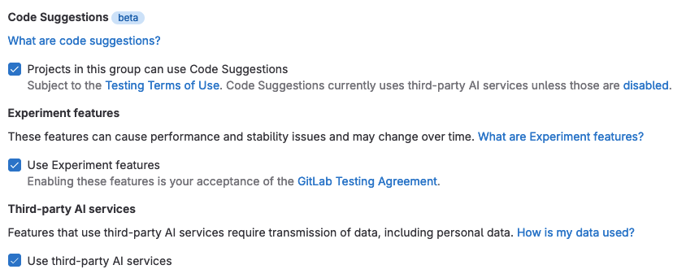

# GitLab Duo

GitLab is creating AI-assisted features across our DevSecOps platform. These features aim to help increase velocity and solve key pain points across the software development lifecycle.

| Feature | Purpose | Large Language Model | Current availability | Maturity |
|-|-|-|-|-|
| [Suggested Reviewers](project/merge_requests/reviews/index.md#gitlab-duo-suggested-reviewers) | Assists in creating faster and higher-quality reviews by automatically suggesting reviewers for your merge request. | GitLab creates a machine learning model for each project, which is used to generate reviewers    [View the issue](https://gitlab.com/gitlab-org/modelops/applied-ml/applied-ml-updates/-/issues/10) | SaaS only | [Generally Available (GA)](../policy/experiment-beta-support.md#generally-available-ga) |
| [Code Suggestions](project/repository/code_suggestions/index.md) | Helps you write code more efficiently by viewing code suggestions as you type. | [Google Vertex Codey APIs](https://cloud.google.com/vertex-ai/docs/generative-ai/code/code-models-overview) | SaaS   Self-managed | [Beta](../policy/experiment-beta-support.md#beta) |
| [Vulnerability summary](application_security/vulnerabilities/index.md#explaining-a-vulnerability) | Helps you remediate vulnerabilities more efficiently, uplevel your skills, and write more secure code. | [Google Vertex Codey APIs](https://cloud.google.com/vertex-ai/docs/generative-ai/code/code-models-overview)    Anthropic's claude model if degraded performance | SaaS only    Ultimate tier | [Beta](../policy/experiment-beta-support.md#beta) |
| [Code explanation](#explain-code-in-the-web-ui-with-code-explanation) | Helps you understand code by explaining it in English language. | [Google Vertex Codey APIs](https://cloud.google.com/vertex-ai/docs/generative-ai/code/code-models-overview) | SaaS only    Ultimate tier | [Experiment](../policy/experiment-beta-support.md#experiment) |
| [Chat](#answer-questions-with-chat) | Process and generate text and code in a conversational manner. Helps you quickly identify useful information in large volumes of text in issues, epics, code, and GitLab documentation. | Anthropic's claude model    OpenAI Embeddings | SaaS only | [Experiment](../policy/experiment-beta-support.md#experiment) |
| [Value stream forecasting](#forecast-deployment-frequency-with-value-stream-forecasting) | Assists you with predicting productivity metrics and identifying anomalies across your software development lifecycle. | Statistical forecasting | SaaS only | [Experiment](../policy/experiment-beta-support.md#experiment) |
| [Discussion summary](#summarize-issue-discussions-with-discussion-summary) | Assists with quickly getting everyone up to speed on lengthy conversations to help ensure you are all on the same page. | [Google Vertex Codey APIs](https://cloud.google.com/vertex-ai/docs/generative-ai/code/code-models-overview) | SaaS only | [Experiment](../policy/experiment-beta-support.md#experiment) |
| [Merge request summary](project/merge_requests/ai_in_merge_requests.md#summarize-merge-request-changes) | Efficiently communicate the impact of your merge request changes. | [Google Vertex Codey APIs](https://cloud.google.com/vertex-ai/docs/generative-ai/code/code-models-overview) | SaaS only | [Experiment](../policy/experiment-beta-support.md#experiment) |
| [Code review summary](project/merge_requests/ai_in_merge_requests.md#summarize-my-merge-request-review) | Helps ease merge request handoff between authors and reviewers and help reviewers efficiently understand suggestions. | [Google Vertex Codey APIs](https://cloud.google.com/vertex-ai/docs/generative-ai/code/code-models-overview) | SaaS only | [Experiment](../policy/experiment-beta-support.md#experiment) |
| [Merge request template population](project/merge_requests/ai_in_merge_requests.md#fill-in-merge-request-templates) | Generate a description for the merge request based on the contents of the template. | [Google Vertex Codey APIs](https://cloud.google.com/vertex-ai/docs/generative-ai/code/code-models-overview) | SaaS only | [Experiment](../policy/experiment-beta-support.md#experiment) |
| [Test generation](project/merge_requests/ai_in_merge_requests.md#generate-suggested-tests-in-merge-requests) | Automates repetitive tasks and helps catch bugs early. | [Google Vertex Codey APIs](https://cloud.google.com/vertex-ai/docs/generative-ai/code/code-models-overview) | SaaS only | [Experiment](../policy/experiment-beta-support.md#experiment) |
| [Git suggestions](https://gitlab.com/gitlab-org/gitlab/-/issues/409636) | Helps you discover or recall Git commands when and where you need them. | OpenAI | SaaS only | [Experiment](../policy/experiment-beta-support.md#experiment) |
| **Root cause analysis** | Assists you in determining the root cause for a pipeline failure and failed CI/CD build. | [Google Vertex Codey APIs](https://cloud.google.com/vertex-ai/docs/generative-ai/code/code-models-overview) | SaaS only | [Experiment](../policy/experiment-beta-support.md#experiment) |
| [Issue description generation](#summarize-an-issue-with-issue-description-generation) | Generate issue descriptions. | [Google Vertex Codey APIs](https://cloud.google.com/vertex-ai/docs/generative-ai/code/code-models-overview) | SaaS only | [Experiment](../policy/experiment-beta-support.md#experiment) |

## Enable AI/ML features

The [Generally Available](../policy/experiment-beta-support.md#generally-available-ga) features listed in the previous table do not need to be enabled.

[Experiment features](../policy/experiment-beta-support.md#experiment) and [Beta features](../policy/experiment-beta-support.md#beta) (besides Code Suggestions) on SaaS must be enabled by a user who has the Owner role in the group. Their usage is subject to the [Testing Terms of Use](https://about.gitlab.com/handbook/legal/testing-agreement/).

In addition, all features built on large language models (LLM) from Google, Anthropic or OpenAI (besides Code Suggestions) require that [third-party AI features are enabled](group/manage.md#enable-third-party-ai-features) (which they are by default). The table above shows which features are built on which LLM. To disable AI features powered by third-party APIs, clear this setting.

Code Suggestions currently has its own settings:

- View [how to enable for self-managed](project/repository/code_suggestions/saas.md#enable-code-suggestions).
- View [how to enable for SaaS](project/repository/code_suggestions/self_managed.md#enable-code-suggestions-on-self-managed-gitlab).

The use of Code Suggestions is also subject to the [Testing Terms of Use](https://about.gitlab.com/handbook/legal/testing-agreement/).

## Experimental AI features and how to use them

The following subsections describe the experimental AI features in more detail.

### Explain code in the Web UI with Code explanation **(ULTIMATE SAAS EXPERIMENT)**

> Introduced in GitLab 15.11 as an [Experiment](../policy/experiment-beta-support.md#experiment) on GitLab.com.

This AI feature is an [Experiment](../policy/experiment-beta-support.md) on GitLab.com that is powered by Google's Codey for Code Chat (codechat-bison).

GitLab can help you get up to speed faster if you:

- Spend a lot of time trying to understand pieces of code that others have created, or
- Struggle to understand code written in a language that you are not familiar with.

By using a large language model, GitLab can explain the code in natural language.

Prerequisites:

Additional prerequisites in addition to [the settings listed previously](#enable-aiml-features).

- The project must be on GitLab.com.
- You must have the GitLab Ultimate subscription tier.
- You must be a member of the project with sufficient permissions to view the repository.

To explain your code:

1. On the left sidebar, select **Search or go to** and find your project.
1. Select any file in your project that contains code.
1. On the file, select the lines that you want to have explained.
1. On the left side, select the question mark (**{question}**). You might have to scroll to the first line of your selection to view it. This sends the selected code, together with a prompt, to provide an explanation to the large language model.
1. A drawer is displayed on the right side of the page. Wait a moment for the explanation to be generated.
1. Provide feedback about how satisfied you are with the explanation, so we can improve the results.

You can also have code explained in the context of a merge request. To explain
code in a merge request:

1. On the left sidebar, select **Search or go to** and find your project.
1. On the left sidebar, select **Code > Merge requests**, then select your merge request.
1. On the secondary menu, select **Changes**.
1. On the file you would like explained, select the three dots (**{ellipsis_v}**) and select **View File @ $SHA**.

   A separate browser tab opens and shows the full file with the latest changes.

1. On the new tab, select the lines that you want to have explained.
1. On the left side, select the question mark (**{question}**). You might have to scroll to the first line of your selection to view it. This sends the selected code, together with a prompt, to provide an explanation to the large language model.
1. A drawer is displayed on the right side of the page. Wait a moment for the explanation to be generated.
1. Provide feedback about how satisfied you are with the explanation, so we can improve the results.

We cannot guarantee that the large language model produces results that are correct. Use the explanation with caution.

### Answer questions with Chat **(ULTIMATE SAAS EXPERIMENT)**

> Introduced in GitLab 16.0 as an [Experiment](../policy/experiment-beta-support.md#experiment).

This feature is an [Experiment](../policy/experiment-beta-support.md) on GitLab.com. It requires the [group-level third-party AI features setting](group/manage.md#enable-third-party-ai-features) to be enabled.

GitLab Duo Chat is powered by Anthropic's Claude-2.0 and Claude-instant-1.1 large language models and OpenAI's text-embedding-ada-002 embeddings. The LLMs are employed to analyze user questions to collect appropriate context data from the user's project, and to generate responses. In some cases, embeddings are used to embed user questions and find relevant content in GitLab documentation to share with the LLMs to generate an answer.

You can get AI generated support from GitLab Duo Chat about the following topics:

- How to use GitLab.
- Questions about an issue.
- Summarizing an issue.

Example questions you might ask:

- `What is a fork?`
- `How to reset my password`
- `Summarize the issue <link to your issue>`
- `Summarize the description of the current issue`

The examples above all use data from either the issue or the GitLab documentation. However, you can also ask to generate code, CI/CD configurations, or to explain code. For example:

- `Write a hello world function in Ruby`
- `Write a tic tac toe game in JavaScript`
- `Write a .gitlab-ci.yml file to test and build a rails application`
- `Explain the following code: def sum(a, b) a + b end`

You can also ask follow-up questions.

This is an experimental feature and we're continuously extending the capabilities and reliability of the chat.

1. In the lower-left corner, select the Help icon.
   The [new left sidebar must be enabled](../tutorials/left_sidebar/index.md#enable-the-new-left-sidebar).
1. Select **Ask in GitLab Duo Chat**. A drawer opens on the right side of your screen.
1. Enter your question in the chat input box and press **Enter** or select **Send**. It may take a few seconds for the interactive AI chat to produce an answer.
1. You can ask a follow-up question.
1. If you want to ask a new question unrelated to the previous conversation, you may receive better answers if you clear the context by typing `/reset` into the input box and selecting **Send**.

To give feedback about a specific response, use the feedback buttons in the response message.
Or, you can add a comment in the [feedback issue](https://gitlab.com/gitlab-org/gitlab/-/issues/415591).

NOTE:
Only the last 50 messages are retained in the chat history. The chat history expires 3 days after last use.

### Summarize issue discussions with Discussion summary **(ULTIMATE SAAS EXPERIMENT)**

> [Introduced](https://gitlab.com/groups/gitlab-org/-/epics/10344) in GitLab 16.0 as an [Experiment](../policy/experiment-beta-support.md#experiment).

This feature is an [Experiment](../policy/experiment-beta-support.md) on GitLab.com that is powered by OpenAI's
GPT-3. It requires the [group-level third-party AI features setting](group/manage.md#enable-third-party-ai-features) to be enabled.

You can generate a summary of discussions on an issue:

1. In an issue, scroll to the **Activity** section.
1. Select **View summary**.

The comments in the issue are summarized in as many as 10 list items.
The summary is displayed only for you.

Provide feedback on this experimental feature in [issue 407779](https://gitlab.com/gitlab-org/gitlab/-/issues/407779).

**Data usage**: When you use this feature, the text of public comments on the issue are sent to the large
language model referenced above.

### Forecast deployment frequency with Value stream forecasting **(ULTIMATE ALL EXPERIMENT)**

> [Introduced](https://gitlab.com/groups/gitlab-org/-/epics/10228) in GitLab 16.2 as an [Experiment](../policy/experiment-beta-support.md#experiment).

This feature is an [Experiment](../policy/experiment-beta-support.md) on GitLab.com.

In CI/CD Analytics, you can view a forecast of deployment frequency:

1. On the left sidebar, select **Search or go to** and find your project.
1. Select **Analyze > CI/CD analytics**.
1. Select the **Deployment frequency** tab.
1. Turn on the **Show forecast** toggle.
1. On the confirmation dialog, select **Accept testing terms**.

The forecast is displayed as a dotted line on the chart. Data is forecasted for a duration that is half of the selected date range.
For example, if you select a 30-day range, a forecast for the following 15 days is displayed.

Provide feedback on this experimental feature in [issue 416833](https://gitlab.com/gitlab-org/gitlab/-/issues/416833).

### Summarize an issue with Issue description generation **(ULTIMATE SAAS EXPERIMENT)**

> [Introduced](https://gitlab.com/groups/gitlab-org/-/epics/10762) in GitLab 16.3 as an [Experiment](../policy/experiment-beta-support.md#experiment).

This feature is an [Experiment](../policy/experiment-beta-support.md) on GitLab.com that is powered by OpenAI's
GPT-3. It requires the [group-level third-party AI features setting](group/manage.md#enable-third-party-ai-features) to be enabled.

You can generate the description for an issue from a short summary.

1. Create a new issue.
1. Above the **Description** field, select **AI actions > Generate issue description**.
1. Write a short description and select **Submit**.

The issue description is replaced with AI-generated text.

Provide feedback on this experimental feature in [issue 409844](https://gitlab.com/gitlab-org/gitlab/-/issues/409844).

**Data usage**: When you use this feature, the text you enter is sent to the large
language model referenced above.

## Data Usage

GitLab AI features leverage generative AI to help increase velocity and aim to help make you more productive. Each feature operates independently of other features and is not required for other features to function.

### Progressive enhancement

These features are designed as a progressive enhancement to existing GitLab features across our DevSecOps platform. They are designed to fail gracefully and should not prevent the core functionality of the underlying feature. You should note each feature is subject to its expected functionality as defined by the relevant [feature support policy](../policy/experiment-beta-support.md).

### Stability and performance

These features are in a variety of [feature support levels](../policy/experiment-beta-support.md#beta). Due to the nature of these features, there may be high demand for usage which may cause degraded performance or unexpected downtime of the feature. We have built these features to gracefully degrade and have controls in place to allow us to mitigate abuse or misuse. GitLab may disable **beta and experimental** features for any or all customers at any time at our discretion.

## Third party services

### Data privacy

Some AI features require the use of third-party AI services models and APIs from: Google AI and OpenAI. The processing of any personal data is in accordance with our [Privacy Statement](https://about.gitlab.com/privacy/). You may also visit the [Sub-Processors page](https://about.gitlab.com/privacy/subprocessors/#third-party-sub-processors) to see the list of our Sub-Processors that we use to provide these features.

Group owners can control which top-level groups have access to third-party AI features by using the [group level third-party AI features setting](group/manage.md#enable-third-party-ai-features).

### Model accuracy and quality

Generative AI may produce unexpected results that may be:

- Low-quality
- Incoherent
- Incomplete
- Produce failed pipelines
- Insecure code
- Offensive or insensitive

GitLab is actively iterating on all our AI-assisted capabilities to improve the quality of the generated content. We improve the quality through prompt engineering, evaluating new AI/ML models to power these features, and through novel heuristics built into these features directly.
