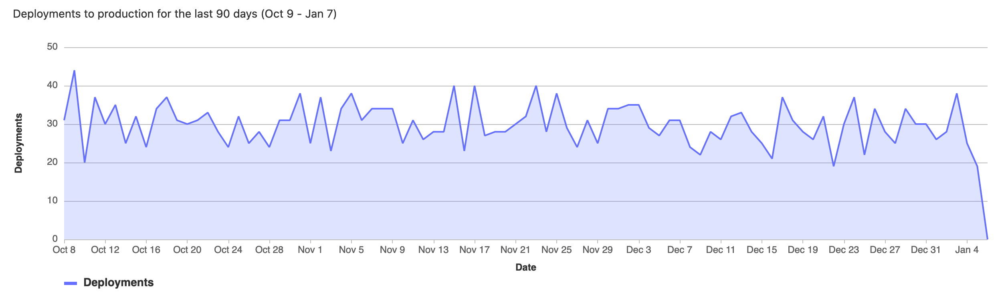

# CI/CD Analytics

## Pipeline success and duration charts **(CORE)**

> - Introduced in GitLab 3.1.1 as Commit Stats, and later renamed to Pipeline Charts.
> - [Renamed](https://gitlab.com/gitlab-org/gitlab/-/issues/38318) to CI/CD Analytics in GitLab 12.8.

GitLab tracks the history of your pipeline successes and failures, as well as how long each pipeline
ran. To view this information, go to **Analytics > CI/CD Analytics**.

View successful pipelines:

View pipeline duration history:

## Deployment frequency charts **(ULTIMATE)**

> [Introduced](https://gitlab.com/gitlab-org/gitlab/-/issues/275991) in GitLab 13.8.

The **Analytics > CI/CD Analytics** page shows information about the deployment frequency to the
`production` environment. The environment **must** be named `production` for its deployment
information to appear on the graphs.

