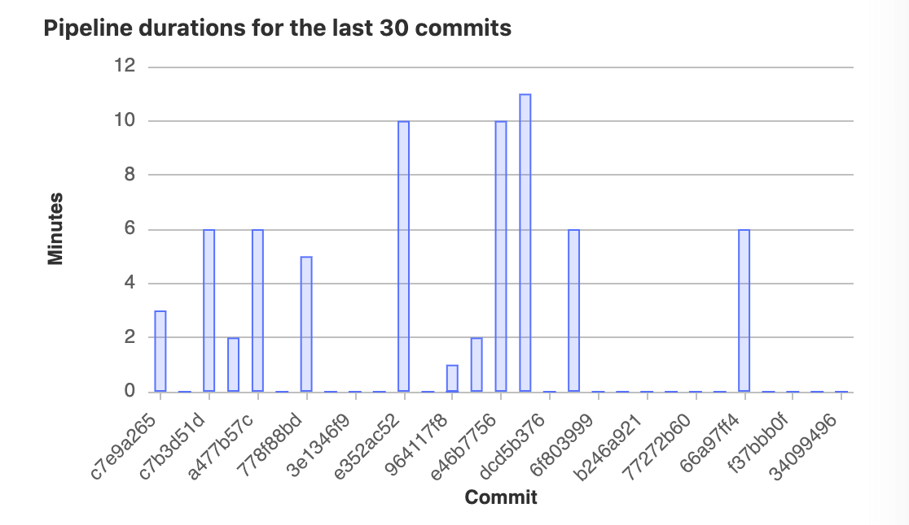
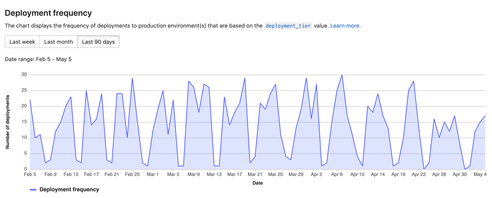
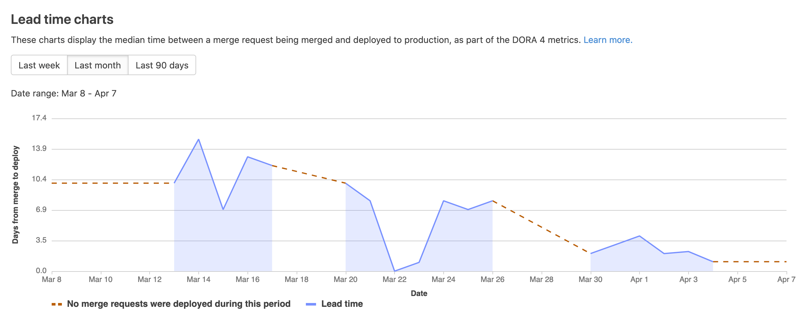

# CI/CD Analytics **(FREE)**

## Pipeline success and duration charts

> [Renamed](https://gitlab.com/gitlab-org/gitlab/-/issues/38318) to CI/CD Analytics in GitLab 12.8.

GitLab tracks the history of your pipeline successes and failures, as well as how long each pipeline
ran. To view this information, go to **Analytics > CI/CD Analytics**.

View successful pipelines:

View pipeline duration history:

## DevOps Research and Assessment (DORA) key metrics **(ULTIMATE)**

> - [Introduced](https://gitlab.com/gitlab-org/gitlab/-/issues/275991) in GitLab 13.7.
> - Added support for [lead time for changes](https://gitlab.com/gitlab-org/gitlab/-/issues/291746) in GitLab 13.10.

Customer experience is a key metric. Users want to measure platform stability and other
post-deployment performance KPIs, and set targets for customer behavior, experience, and financial
impact. Tracking and measuring these indicators solves an important pain point. Similarly, creating
views that manage products, not projects or repositories, provides users with a more relevant data set.
Since GitLab is a tool for the entire DevOps life-cycle, information from different workflows is
integrated and can be used to measure the success of the teams.

The DevOps Research and Assessment ([DORA](https://cloud.google.com/blog/products/devops-sre/the-2019-accelerate-state-of-devops-elite-performance-productivity-and-scaling))
team developed four key metrics that the industry has widely adopted. You can use these metrics as
performance indicators for software development teams:

- Deployment frequency: How often an organization successfully releases to production.
- Lead time for changes: The amount of time it takes for code to reach production.
- Change failure rate: The percentage of deployments that cause a failure in production.
- Time to restore service: How long it takes an organization to recover from a failure in
  production.

### Supported metrics in GitLab

The following table shows the supported metrics, at which level they are supported, and which GitLab version (API and UI) they were introduced:

| Metric                    | Level               | API version                          | Chart (UI) version                    | Comments  |
|---------------------------|---------------------|--------------------------------------|---------------------------------------|-----------|
| `deployment_frequency`    | Project-level       | [13.7+](../../api/dora/metrics.md)   | [13.8+](#deployment-frequency-charts) | The [old API endpoint](../../api/dora4_project_analytics.md) was [deprecated](https://gitlab.com/gitlab-org/gitlab/-/issues/323713) in 13.10. |
| `deployment_frequency`    | Group-level         | [13.10+](../../api/dora/metrics.md)  | [13.12+](#deployment-frequency-charts)                    | |
| `lead_time_for_changes`   | Project-level       | [13.10+](../../api/dora/metrics.md)  | [13.11+](#lead-time-charts)           | Unit in seconds. Aggregation method is median. |
| `lead_time_for_changes`   | Group-level         |  [13.10+](../../api/dora/metrics.md) | [14.0+](#lead-time-charts)                        | Unit in seconds. Aggregation method is median. |
| `change_failure_rate`     | Project/Group-level |  To be supported                     | To be supported                       | |
| `time_to_restore_service` | Project/Group-level |  To be supported                     | To be supported                       | |

### Deployment frequency charts **(ULTIMATE)**

> [Introduced](https://gitlab.com/gitlab-org/gitlab/-/issues/275991) in GitLab 13.8.

The **Analytics > CI/CD Analytics** page shows information about the deployment
frequency to the `production` environment. The environment must be part of the
[production deployment tier](../../ci/environments/index.md#deployment-tier-of-environments)
for its deployment information to appear on the graphs.

These charts are available for both groups and projects.

### Lead time charts **(ULTIMATE)**

> [Introduced](https://gitlab.com/gitlab-org/gitlab/-/issues/250329) in GitLab 13.11.

The charts in the **Lead Time** tab show information about how long it takes
merge requests to be deployed to a production environment.

Smaller values are better. Small lead times indicate fast, efficient deployment
processes.

For time periods in which no merge requests were deployed, the charts render a
red, dashed line.

These charts are available for both groups and projects.
